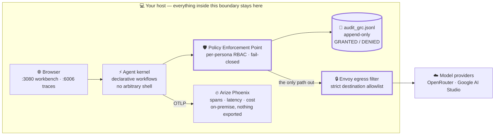

# 🛡️ DeepSeek Harness (DSH-DDS) — Governed Agent Operations, Air-Gapped by Default

[](https://www.docker.com/)
[](https://docs.docker.com/compose/)
[](https://github.com/hdjebar/DSH-DDS/actions/workflows/ci.yml)
[](https://nodejs.org/)
[](LICENSE)

> **Run AI agents where nothing is allowed to leave.**
> A self-hosted Docker stack pairing DeepSeek Harness with an on-premise Arize Phoenix backend. Every prompt, span, token and euro stays on the host — no SaaS tracing backend, no egress requirement, no telemetry contract to sign.

*For platform and AI engineering teams operating under data-residency, sovereignty or regulated-sector constraints — and for developers who want full agent observability and cost attribution without sending prompts to a third party.*



> 🗺️ **Journey the Architecture by Visualising It**
> Explore the runtime topology, zero-trust PEP, and telemetry waterfalls through self-contained, publication-ready **interactive HTML web apps** featuring pan/zoom, dark/light modes, story chapters, and trace motion:
> * 🏛️ **[Runtime Architecture & Isolation](docs/visual-architecture/system-runtime.architecture.html)** (`open docs/visual-architecture/system-runtime.architecture.html`)
> * 🛡️ **[Zero-Trust PEP & Dynamic RBAC](docs/visual-architecture/security-pipeline.workflow.html)** (`open docs/visual-architecture/security-pipeline.workflow.html`)
> * 🔄 **[Declarative Workflow & Loop Trap](docs/visual-architecture/declarative-workflow.workflow.html)** (`open docs/visual-architecture/declarative-workflow.workflow.html`)
> * ⚡ **[Agent Execution & OTLP Telemetry Sequence](docs/visual-architecture/agent-trace.sequence.html)** (`open docs/visual-architecture/agent-trace.sequence.html`)
>
> *Compiled deterministically via Archify (`@tt-a1i/archify-dsh`). Full index and build instructions: **[Visual Architecture Suite](docs/visual-architecture/README.md)**.*

DSH-DDS is a self-hosted environment for governed AI agents, combining multi-provider model routing, declarative workflows, MCP tools, human approval gates, sandboxed execution and local observability in one reproducible Docker stack.

**→ [Get running in about 10 minutes](#-quick-start)** · **[Journey the Architecture](docs/visual-architecture/README.md)** · **[Read the whitepaper](docs/architecture/sota-whitepaper.md)** · **[Inspect the threat model](#️-threat-model--security-boundaries)**

---

### Contents

**Understand it** — [The problem](#-the-problem-this-solves) · [Governance posture](#️-governance-posture) · [What it gives you](#-what-it-gives-you) · [Personas-as-code](#-personas-as-code-worked-example) · [Why it's different](#-why-dsh-dds-is-unique) · [What it is not](#-what-this-is-not)

**Verify it** — [Security & sandbox](#️-hardened-sandbox-mode-untrusted-code-evaluation) · [Threat model](#️-threat-model--security-boundaries) · [Test suite](#-automated-regression--supply-chain-test-suite) · [Plugins & MCP](#-pre-packaged-plugins--mcp-servers) · [Documentation](#-documentation-suite-diátaxis-organization)

**Run it** — [Quick start](#-quick-start) · [Environment config](#️-environment-configuration-env-reference) · [Endpoints](#-web-interfaces--endpoints) · [Storage layout](#-config-directory--persistent-storage) · [Maintenance](#-maintenance--operations)

---

## 🎯 The Problem This Solves

Most agent tooling assumes the opposite of an air gap. Observability wants a hosted backend. Agent frameworks assume outbound network access. In a sovereignty-constrained or data-resident environment, that assumption disqualifies the tool before evaluation starts.

DSH-DDS was built for that constraint rather than adapted to it. Four specific problems:

1. **Keep telemetry under your control.** Cloud tracing services receive prompts, code and tool data by design. Phoenix runs on the local Docker network at `127.0.0.1:6006`, so traces stay on the host unless you explicitly export them. This supports data-governance controls relevant to EU AI Act, DORA and NIS2 programmes; it is not compliance by itself.

2. **Close the prompt-injection-to-RCE path.** Arbitrary shell execution is replaced by declarative YAML workflows and typed capability adapters. An injected instruction has no shell to reach.

3. **Make model choice a cost decision, not a default.** Sending every step to a premium frontier model is expensive. Personas route routine drafting and tool work to fast tiers and reserve reasoning tiers for complex analysis, with live pricing synchronised at boot.

4. **Make agent behaviour reproducible.** Prompt changes made in a chat window are lost. Personas package domain rules, model tiers, MCP tools and workflows as version-controlled declarative assets (`persona.yaml` + `SKILL.md`) tracked in Git.

---

## 🛡️ Governance Posture

Four properties, each verifiable in this repository:

| Property | What it means | Where it lives |
| :--- | :--- | :--- |
| **Local telemetry invariant** | All spans, trajectories and GRC audit records remain on the host. Unlike SaaS agent observability platforms, zero trace data or prompt history is exported. | [`docs/architecture/security-model.md`](docs/architecture/security-model.md) |
| **Kernel-level confinement** | Landlock LSM, `cap_drop: ALL`, read-only root filesystem, `no-new-privileges`, non-root execution (UID 1000), and filtered egress through a hardened Envoy sidecar on an internal-only bridge. | [`docker-compose.sandbox.yml`](docker-compose.sandbox.yml) · [Threat model](#️-threat-model--security-boundaries) |
| **Non-repudiable audit trail** | `audit_grc.jsonl` on a privileged isolated path (mode `0600`), recording timestamp, persona, role, action, decision and reason. Append-only, surviving sandbox teardown. Aligned to EU AI Act Article 12 record-keeping. | [`docs/architecture/guardrails-owasp.md`](docs/architecture/guardrails-owasp.md) · [ADR 0002](docs/adr/0002-out-of-band-grc-and-deterministic-e2e-sandbox.md) |
| **Fail-closed RBAC** | Per-persona filesystem and MCP permissions enforced at an in-line Policy Enforcement Point, with explicit deny lists and symlink ancestor canonicalisation. | [ADR 0003](docs/adr/0003-authoritative-declarative-orchestrator-and-capability-adapters.md) · [ADR 0005](docs/adr/0005-remediation-of-audit-v3-findings.md) |

> [!IMPORTANT]
> This is a **reference implementation**, not a maintained product, and it supports compliance work rather than delivering it. Read the [threat model](#️-threat-model--security-boundaries) before treating any boundary here as uncircumventable — in particular, the Node.js loader is a Policy Enforcement Point, not a sandbox.

---

## 🌟 What It Gives You

* **📊 100% local Arize Phoenix telemetry** — integrated OpenTelemetry collector and dashboard visualising agent trajectories, token waterfalls, latency bottlenecks and exact invocation costs.
* **🔄 Dynamic model synchronisation (`dsh-model-sync`)** — queries OpenRouter (420+ models) and Google AI Studio (31+ models) on boot, caching live pricing, context limits and token specs locally. Live quota and balance rings render in the Web UI.
* **🛡️ Hardened sandbox mode** — drop-in `docker-compose.sandbox.yml` with read-only root filesystems, stripped capabilities, disabled privilege escalation, credential isolation and zero-trust filtered egress for evaluating untrusted code.
* **✋ Human approval gates** — asymmetric approval tokens (`./dsh.sh approve`) signed with an internal HMAC secret, gating workflows that need a person in the loop.

---

## 🎭 Personas-as-Code (Worked Example)

Personas package instructions, model matrices, RBAC and MCP tools into declarative YAML:

```yaml
# config/personas/sdmx-expert/persona.yaml
name: sdmx-expert
title: SDMX 2.1 Statistical Data Specialist
models:
  default:
    provider: openrouter
    model: deepseek/deepseek-chat
  reasoning:
    provider: openrouter
    model: deepseek/deepseek-r1
  coding:
    provider: google
    model: gemini-3.7-flash
mcpServers:
  fetch:
    command: /usr/local/bin/mcp-server-webresearch
  sqlite-db:
    command: /root/.local/bin/mcp-server-sqlite
    args: ["--db-path", "/workspaces/data.db"]
rbac:
  role: sdmx_expert
  permissions:
    filesystem:
      read: ["/workspaces", "/root/.dsh/personas/sdmx-expert"]
      write: ["/workspaces", "/root/.dsh/sessions"]
      deny: ["/etc", "/root/.ssh", "config/personas/*", "reset.sh", "install_dsh.sh"]
    mcp:
      allowed: ["fetch", "sqlite-db"]
workflows:
  extract_indicators:
    modelTier: reasoning
    steps:
      - name: Fetch SDMX Dataflows
        action: fetch_dataflows
        scope: /workspaces/data
```

Execute personas through the unified CLI wrapper:

```bash
# Run with calibrated default tier
./dsh.sh persona run sdmx-expert "Analyze inflation metrics for Luxembourg"

# Force reasoning model tier (DeepSeek-R1)
./dsh.sh persona run sdmx-expert --tier reasoning "Prove statistical correlation formula"
```

---

## 💡 Why DSH-DDS Is Unique

An enterprise governance and reliability harness wrapped around an interactive, user-friendly agent environment.

Instead of stitching together an agent UI, a Python orchestration library, a Docker sandbox, an egress proxy, an OpenTelemetry database and compliance audit scripts from separate repositories, DSH-DDS delivers all of them in a single verified turnkey repository.

> [!TIP]
> For an in-depth architectural and functional comparison against upstream DeepSeek Harness, OpenHands, SWE-agent, Goose, LangGraph, AutoGen, CrewAI and NeMo Guardrails, see the [Open Source Landscape & Ecosystem Comparison](docs/architecture/ecosystem-analysis.md).

---

## 🚫 What This Is Not

* **Not a hosted cloud SaaS** — a self-hosted infrastructure stack running on your workstation, VM or private cloud.
* **Not a multi-user shared service by default** — DSH and Phoenix bind strictly to loopback. For team access, configure reverse-proxy authentication or set `PHOENIX_ENABLE_AUTH=true` with `PHOENIX_SECRET`.
* **Not a compliance product** — it produces evidence an auditor can read. It does not make you compliant.
* **Not native Windows** — runs as a Linux container environment via Docker Desktop or WSL2 on Windows, macOS and Linux.

---

## 🛡️ Hardened Sandbox Mode (Untrusted Code Evaluation)

When analysing external or unverified code repositories, start with the sandbox override:

```bash
docker compose -f docker-compose.yml -f docker-compose.sandbox.yml up -d
```

**Sandbox protections:**

* **Disposable runtime configuration** — copies `./config` from `/opt/dsh-config:ro` into an in-memory `/var/lib/dsh` tree on every start.
* **Read-only workspaces (`/workspaces:ro`)** — protects host files from unauthorised modification.
* **Linux capability stripping (`cap_drop: [ALL]`)** — drops all privileged container capabilities.
* **No new privileges (`no-new-privileges:true`)** — prevents privilege escalation inside the container.
* **Credential isolation** — explicitly blanks provider API keys inside the untrusted container to eliminate exfiltration paths.
* **Zero-trust filtered egress** — isolates DSH and Phoenix on an internal bridge network (`internal: true`), with outbound traffic restricted through a hardened Envoy proxy sidecar enforcing strict destination allowlists.
* **Persistent session isolation** — preserves transcripts and JSON storage in a dedicated `sandbox-session-state` volume, preventing contamination of trusted host session directories.
* **Audit trail retention** — persists GRC audit logs to `./config/audit`, preserving non-repudiation records after sandbox teardown.
* **Resource caps** — 2 CPUs, 2 GB RAM, 150 PIDs.

Destroy all transient sandbox session data:

```bash
docker compose -f docker-compose.yml -f docker-compose.sandbox.yml down -v
```

### 🛡️ Threat Model & Security Boundaries

* **Kernel and container primitives** — the primary security boundaries for untrusted code execution are Linux kernel namespaces, cgroups, capability stripping (`cap_drop: ALL`), read-only root filesystems, non-root execution (UID/GID 1000) and Landlock LSM.
* **Role of the `@dsh-dds/core` loader** — `loader.mjs` is an internal runtime compatibility layer and an application-level Policy Enforcement Point. **It is not an uncircumventable sandbox boundary** against hostile subshell escapes; process-level containment rests on the container sandbox.
* **Supply-chain policies** — installation uses `--frozen-lockfile` with explicit build-script approval (`allowBuilds`) for native modules (`node-pty`, `protobufjs`, `sharp`). `minimumReleaseAge: 0` enables immediate consumption of verified release candidates and hermetic offline packages.

---

## 🧪 Automated Regression & Supply-Chain Test Suite

```bash
# Run all regression & installer parity tests
node --test tests/*.test.mjs
```

**Coverage:**

1. **CLI argument parser** — validates `--option=value`, short flags, mixed ordering, prompts with quotes and spaces; rejects malformed options.
2. **YAML & persona schema validation** — asserts patch validity across all 7 shipped personas.
3. **Secret scrubber** — asserts redaction of Google AI Studio keys, GitHub fine-grained PATs and Bearer tokens.
4. **Installer parity assertion** — dynamically asserts byte-for-byte synchronisation between `install_dsh.sh` manifests and canonical repository files.
5. **CI & supply-chain hardening** — [`.github/workflows/ci.yml`](.github/workflows/ci.yml) builds images with `--no-cache`, validates ShellCheck and Hadolint, verifies entrypoint syntax, runs `npm audit`, and conducts `--network none` offline MCP smoke tests on every commit.

---

## 📦 Pre-Packaged Plugins & MCP Servers

### Active plugins (1 core + 10 pre-packaged)

| Plugin | Service ID | Category | Purpose |
| :--- | :--- | :--- | :--- |
| **`@dsh-dds/core`** | `core` | **Core kernel** | Gateway middleware, lifecycle restart, model catalog sync, localization tap, in-line RBAC PEP |
| **`@liustack/modsearch`** | `modsearch` | Search | Integrated free web search provider |
| **`deepseek-flow`** | `deepseek-flow` | Workflows | Visual DAG canvas and workflow designer |
| **`dshmarket`** | `dsh-market` | Marketplace | Visual plugin marketplace |
| **`dsh-find-plugin`** | `find-dsh-plugin` | Navigation | Workspace file and symbol finder |
| **`dsh-mcp-panel`** | `mcp-panel` | Tools | Model Context Protocol management panel |
| **`dsh-mcp-market`** | `dsh-mcp-market` | Marketplace | Visual MCP server marketplace |
| **`dsh-provider-model-configurator`** | `dsh-provider-model-configurator` | Models | Visual LLM provider and model manager |
| **`dsh-model-sync`** | `model-sync` | Telemetry | Automated model sync and quota monitor |
| **`dsh-mnemon`** | `mnemon` | Memory | Multi-workspace unified memory engine |
| **`dsh-session-reader`** | `dsh-session-reader` | Inspection | Cross-session transcript and tool call reader |

### Pre-configured MCP tool servers (4 built-in)

| MCP Server | Runner Executable | Capabilities |
| :--- | :--- | :--- |
| **`fetch`** | `mcp-server-webresearch` (`@mzxrai/mcp-webresearch@0.1.7`) | Web scraping, page summarisation, live URL fetching |
| **`context7`** | `context7-mcp` (`@upstash/context7-mcp@1.0.14`) | Real-time SDK documentation and library context |
| **`github`** | `github-mcp-server` (`v1.11.0`) | Repository operations, PRs, issue tracking |
| **`sqlite-db`** | `mcp-server-sqlite` (`mcp-server-sqlite@2025.4.25`) | Relational SQL querying, schema inspection, tabular analysis |

Full specification: [Plugins & MCP Reference](docs/reference/plugins.md).

---

## 📚 Documentation Suite (Diátaxis Organization)

### 🚀 Getting started & evaluation (Tutorials)
* 🧪 **[End-to-End Test Scenario](docs/getting-started/testing-scenario.md)** — interactive chat, trace inspection, persona distillation.
* ❓ **[Troubleshooting & Diagnostics](docs/getting-started/troubleshooting.md)** — diagnostic matrix, Gemini 400 thought signatures, port debugging.

### 🛠️ Daily operations & runbooks (How-To Guides)
* 🕹️ **[Standard Operations & CLI Manual](docs/guides/standard-operations.md)** — daily operations, headless scripting, `./dsh.sh` reference.
* 🎨 **[Prompt-Driven Customization](docs/guides/customization.md)** — teaching skills, MCP servers and local model routing via chat.
* 🔄 **[Upstream Upgrades & Evolution](docs/guides/upgrades.md)** — Cordis microkernel, plugins and pnpm patch evolution.
* 🧠 **[GitNexus & Archify Workflow Guide](docs/guides/gitnexus-archify.md)** — coordinated code intelligence, AST knowledge graph, blast radius analysis, and interactive diagram compilation.

### 🏛️ Architecture & security specifications (Explanations)
* 🏛️ **[System Architecture Overview](docs/architecture/system-overview.md)** — dual-container topology, kernel proxy, OTel trace pipelines.
* 🏛️ **[SOTA AI Harness Architecture](docs/architecture/sota-whitepaper.md)** — whitepaper: five architectural pillars, theoretical foundations, NIST/OWASP/EU AI Act alignment, comparative benchmarks.
* 🔒 **[Security & Sandbox Guide](docs/architecture/security-model.md)** — filesystem boundaries, Zero Trust persona RBAC, network isolation.
* 🛡️ **[AI Guardrails & OWASP Agentic Security](docs/architecture/guardrails-owasp.md)** — four deterministic guardrail layers, Invariant 7 loop trap, asymmetric approval gates, OWASP LLM/ASI alignment.
* 🌐 **[Ecosystem Landscape & Comparison](docs/architecture/ecosystem-analysis.md)** — comparative analysis against LangGraph, OpenHands, SWE-agent, AutoGen, and CrewAI.
* 🔬 **[AI Personas Research Note](docs/architecture/research-notes.md)** — theoretical foundations, academic literature, framework comparisons.

### 📚 Technical reference & catalogs
* 🎭 **[AI Agent Personas Guide](docs/reference/personas.md)** — multi-model task matrix, session recording, automated persona distillation.
* 🔌 **[Plugins & MCP Reference](docs/reference/plugins.md)** — active plugins catalog and pre-configured MCP tool suite.
* 📜 **[Architecture Decision Records (ADR 0001–0008)](docs/adr/)** — build-time immutability and RBAC, out-of-band GRC, declarative orchestration and capability adapters, in-container containment, audit v3 remediation, non-root refactoring, rejection of in-container Antigravity CLI, sandbox hardening and supply-chain remediation.
* 🗺️ **[Visual Architecture Journey](docs/visual-architecture/README.md)** — explore the architecture interactively: standalone HTML web apps with dark/light toggles, route tracing, and deep state inspection: [System Runtime Topology](docs/visual-architecture/system-runtime.architecture.html), [Zero-Trust PEP Pipeline](docs/visual-architecture/security-pipeline.workflow.html), [Declarative Loop Trap](docs/visual-architecture/declarative-workflow.workflow.html), and [Agent Trace Sequence](docs/visual-architecture/agent-trace.sequence.html).

### 📋 Agile engineering & roadmap
* 📋 **[Agile Kanban Work Hub](docs/work/README.md)** — interactive Kanban board tracking ideation, backlog epics, active sprints, and quality-gated delivery milestones (`backlog/`, `todo/`, `in-progress/`, `testing/`, `done/`).
* 🚀 **[Future Development Hub](docs/future-development/README.md)** — [engineering roadmap](docs/future-development/ROADMAP.md) (v1.11.0, v1.12.0, v2.0.0) and [SOTA research report](docs/future-development/SOTA-ResearchReport-ProductionArch.md).

---

## ⚡ Quick Start

### Prerequisites

* **Docker Engine 24+ & Docker Compose v2.24+** (`docker compose version`) — Compose 2.24+ is required for the sandbox `!override` syntax.
* **~4 GB free disk space** for multi-stage image layers.
* **API credentials (optional at install time)** — Google AI Studio (`GEMINI_API_KEY`) or OpenRouter (`OPENROUTER_API_KEY`). You can launch without keys and populate `.env` later.

### Step 1 — Choose your installation path

#### Path A: turnkey 1-file installer (recommended)

*Best for evaluators and standalone servers — no Git clone required:*

```bash
# 1. Download the standalone installer script
curl -fsSL https://raw.githubusercontent.com/hdjebar/DSH-DDS/main/install_dsh.sh -o install_dsh.sh
chmod +x install_dsh.sh

# 2. Run the turnkey installer (scaffolds environment & prompts for keys)
./install_dsh.sh

# 3. Launch the container stack
./dsh.sh up
```

#### Path B: clone the repository

*Best for developers modifying personas, Dockerfiles or plugins:*

```bash
git clone https://github.com/hdjebar/DSH-DDS.git
cd DSH-DDS

# Configure environment variables (restrict permissions)
cp .env.example .env
chmod 0600 .env
nano .env

# Launch the stack
./dsh.sh up
```

### ⚙️ Environment Configuration (`.env` Reference)

[`.env`](.env.example) configures network ports, LLM provider credentials, MCP integrations and governance secrets:

| Variable | Requirement | Default | Purpose & Notes |
| :--- | :---: | :---: | :--- |
| **`DSH_PORT`** | Optional | `3080` | Host port on `127.0.0.1` for the DSH Web UI. Change if 3080 is already bound. |
| **`GEMINI_API_KEY`** | Conditionally mandatory | *(empty)* | Google AI Studio key (Gemini 3.7 / 2.5 Flash & Pro). At least one provider key is required to run agents. |
| **`OPENROUTER_API_KEY`** | Conditionally mandatory | *(empty)* | OpenRouter key (DeepSeek V3/R1, Claude 3.5/3.7, GPT-4o). At least one provider key is required. |
| **`DSH_VAULT_MASTER_KEY`** | Auto-generated | *(auto)* | Master key (≥32 chars) for the AES-256-GCM BYOK keystore. Generated by `install_dsh.sh` or `openssl rand -hex 32`. |
| **`DSH_APPROVAL_SECRET`** | Auto-generated | *(auto)* | Internal HMAC/Ed25519 signing key. **Not an external API key** — no account needed. Required only for signing human approval tokens (`./dsh.sh approve`). |
| **`GITHUB_PERSONAL_ACCESS_TOKEN`** | Optional | *(empty)* | Fine-grained PAT. Only required if workflows invoke the `github` MCP server. |
| **`PHOENIX_ENABLE_AUTH`** | Optional | `false` | Set `true` to require authentication on the Phoenix UI. |
| **`PHOENIX_SECRET`** | Optional | *(empty)* | Session encryption secret. Required when `PHOENIX_ENABLE_AUTH=true`. |
| **`PHOENIX_API_KEY`** | Optional | *(empty)* | API key for programmatic OTel query endpoints. |

> [!NOTE]
> **No registration required for `DSH_APPROVAL_SECRET`.** Unlike provider keys, it is purely an internal signing secret for human-in-the-loop governance. Chat, MCP tools and web research work normally without it.
>
> **Host security.** Always secure credentials with `chmod 0600 .env`. `./dsh.sh doctor` verifies that permissions are restricted to the file owner.

### Step 2 — Confirm it worked (success gate)

```bash
./dsh.sh doctor
```

```text
🩺 DeepSeek Harness Ecosystem Diagnostics (Doctor)
========================================================
🔍 [1/9] DeepSeek Harness Engine:        ✅ Listening on 0.0.0.0:3080 (HTTP 200)
🔍 [2/9] Arize Phoenix Telemetry:        ✅ Connected at http://phoenix:6006
🔍 [3/9] Google AI Studio Bridge:        ✅ Authenticated (gemini-3.7-flash live)
🔍 [4/9] OpenRouter Gateway:             ✅ Authenticated (420+ models available)
🔍 [5/9] GitHub MCP Token:               ✅ Authenticated
🔍 [6/9] MCP Binaries & Permissions:     ✅ 4 servers verified (fetch, context7, github, sqlite-db)
🔍 [7/9] Automated Model Sync:           ✅ Active & Healthy
🔍 [8/9] Pre-Packaged Plugins:           ✅ 10 plugins installed & active
🔍 [9/9] Storage & Volume Mounts:        ✅ Config read-only; sessions & audit writable
========================================================
📊 Summary: 23 Passed | 0 Warnings | 0 Failed
```

*Nine suites report ✅ or ⚠️. A ⚠️ on an optional provider you didn't configure is expected.*

*⏱️ Time to first value: about 10 minutes, mostly a one-time Docker image build.*

### Step 3 — Now try

1. **Run your first persona:**
   ```bash
   ./dsh.sh persona run sdmx-expert "List top statistical indicators from STATEC"
   ```
2. **Inspect the live trace in Phoenix** — open [http://localhost:6006](http://localhost:6006) to examine prompt spans, tool call latencies and token costs.
3. **Follow the guided walkthrough** — [End-to-End Testing Scenario](docs/getting-started/testing-scenario.md).

---

## 🌐 Web Interfaces & Endpoints

| Service | Local URL | Container Port | Purpose |
| :--- | :--- | :--- | :--- |
| **DeepSeek Harness Web UI** | **[http://localhost:3080](http://localhost:3080)** | `3080` | Interactive AI agent workbench |
| **Arize Phoenix Telemetry** | **[http://localhost:6006](http://localhost:6006)** | `6006` | Real-time LLM traces, spans and token costs |

Run `./dsh.sh web` or `./dsh.sh token` to launch or view the authenticated session URL (required on first access to set the session cookie).

---

## 📁 `config/` Directory & Persistent Storage

The host `./config` folder is mounted conforming to Linux FHS: declarative configuration read-only to `/etc/dsh:ro`, mutable state (sessions, storages, audit) to `/var/lib/dsh`. A `/root/.dsh -> /var/lib/dsh` symlink is maintained for legacy scripts. Chat histories, agent memories and custom personas **survive container rebuilds, updates and restarts**:

```text
config/                          # Mounted to /etc/dsh:ro and /var/lib/dsh in container
├── cordis.patch.yml             # LLM provider routing & plugin config overlay
├── settings.yaml                # Agent defaults, active model tier & UI preferences
├── sync_models.mjs              # Dynamic OpenRouter & Google model synchronizer
├── doctor.mjs                   # Automated 9-suite diagnostic engine (./dsh.sh doctor)
├── persona.mjs                  # Multi-Model Persona CLI & Session Distiller
├── MEMORY.md                    # Long-term agent memory across sessions (dsh-mnemon)
├── phoenix/                     # Persistent Arize Phoenix SQLite database
├── sessions/                    # Historical chat transcripts & tool call logs
├── personas/                    # Active custom persona packages (persona.yaml, SKILL.md)
│   ├── sdmx-expert/             # Pre-configured SDMX 2.1 statistical data expert
│   └── data-analyst/            # Pre-configured tabular & SQLite data analyst
├── skills/                      # Active agent skill definitions loaded at runtime
│   └── <name>/SKILL.md
└── profiles/
    ├── web/                     # Web profile manifest (10 plugins + 4 MCP servers)
    ├── cli/                     # Interactive terminal profile
    └── headless/                # One-shot autonomous CLI runner profile
```

---

## 🔄 Maintenance & Operations

### 1. Resetting the stack

```bash
# Soft reset: clears cache locks, temp files and model sync without losing chat sessions
./dsh.sh reset

# Hard reset: confirms and wipes persistent databases and volume state
./dsh.sh reset --hard
```

### 2. Model catalog synchronisation & quotas (`dsh-model-sync`)

```bash
./dsh.sh sync-models    # Manual resync from OpenRouter & Google AI Studio
./dsh.sh models         # Active model totals, breakdown and sync timestamp
```

The `dsh-model-sync` plugin synchronises catalogs on container boot and renders live balance and 5h/7d quota rings beside the prompt composer.

### 3. Backups & disaster recovery

```bash
# Create timestamped archive of configuration, memories and traces
tar -czvf "dsh_backup_$(date +%Y%m%d_%H%M%S).tar.gz" config/ workspaces/ .env

# Restore on a new machine
tar -xzvf dsh_backup_*.tar.gz
docker compose up -d --build
```

### 4. Upstream upgrades & component evolution

To upgrade DeepSeek Harness, the Cordis microkernel, plugins or pre-baked MCP servers without breaking existing workflows, see the [Upstream Upgrades & Component Evolution Guide](docs/guides/upgrades.md).

---

## 🤝 Contributing & Changelog

* 📖 **[Contributing Guide](CONTRIBUTING.md)** — three-stage promotion lifecycle (`installtest/` → local canonical → `origin/main`), coding standards, test runner workflows.
* 📝 **[Changelog](CHANGELOG.md)** — release notes, security remediations, audit findings.

---

## 📄 License

MIT — see [LICENSE](LICENSE).
