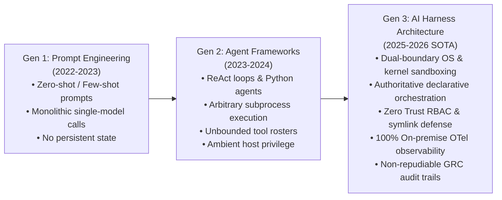
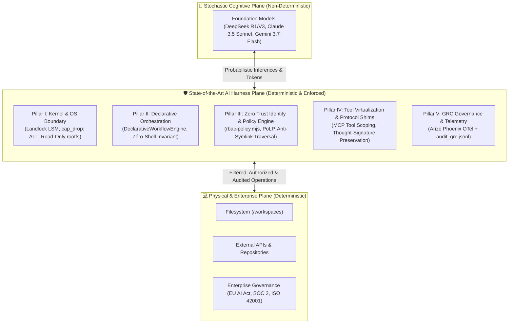
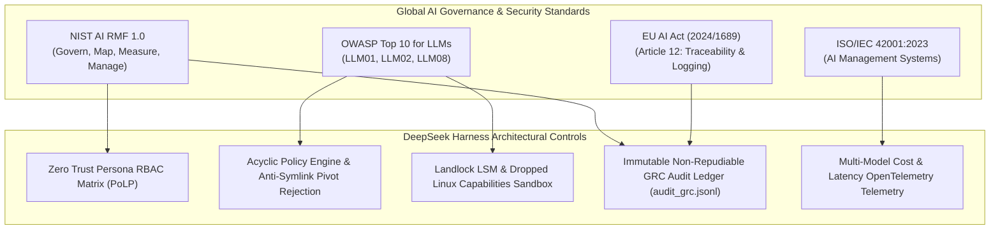

# 🏛️ State of the Art: AI Harness Architecture for Autonomous Agentic Systems

> **Reference Architecture & Engineering Specification**  
> *Author*: Principal Systems & AI Security Architecture  
> *Target Stack*: DeepSeek Harness Multi-Model Autonomous Matrix (`DSH-DDS`)  
> *Version*: 1.0.0 (Post-Audit v3 / ADRs 0001–0005)  
> *Classification*: Architectural Whitepaper & Research Synthesis  

---

## 📑 Abstract

Early deployments of Large Language Models (LLMs) in software engineering relied heavily on prompt tuning, unstructured context concatenation, and unconfined host subprocesses. In real-world enterprise environments, this paradigm fails catastrophically due to non-deterministic execution, prompt injection vulnerabilities, tool selection entropy, and lack of non-repudiable audit trails.

This document formalizes the **State of the Art (SOTA) in AI Harness Architecture**—the engineering discipline of constructing deterministic, zero-trust runtime scaffolds, kernel sandboxes, and policy interceptors around stochastic foundation models. We synthesize theoretical foundations from Stanford, Anthropic, Google Research, and NIST, establish the **5 Architectural Pillars of a SOTA AI Harness**, and provide an empirical comparative benchmark contrasting this repository's implementation against mainstream agent frameworks (CrewAI, Microsoft AutoGen, MetaGPT, LangGraph).

---

## 🎯 1. The Paradigm Shift: From Prompt Engineering to Harness Engineering

The evolution of agentic AI systems has traversed three distinct generational eras:



### The Monolithic & Unharnessed Failure Modes
Empirical research across production agent deployments highlights three primary structural failure modes when models operate without an authoritative harness:

1. **Context Degradation & Negative Constraint Dissolution**:
   * *Citation*: Liu et al. (2023), *Lost in the Middle: How Language Models Use Long Contexts* (TACL 2023 / arXiv:2307.03172).
   * *Mechanism*: As monolithic system prompts grow to incorporate dozens of disparate tools, domain rules, and safety warnings, model recall drops non-linearly for instructions placed in the middle 60% of the context window. Negative constraints (e.g., *"never modify files in `/etc`"*) reliably dissolve under multi-turn iterative reasoning.
2. **Tool Selection Entropy & Hallucinatory Invocation**:
   * *Citation*: Anthropic Research (2024), *Building Effective Agents*.
   * *Mechanism*: Exposing an autonomous model to an unpartitioned tool catalog dramatically increases the parameter search space, yielding combinatorial tool hallucinations, mismatched JSON arguments, and execution loops.
3. **Ambient Privilege Leakage & Remote Code Execution (RCE)**:
   * *Citation*: OWASP Foundation (2025), *Top 10 for Large Language Model Applications* (LLM01: Prompt Injection, LLM08: Excessive Agency).
   * *Mechanism*: Agents that execute commands via unconfined host shells (`sh`, `bash`, `subprocess.Popen`) allow indirect prompt injections embedded in external datasets (e.g., git commits, CSVs, documentation) to pivot into unrestricted arbitrary command execution on the host machine.
4. **The "Everything is a Plugin" Modularity Trap (Cordis Dependency Chaining)**:
   * *Citation*: Breath of Code (2026), *Why "Everything is a Plugin" is Harder Than It Sounds: Lessons from DeepSeek Harness*.
   * *Mechanism*: Frameworks that enforce an extreme "everything is a plugin" ethos without a privileged core create an illusion of simplicity. In reality, in-process plugins share execution context, memory, and credentials (`process.env`). Modularity becomes a fragile dependency chain where swapping or adding an unvetted community plugin can destabilize the runtime or introduce covert data-exfiltration vectors. Security cannot be a dynamic property of an unvetted plugin tree; it requires an invariant, deterministic harness boundary.

---

## 🧩 2. Formal Definition of an AI Harness

An **AI Harness** is the deterministic, bi-directional mediation envelope separating a non-deterministic cognitive engine from physical computational resources:

$$\mathcal{H}_{\text{AI}} = \langle \mathcal{K}_{\text{sandbox}}, \, \mathcal{O}_{\text{declarative}}, \, \mathcal{P}_{\text{RBAC}}, \, \mathcal{V}_{\text{tools}}, \, \mathcal{G}_{\text{observability}} \rangle$$

Where:
* $\mathcal{K}_{\text{sandbox}}$ represents the **Kernel & OS Boundary** (Landlock LSM, dropped POSIX capabilities, read-only rootfs).
* $\mathcal{O}_{\text{declarative}}$ represents the **Declarative Orchestration Engine** (acyclic execution graphs, typed capability adapters, zero-shell invariant).
* $\mathcal{P}_{\text{RBAC}}$ represents the **Zero Trust Policy Interceptor** (principle of least privilege, canonical realpath resolution, anti-symlink pivot rejection).
* $\mathcal{V}_{\text{tools}}$ represents **Tool Virtualization & Protocol Bridges** (scoped Model Context Protocol servers, cryptographic thought-signature preservation).
* $\mathcal{G}_{\text{observability}}$ represents the **GRC Governance & FinOps Engine** (immutable non-repudiable audit logs, distributed OpenTelemetry trace waterfalls).



---

## 🏛️ 3. The 5 Architectural Pillars of a SOTA AI Harness

### Pillar I: Kernel & Operating System Boundary ($\mathcal{K}_{\text{sandbox}}$)

The lowest layer of an AI Harness must enforce isolation through hardware and operating system kernel primitives rather than relying on application-level filtering:

1. **Linux Security Modules (LSM) & Landlock**:
   * *Mechanism*: Exploits Linux Landlock to restrict filesystem access rules at the kernel level for unprivileged processes, preventing child threads from accessing unmounted directories even in the event of an in-process RCE.
2. **POSIX Capabilities Dropping**:
   * *Standard*: Complete revocation of Linux capabilities (`cap_drop: [ALL]`), explicitly preventing `setuid`, `sys_chroot`, raw socket creation, and DAC override.
3. **Immutable Root Filesystems & Memory Jails**:
   * *Standard*: The container root filesystem is mounted strictly read-only (`read_only: true`). All transient session allocations occur in memory-backed volatile `tmpfs` mounts, ensuring zero persistence of rogue artifacts.
4. **Strict Fail-Closed Execution Perimeter**:
   * *Reference*: [ADR 0004: In-Container Execution Boundaries](adr/0004-in-container-boundaries-and-strict-directory-containment.md).
   * *Mechanism*: CLI entrypoints (`./dsh.sh persona workflow`) must disallow ambient host fallback. If the hardened container stack is offline, execution fails closed rather than executing with invoking developer user privileges on the host OS.

---

### Pillar II: Cognitive Scaffolding & Declarative Orchestration ($\mathcal{O}_{\text{declarative}}$)

A SOTA harness enforces that all automated multi-step actions execute via structured declarative recipes rather than dynamic shell scripting:

1. **The Zero-Shell Invariant**:
   * *Reference*: [ADR 0003: Authoritative Declarative Orchestrator](adr/0003-authoritative-declarative-orchestrator-and-capability-adapters.md).
   * *Rule*: No executable scripts (`.sh`, `.bash`, arbitrary `.py`) are permitted inside persona packages. Persona workflows are declared 100% in structured YAML (`persona.yaml`).
2. **Deterministic JavaScript Execution Engine**:
   * *Component*: [`config/declarative-orchestrator.mjs`](../config/declarative-orchestrator.mjs).
   * *Mechanism*: Evaluates step sequences through native typed capability adapters (`fetch_sources`, `evaluate_incident`, `forensic_investigation`, `contain_threat`, `write_report`). Any step invoking an unregistered or arbitrary command halts the pipeline immediately (`status: 'FAILED'`).
3. **Adaptive Case Management (ACM) & Human-in-the-Loop Gates**:
   * *Mechanism*: Steps tagged with `approval_required: true` transition the execution state machine into `GATED`. The harness halts execution, generates a cryptographic decision token, and emits an event to the GRC audit ledger pending out-of-band human sign-off.
4. **Truthful Capability Adapters**:
   * *Reference*: [ADR 0005: Remediation of Audit v3 Findings](adr/0005-remediation-of-audit-v3-findings.md).
   * *Standard*: Capability adapters must never return static mock successes. Operations perform verified cryptographic actions (e.g. SHA-256 computation on real filesystem bytes, active HTTP reachability probes with timeouts, and airgapped containment ledgers).

---

### Pillar III: Zero Trust Identity & Policy Interceptor ($\mathcal{P}_{\text{RBAC}}$)

The harness treats every persona as an untrusted micro-identity subject to continuous validation:

1. **Acyclic Policy Enforcement**:
   * *Component*: [`config/rbac-policy.mjs`](../config/rbac-policy.mjs).
   * *Mechanism*: An independent, acyclic policy engine that inspects every I/O target before execution. If a persona manifest omits an explicit `rbac:` policy, the orchestrator fails closed (`RBAC_POLICY_MISSING`).
2. **Prior Concrete Scope Resolution**:
   * *Standard*: Logical scopes (e.g. `scope: recursive`, `scope: workspace`) must be canonically resolved into concrete filesystem paths (`resolvePath('/workspaces')`) **before** invoking policy checks, eliminating unverified directory reading.
3. **Ancestor Canonicalization & Intermediate Symlink Defense**:
   * *Reference*: [ADR 0005: Remediation of Audit v3 Findings](adr/0005-remediation-of-audit-v3-findings.md) (F-02).
   * *Mechanism*: To prevent symlink pivot attacks (where an attacker creates `allowed/pivot/escaped.json` pointing to `/etc/shadow`), the policy engine executes `canonicalizeWithAncestorRealpath()` to resolve the physical realpath of the nearest existing ancestor directory. It then walks every path segment via `checkSymlinkEscape()`, terminating with `RBAC_SYMLINK_ESCAPE` if any segment points outside the container perimeter.
4. **Anti-Self-Mutation Invariant**:
   * *Rule*: All personas explicitly declare `config/personas/*` and administrative scripts (`reset.sh`, `install_dsh.sh`) in their `deny:` list, preventing an autonomous agent from rewriting its own constraints or tampering with adjacent personas.

---

### Pillar IV: Tool Virtualization & Protocol Bridges ($\mathcal{V}_{\text{tools}}$)

Foundation models must never communicate directly with bare operating system sockets:

1. **Model Context Protocol (MCP) Scoping**:
   * *Standard*: All tool integrations adhere to the open Model Context Protocol (Anthropic, 2024). Persona manifests declare an allowlist (`permissions.mcp.allowed`). Invocations of non-whitelisted MCP tools are blocked by the policy engine (`RBAC_MCP_FORBIDDEN`).
2. **Thought Signature Preservation Shims**:
   * *Component*: Dynamic runtime bridge in `pi-ai`.
   * *Problem*: Advanced reasoning models (e.g. Google Gemini 3.x Flash) generate internal cryptographic thought signatures during intermediate reasoning. Standard client libraries strip these tokens, breaking tool-call verification in subsequent turns.
   * *Solution*: The harness intercepts the incoming streaming chunks, caches the `thought_signature`, and transparently re-attaches it to outbound tool result payloads.
3. **Environment Indirection for Zero Secret Exposure**:
   * *Rule*: Manifests and skill files are forbidden from storing credentials. Secrets are resolved dynamically at runtime using in-memory variable references (`${GITHUB_PERSONAL_ACCESS_TOKEN}`).

---

### Pillar V: GRC Governance, Telemetry & FinOps ($\mathcal{G}_{\text{observability}}$)

An enterprise AI Harness must guarantee full visibility and legal auditability:

1. **100% Local OpenTelemetry Instrumentation**:
   * *Engine*: Arize Phoenix running locally on port `6006`.
   * *Guarantee*: Zero telemetry egress to third-party clouds. All multi-turn conversation traces, prompt token counts, latency waterfalls, and model evaluation metrics persist in local SQLite/Parquet databases.
2. **Immutable Non-Repudiable GRC Ledger (`audit_grc.jsonl`)**:
   * *Reference*: [ADR 0002: Out-of-Band GRC Observability](adr/0002-out-of-band-grc-and-deterministic-e2e-sandbox.md).
   * *Standard*: Every authorization check, gate suspension, and workflow outcome appends a structured JSON Lines record to `/root/.dsh/sessions/audit_grc.jsonl`:
     ```json
     {
       "timestamp": "2026-09-03T14:10:22.185Z",
       "event_type": "GRC_STEP_GATED",
       "persona": "security-auditor",
       "workflow": "incident_triage",
       "step_index": 2,
       "step_name": "Isolate Compromised Artifacts",
       "action": "contain_threat",
       "decision": "GATED",
       "trace_id": "4bf92f3577b34da6a3ce929d0e0e4736",
       "reason": "Human-in-the-loop approval required"
     }
     ```
3. **Multi-Model FinOps Routing**:
   * *Mechanism*: The harness provisions a 4-tier routing matrix (`default`, `reasoning`, `fast`, `multimodal`), dynamically tracking cost attribution and tokens across 420+ provider models synchronized at container boot (`sync_models.mjs`).

---

## 📊 4. Comparative Framework Benchmark

The table below contrasts **DeepSeek Harness (DSH-DDS)** against primary industry agent frameworks across the 5 SOTA Harness Dimensions:

| Evaluation Dimension | CrewAI | Microsoft AutoGen | MetaGPT | LangGraph | **DeepSeek Harness (This SOTA Stack)** |
| :--- | :--- | :--- | :--- | :--- | :--- |
| **Primary Architecture** | Python class agents | Conversable Python objects | Python SOP roles | Python StateGraphs | **6-Layer Declarative Persona Package (`persona.yaml`)** |
| **Pillar I: OS & Kernel Isolation** | None (Host Python process) | Docker option (Root / unhardened) | Process sandbox | None (Host runtime) | **Landlock LSM + `cap_drop: ALL` + Read-Only rootfs + Fail-Closed Boundary** |
| **Pillar II: Workflow Orchestration** | Imperative Python code | Conversational chat loop | Standard operating procedures | Programmatic graph nodes | **100% Declarative YAML (`DeclarativeWorkflowEngine`) + Zero-Shell Invariant** |
| **Pillar III: Access Control & RBAC** | Prompt-level guidelines | None (Jailbreakable via prompt) | Class-level checks | Application logic | **Acyclic Zero Trust Policy Engine + Anti-Symlink Traversal (`config/rbac-policy.mjs`)** |
| **Anti-Self-Mutation** | Vulnerable (Agent can edit `.py`) | Vulnerable | Vulnerable | Application dependent | **Enforced Invariant (`deny: config/personas/*`, `reset.sh`)** |
| **Pillar IV: Tool Interface** | LangChain / Python tools | Python functions | Python action classes | LangChain tools | **Model Context Protocol (MCP) + Gemini Thought Signature Bridge** |
| **Pillar V: GRC & Governance** | Ephemeral console output | Standard logging | Output text files | Cloud LangSmith (Commercial) | **Local Arize Phoenix OTel + Immutable `audit_grc.jsonl` Ledger** |
| **Human-in-the-Loop** | Callback hooks | Input prompts | Human participant role | `interrupt_before` / `after` | **Formal Adaptive Case Management (ACM) with `GATED` Audit State** |
| **Supply Chain Hardening** | Unpinned pip wheels | Unpinned pip wheels | Unpinned pip dependencies | Unpinned pip dependencies | **Pinned SHA-256 Digests + Pinned `pnpm@11.25.0` + Clean-Room Installer Parity** |

---

## 📜 5. Alignment with International Standards & Security Frameworks

The AI Harness Architecture directly addresses the governance mandates of leading cybersecurity and artificial intelligence standards:



### 1. NIST AI Risk Management Framework (NIST AI RMF 1.0)
* **Govern 1.2 & 1.3**: Policies, processes, and responsibilities for AI systems are documented and enforced via immutable `persona.yaml` declarations.
* **Measure 2.6 & 2.7**: System performance and autonomous actions are tracked continuously via OpenTelemetry traces in Arize Phoenix.
* **Manage 2.2**: High-consequence actions trigger formal approval gates (`approval_required: true`), maintaining human oversight.

### 2. OWASP Top 10 for LLMs (2025 Edition)
* **LLM01 (Prompt Injection)**: Prompt injections cannot compromise the host because the agent is stripped of arbitrary shell execution capabilities (`workflow.sh` eliminated).
* **LLM02 (Sensitive Information Disclosure)**: Filesystem targets are constrained strictly to `/workspaces`. Critical credentials in `/etc` and `/root/.ssh` are blocked at the policy interceptor level.
* **LLM08 (Excessive Agency)**: Personas operate under Least Privilege with scoped MCP server access and explicit permission matrices.

### 3. EU AI Act (Regulation EU 2024/1689)
* **Article 12 (Record-Keeping)**: High-risk AI systems must implement automated logging capabilities. The harness guarantees continuous recording of every authorization decision in `audit_grc.jsonl` with timestamps and cryptographic trace IDs.
* **Article 14 (Human Oversight)**: The Adaptive Case Management state machine enables human intervention prior to the execution of disruptive actions.

---

## 📚 6. Academic & Industry Bibliography

1. **Liu, N. F., Lin, K., Hewitt, J., Paranjape, A., Bevilacqua, M., Petroni, F., & Liang, P.** (2023). *Lost in the Middle: How Language Models Use Long Contexts*. Transactions of the Association for Computational Linguistics (TACL), 12, 157–173. [arXiv:2307.03172](https://arxiv.org/abs/2307.03172).
2. **Park, J. S., O'Brien, J. C., Cai, C. J., Morris, M. R., Liang, P., & Bernstein, M. S.** (2023). *Generative Agents: Interactive Simulacra of Human Behavior*. In Proceedings of the 36th Annual ACM Symposium on User Interface Software and Technology (UIST '23), 1–22. [arXiv:2304.03442](https://arxiv.org/abs/2304.03442).
3. **Anthropic Research**. (2024). *Building Effective Agents*. Anthropic Engineering Publications. [https://www.anthropic.com/research/building-effective-agents](https://www.anthropic.com/research/building-effective-agents).
4. **National Institute of Standards and Technology (NIST)**. (2023). *Artificial Intelligence Risk Management Framework (AI RMF 1.0)*. NIST Trustworthy and Responsible AI, NIST AI 100-1. [https://doi.org/10.6028/NIST.AI.100-1](https://doi.org/10.6028/NIST.AI.100-1).
5. **OWASP Foundation**. (2025). *OWASP Top 10 for Large Language Model Applications (v2.0)*. Open Web Application Security Project. [https://genai.owasp.org/llm-top-10/](https://genai.owasp.org/llm-top-10/).
6. **Wang, L., Ma, C., Feng, X., Zhang, Z., Yang, H., Chen, J., Tang, J., Chen, X., Lin, Y., Zhao, W. X., Wei, Z., & Wen, J. R.** (2024). *A Survey on Large Language Model based Autonomous Agents*. Frontiers of Computer Science, 18(6), 186345. [arXiv:2308.11432](https://arxiv.org/abs/2308.11432).
7. **Google Cybersecurity Action Team**. (2023). *Secure AI Framework (SAIF): A Guide to Applying Cybersecurity Best Practices to AI*. Google Security Whitepapers.
8. **International Organization for Standardization**. (2023). *ISO/IEC 42001:2023: Information technology — Artificial intelligence — Management system*. ISO Standard Publications.
9. **Breath of Code**. (2026). *Why "Everything is a Plugin" is Harder Than It Sounds: Lessons from DeepSeek Harness*. Medium Technical Dissections. [https://breathofcode.medium.com/why-everything-is-a-plugin-is-harder-than-it-sounds-lessons-from-deepseek-harness-c7e94d044d3a](https://breathofcode.medium.com/why-everything-is-a-plugin-is-harder-than-it-sounds-lessons-from-deepseek-harness-c7e94d044d3a).

---

## 🔗 Internal Repository Cross-References

* 🏛️ **System Architecture & Container Topology**: [docs/architecture.md](architecture.md)
* 🎭 **Persona Manifest & Multi-Model Matrix Specification**: [docs/personas.md](personas.md)
* 🔒 **Security Model, Threat Vectors & Hardening**: [docs/security.md](security.md)
* 🔬 **Theoretical Foundations & Research Notes**: [docs/research-notes-ai-personas.md](research-notes-ai-personas.md)
* 📜 **Architecture Decision Records (ADRs)**:
  - [ADR 0001: Build-Time Immutability & Zero Trust RBAC](adr/0001-build-time-immutability-and-rbac.md)
  - [ADR 0002: Out-of-Band GRC Observability & Deterministic Sandbox](adr/0002-out-of-band-grc-and-deterministic-e2e-sandbox.md)
  - [ADR 0003: Authoritative Declarative Orchestrator](adr/0003-authoritative-declarative-orchestrator-and-capability-adapters.md)
  - [ADR 0004: In-Container Boundaries & Strict Containment](adr/0004-in-container-boundaries-and-strict-directory-containment.md)
  - [ADR 0005: Remediation of Audit v3 Findings](adr/0005-remediation-of-audit-v3-findings.md)
