# 🏛️ DeepSeek Harness & Phoenix System Architecture

> 🏛️ **Comprehensive State-of-the-Art Whitepaper**: For theoretical foundations, NIST/OWASP compliance mapping, and the 5-Pillar SOTA AI Harness engineering specification, see **[SOTA AI Harness Architecture](ai-harness-architecture-sota.md)**.
> 
> 🌐 **Ecosystem Comparison**: For architectural comparisons against OpenHands, SWE-agent, Goose, LangGraph, AutoGen, CrewAI, and NeMo Guardrails, see **[Open Source Landscape & Ecosystem Comparison](ecosystem-comparison.md)**.
> 
> 🏗️ **Global Architecture Refactoring Blueprint**: For the 9-pillar refactoring specification (root role elimination, native Cordis IoC plugins, and pnpm.patchedDependencies), see **[Global Refactoring Blueprint](globalrefactoring/README.md)** and **[ADR 0006: Global Refactoring](adr/0006-global-refactoring-non-root-fhs-cordis-plugin.md)**.
> 
> 🔒 **Sandbox Hardening & Supply Chain**: For credential isolation, GRC audit retention, and production cgroup limits, see **[ADR 0008: Container Sandbox Hardening](adr/0008-container-sandbox-hardening-and-supply-chain-remediation.md)**.
> 
> 📐 **Interactive Archify Visualizations**: Explore verified, interactive architecture and workflow maps featuring dark/light modes, route tracing, and state inspections:
> * 🗺️ **[System Runtime Architecture](diagrams/system-runtime.architecture.html)** (`system-runtime.architecture.json`) — Dual-container topology, kernel isolation, and Envoy egress proxy.
> * 🛡️ **[Zero-Trust PEP & RBAC Pipeline](diagrams/security-pipeline.workflow.html)** (`security-pipeline.workflow.json`) — In-line tool interceptor, symlink escape trap, and GRC audit ledger.
> * 🔄 **[Declarative Workflow & Loop Trap](diagrams/declarative-workflow.workflow.html)** (`declarative-workflow.workflow.json`) — Invariant 7 hash ring, ACM approval gate, and checkpoint sync.
> * ⚡ **[Agent Execution & OTLP Telemetry](diagrams/agent-trace.sequence.html)** (`agent-trace.sequence.json`) — End-to-end request lifecycle, BYOK vault, and local Arize Phoenix waterfall.

```mermaid
flowchart TD
    subgraph Host ["💻 Host Environment (127.0.0.1)"]
        ENV[".env Configuration\n(Keys, Ports, Tokens)"]
        VOL_ETC["📁 ./config (Mounted to /etc/dsh :ro)"]
        VOL_AUDIT["📁 ./config/audit (Mounted to /var/lib/dsh/audit :rw)"]
        VOL_STATE["📁 ./config/{sessions,storages,cache}\n(Mounted to /var/lib/dsh/... :rw)"]
        VOL_PHX["📁 ./config/phoenix\n(Mounted to /home/phoenix/.phoenix :rw)"]
        VOL_WS["📁 ./workspaces\n(Mounted to /workspaces :ro / :rw)"]
        DEV_OVERRIDE["📁 docker-compose.dev.yml\n(Isolated Live Mounts)"]
        BROWSER["🌐 User Browser\n(Web UI: 3080 | Phoenix: 6006)"]
    end

    subgraph DSH_Container ["🐳 Container: dsh-local (UID 1000:1000, cap_drop: ALL, 2 CPU / 4GB)"]
        CORE["⚡ DeepSeek Harness Kernel (Port 3080)\n@deepseek-ai/dsh (Cordis Microkernel)"]
        
        subgraph Core_Plugin ["🧩 Native Core Plugin: @dsh-dds/core (Level 4.0)"]
            GW["🌐 WebServer Gateway Middleware\n(Bridge IP Recognition & Origin Normalization)"]
            IAM["👤 Identity & Access Management\n(Token Auth & Context Enrichment)"]
            VAULT["🔐 BYOK Encrypted Vault\n(/dsh-dds/api/vault/keys & AES-256-GCM)"]
            PEP["🛡️ In-Line Tool Interceptor (PEP)\n(Dynamic Policy & Tenant Confinement)"]
            RESTART["🔄 Lifecycle Supervisor\n(/dsh-dds/lifecycle/restart & /dsh-dds/health)"]
            CATALOG["⚡ In-Process ModelCatalogService\n(/dsh-dds/api/models/sync & OTel Init)"]
            I18N["🌐 Web UI Localization Tap\n(In-Memory HTML tapIndex)"]
        end

        subgraph Plugins ["🧩 Pre-Packaged Plugin Suite (10 Plugins)"]
            PLUG_SRC["@liustack/modsearch (Web Search)"]
            PLUG_FLOW["deepseek-flow (Visual Workflow Canvas)"]
            PLUG_MKT["dshmarket (Plugin Market)"]
            PLUG_FIND["dsh-find-plugin (File Finder)"]
            PLUG_MCP_PNL["dsh-mcp-panel & dsh-mcp-market"]
            PLUG_CFG["dsh-provider-model-configurator"]
            PLUG_SYNC["dsh-model-sync (Quota & Token Monitor)"]
            PLUG_MNEM["dsh-mnemon (Unified Memory System)"]
            PLUG_DISTILL["dsh-session-reader (Cross-Session Reader)"]
        end

        subgraph MCP_Servers ["🔌 Integrated MCP Servers"]
            MCP_FETCH["fetch (mcp-server-webresearch)"]
            MCP_CTX["context7 (context7-mcp)"]
            MCP_GH["github (github-mcp-server)"]
            MCP_SQL["sqlite-db (mcp-server-sqlite)"]
        end

        subgraph LLM_Bridges ["🧠 Model Provider Orchestration"]
            BRIDGE_GEMINI["Google Gemini Thought Signature Bridge\n(Native pnpm patch in pi-ai)"]
            AUTO_SYNC["ModelCatalogService In-Process Engine\n(Fetches 420+ OpenRouter & 31+ Google Models)"]
        end

        OTEL_EXPORTER["📡 OTel Trace Exporter\n(@deepseek-ai/dsh-session-telemetry-otel)"]
    end

    subgraph Egress_Sidecar ["🔒 Egress Filter Sidecar (ADR 0007 / ADR 0008)"]
        ENVOY["🛡️ Envoy Proxy Sidecar v1.31\n(Strict DNS Caching & Egress Lockdown)"]
    end

    subgraph Phoenix_Container ["📊 Container: dsh-phoenix (UID 1000:1000, cap_drop: ALL)"]
        PHOENIX_SRV["🔥 Arize Phoenix Engine (Port 6006)"]
        SQLITE_DB["💾 SQLite DB (/home/phoenix/.phoenix/phoenix.db)\n(Persisted to ./config/phoenix)"]
        TRACES["🌊 Distributed Trace Waterfall & Evals"]
    end

    subgraph External_APIs ["☁️ External Cloud Providers"]
        API_GEMINI["Google AI Studio API\n(Gemini 3.7 Flash / 3.6 Flash)"]
        API_OPENROUTER["OpenRouter API Gateway\n(DeepSeek V3, R1, Claude, GPT-4o)"]
        API_GITHUB["GitHub REST / GraphQL API\n(Repos, PRs, Commits)"]
    end

    %% Connections
    BROWSER -->|Port 3080| GW
    GW --> CORE
    BROWSER -->|Port 6006| PHOENIX_SRV
    CORE --> Core_Plugin
    CORE --> Plugins
    CORE --> MCP_Servers
    CORE --> LLM_Bridges
    
    %% Governed Egress
    PEP -->|Restricted Egress| ENVOY
    ENVOY --> API_GEMINI
    ENVOY --> API_OPENROUTER
    MCP_GH --> API_GITHUB
    
    CORE -->|OTLP Traces| OTEL_EXPORTER
    OTEL_EXPORTER -->|HTTP /v1/traces| PHOENIX_SRV
    PHOENIX_SRV --> SQLITE_DB
    PHOENIX_SRV --> TRACES
    CATALOG -->|GraphQL / SQLite| PHOENIX_SRV

    VOL_ETC -.->|/etc/dsh :ro| CORE
    VOL_AUDIT -.->|/var/lib/dsh/audit :rw| CORE
    VOL_STATE -.->|/var/lib/dsh :rw| CORE
    VOL_PHX -.-> SQLITE_DB
    VOL_WS -.-> CORE
```



---

## 🏗️ Core Layers

### 1. Dual-Container Non-Root Runtime Layer
* **`dsh-local`**: Hardened production Node.js 24 multi-stage image built from `node:24-bookworm-slim`. Executes unprivileged as user `dsh:dsh` (UID/GID 1000) with stripped Linux capabilities (`cap_drop: [ALL]`) and disabled privilege escalation (`security_opt: [no-new-privileges:true]`).
  - Strict Linux FHS directory segregation: `/etc/dsh` (read-only configuration), `/var/lib/dsh` (mutable runtime state), `/var/lib/dsh/profiles` (sticky tmpfs `mode=1777`), and `/workspaces` (user project files).
  - Cgroup resource limits enforced in production (`cpus: '2.0'`, `memory: 4096M`, `pids: 512`), preventing runaway agent loops from exhausting host memory or process tables.
  - Multi-stage build isolates compiler toolchains (`g++`, `make`) to the builder stage and purges compilers from the runner stage, achieving a slim content size and eliminating Living-off-the-Land (LotL) compiler exploitation.
  - Production image immutability: development live mounts (`@dsh-dds/core` and `entrypoint.sh`) are isolated in `docker-compose.dev.yml`; production compose runs strictly from immutable image layers.
  - Threat Model Demarcation: The Node.js loader (`loader.mjs` / `NODE_OPTIONS`) functions as an application-level Policy Enforcement Point (PEP) and runtime compatibility shim. Hard process isolation and filesystem confinement are enforced by the Linux kernel (namespaces, cgroups, capability stripping, Landlock LSM, and read-only rootfs).
  - Binds native Cordis HTTP server to `0.0.0.0:3080` internally, exposed strictly on loopback `127.0.0.1:3080`.
* **`dsh-phoenix`**: Hardened Arize Phoenix instance (`arizephoenix/phoenix:20.5.0`) executing unprivileged as UID 1000 with `cap_drop: [ALL]`. Runs on port `6006` bound strictly to `127.0.0.1` with state persisted to `./config/phoenix` (`/home/phoenix/.phoenix/phoenix.db`).

### 2. Native Cordis Core Plugin Architecture (`@dsh-dds/core`)
* **Inversion-of-Control Microkernel**: Rather than ad-hoc monkey-patch scripts, system extension is implemented via the in-tree `@dsh-dds/core` plugin:
  - **Gateway Middleware**: Intercepts HTTP requests on `ctx.webServer`, normalizes Host/Origin headers, recognizes trusted Docker bridge networks, and provides `/dsh-dds/health` and `/dsh-dds/lifecycle/restart`.
  - **In-Process Model Catalog**: `ModelCatalogService` manages real-time pricing and context specs for 420+ models in memory without external cron shells or subshell polling.
  - **In-Memory Localization**: Taps the root HTML document via `ctx.webServer.tapIndex()` to deliver seamless English localization at runtime.
  - **In-Line RBAC PEP**: Dynamically intercepts `tool-execute` events to contain path traversal and enforce persona permissions in real time.

### 3. Native Package Mutation Engine (`pnpm.patchedDependencies`)
* Eliminates hijacked wrapper binaries and post-install regex scripts.
* Mutations to upstream packages (`dsh-mnemon`, `@deepseek-ai/dsh-session`, and `@earendil-works/pi-ai`) are maintained as standard unified diffs in `config/profiles/web/patches/` and recorded directly in `package.json#pnpm.patchedDependencies`.
* Preserves Google Gemini thought signatures and fixes session iterable getters natively during package installation.

### 4. Authoritative Declarative Orchestrator & Acyclic Policy Engine (`config/`)
* **`DeclarativeWorkflowEngine` ([declarative-orchestrator.mjs](../config/declarative-orchestrator.mjs))**: Evaluates 100% declarative workflow recipes defined in `persona.yaml` natively in JavaScript. Implements 15 typed capability adapters with real cryptographic SHA-256 hashing, real HTTP endpoint reachability probes, and airgap containment ledgers.
* **Acyclic Policy Engine ([rbac-policy.mjs](../config/rbac-policy.mjs))**: Single source of truth for Zero Trust RBAC policy enforcement, canonical path resolution (`resolvePath`), strict directory containment (`isContainedWithin`), symlink ancestor canonicalization (`canonicalizeWithAncestorRealpath`), and escape detection (`checkSymlinkEscape`).
* **Multi-State GRC Audit Trail (`config/audit/audit_grc.jsonl`)**: Records structured decision lifecycle events (`POLICY_DECISION`, `STEP_GATED`, `STEP_COMPLETED`, `STEP_FAILED`) with 128-bit OTel parent-child span correlation (`AgentPhoenixTracer`), persisted to `./config/audit` across both standard and sandbox executions.
* **In-Container Execution Boundary ([dsh.sh](../dsh.sh))**: Dispatches workflow execution directly into the running container (`docker compose exec dsh`), enforcing container Landlock LSM confinement, dropped capabilities (`cap_drop: ALL`), and non-root execution.

### 5. Archify Verifiable Architecture Visualizations (`docs/diagrams/`)
The repository includes deterministic, interactive visual maps compiled via **[Archify](https://github.com/tt-a1i/archify)** (`@tt-a1i/archify-dsh`). All diagrams are validated against typed JSON schemas with 100% showcase quality:

1. **[System Runtime Architecture](diagrams/system-runtime.architecture.html)** (`docs/diagrams/system-runtime.architecture.json`):
   - Maps the dual-container topology, non-root user confinement (`1000:1000`), `@dsh-dds/core` Gateway, BYOK Vault, Envoy v1.31 egress proxy sidecar ([ADR 0007](adr/0007-rejection-of-in-container-antigravity-and-credential-isolation.md), [ADR 0008](adr/0008-container-sandbox-hardening-and-supply-chain-remediation.md)), and Arize Phoenix storage.
2. **[Zero-Trust PEP & Dynamic RBAC Pipeline](diagrams/security-pipeline.workflow.html)** (`docs/diagrams/security-pipeline.workflow.json`):
   - Details the in-line interceptor lifecycle, persona read/write allowlists, ancestor canonicalization symlink escape detection (F-02), and immutable GRC audit logging.
3. **[Declarative Workflow & Invariant 7 Loop Trap](diagrams/declarative-workflow.workflow.html)** (`docs/diagrams/declarative-workflow.workflow.json`):
   - Shows the 12-step hash ring buffer detecting and preventing infinite tool/model invocation loops (`LOOP_DETECTED`), coupled with asymmetric Ed25519 ACM human approval gates.
4. **[Agent Execution & OTLP Telemetry Sequence](diagrams/agent-trace.sequence.html)** (`docs/diagrams/agent-trace.sequence.json`):
   - Sequences end-to-end prompt processing, AES-256-GCM BYOK credential decryption, Google Gemini thought signature preservation, and zero-leakage local Phoenix telemetry emission.

To recompile or validate diagrams:
```bash
npm run diagrams:build
```


