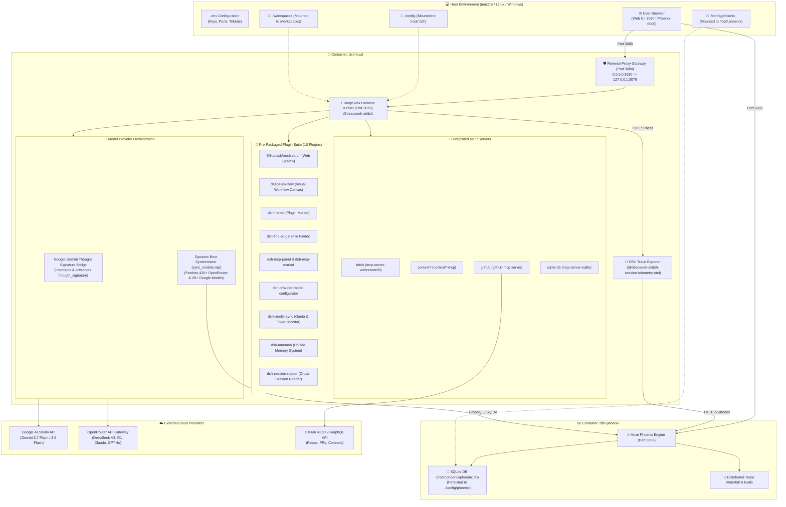

# 🏛️ DeepSeek Harness & Phoenix System Architecture

---

## 🏗️ Core Layers

### 1. Dual-Container Runtime Layer
* **`dsh-local`**: Minimal production Node.js 24 image based on pinned digest `smanx/deepseek-harness:0.1.1-rc.2`. Compiles native binaries (`node-pty`) via multi-stage `pnpm`, embeds prebuilt plugins and MCP binaries, and exposes proxy port `3080` bound strictly to `127.0.0.1`.
* **`dsh-phoenix`**: Open-source Arize Phoenix instance (`arizephoenix/phoenix:20.5.0`) running uvicorn/Python on port `6006` bound strictly to `127.0.0.1` with embedded SQLite persistence.

### 2. Google Gemini Thought Signature Bridge
* In modern Gemini 3.x / 2.x Flash models, Google AI Studio generates reasoning tokens that require a proprietary `extra_content.google.thought_signature` when returning tool results in multi-turn conversations.
* DSH-DDS embeds an in-memory thought signature interceptor in `pi-ai` that captures the signature on chunk streams (Step 1) and re-attaches it on outbound tool response payloads (Step 2).

### 3. Dynamic Boot-Time Model Synchronizer (`sync_models.mjs`)
* Automatically queries `https://openrouter.ai/api/v1/models` and `https://generativelanguage.googleapis.com/v1beta/models` every time the container boots.
* Ingests all **420+ models** with real-time prompt/completion token pricing directly into the Arize Phoenix SQLite database and DeepSeek Harness runtime.

### 4. Authoritative Declarative Orchestrator & Acyclic Policy Engine (`config/`)
* **`DeclarativeWorkflowEngine` ([declarative-orchestrator.mjs](../config/declarative-orchestrator.mjs))**: Evaluates 100% declarative workflow recipes defined in `persona.yaml` natively in JavaScript, permanently replacing shell scripts. Implements 15 typed capability adapters with real cryptographic SHA-256 hashing, real HTTP endpoint reachability probes, and airgap containment ledgers.
* **Acyclic Policy Engine ([rbac-policy.mjs](../config/rbac-policy.mjs))**: Single source of truth for Zero Trust RBAC policy enforcement, canonical path resolution (`resolvePath`), strict directory containment (`isContainedWithin`), symlink ancestor canonicalization (`canonicalizeWithAncestorRealpath`), and escape detection (`checkSymlinkEscape`).
* **Multi-State GRC Audit Trail (`config/audit/audit_grc.jsonl`)**: Records structured decision lifecycle events (`POLICY_DECISION`, `STEP_GATED`, `STEP_COMPLETED`, `STEP_FAILED`) with 128-bit OTel parent-child span correlation (`AgentPhoenixTracer`).
* **In-Container Execution Boundary ([dsh.sh](../dsh.sh))**: Dispatches workflow execution directly into the running container (`docker compose exec dsh`), enforcing container Landlock LSM confinement, dropped capabilities (`cap_drop: ALL`), and read-only root filesystems.
