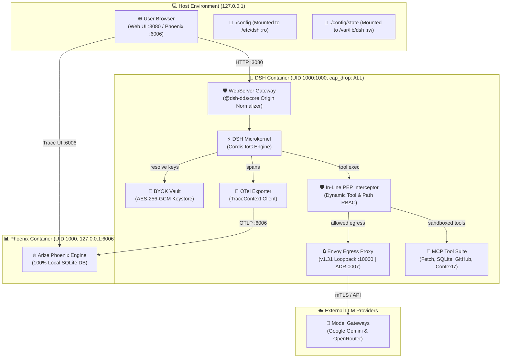
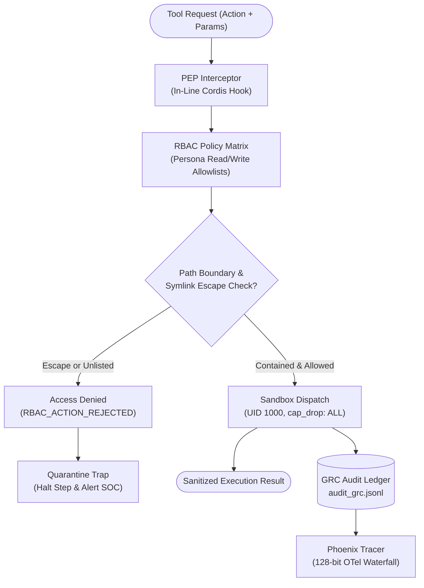
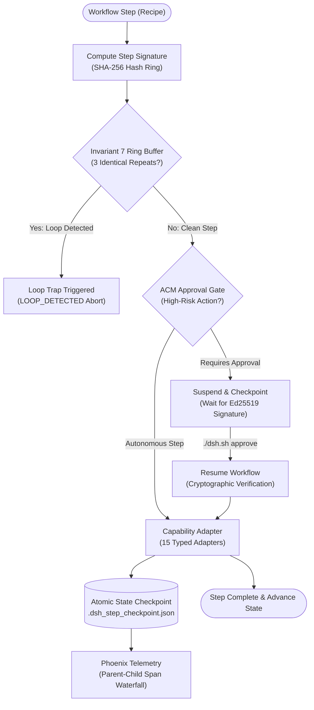
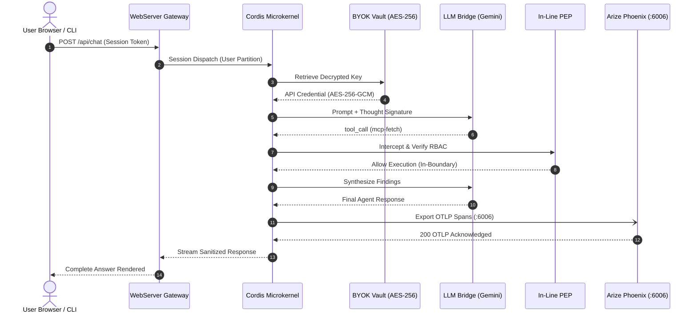

# 📐 Archify Architecture & Workflow Visualizations

Interactive, verifiable system architecture, workflow, and sequence diagrams for **DeepSeek Harness (DSH-DDS)** compiled deterministically using **[Archify](https://github.com/tt-a1i/archify)** (`@tt-a1i/archify-dsh`).

All diagrams in this directory are authored as typed JSON Intermediate Representations (IR), validated against strict schemas, and rendered to self-contained, publication-ready HTML/SVG artifacts featuring:
* 🌓 **Dark / Light mode** toggling with persistent visual presets
* 🔍 **Pan, zoom, search, and focus** modes for interactive inspection
* 🎬 **Story chapters** and guided walkthroughs
* 📦 **Truthful export** to PNG, SVG, WebM, and canonical 1200×630 Share Cards
* 🛡️ **Showcase quality certification** (9/9 artifact checks passed, 0 composition errors, 0 warnings)

---

## 🗺️ Interactive Diagram Index

| Diagram Type | Title & Artifact | Specification (IR) | Focus & Highlights |
| :--- | :--- | :--- | :--- |
| **`architecture`** | **[System Runtime Architecture](system-runtime.architecture.html)** | [`system-runtime.architecture.json`](system-runtime.architecture.json) | Non-root container sandbox (UID 1000), `@dsh-dds/core` Gateway, in-line PEP, BYOK Vault, Envoy egress proxy (ADR 0007), and local Arize Phoenix trace storage. |
| **`workflow`** | **[Zero-Trust PEP & RBAC Pipeline](security-pipeline.workflow.html)** | [`security-pipeline.workflow.json`](security-pipeline.workflow.json) | Real-time tool interception, canonical path resolution, symlink traversal detection (F-02), fail-closed quarantine traps, and immutable GRC audit logging. |
| **`workflow`** | **[Declarative Workflow & Loop Trap](declarative-workflow.workflow.html)** | [`declarative-workflow.workflow.json`](declarative-workflow.workflow.json) | Deterministic step hashing, Invariant 7 loop trap ring buffer (`LOOP_DETECTED`), ACM approval gate (`./dsh.sh approve`), and 15 typed capability adapters. |
| **`sequence`** | **[Agent Execution & OTLP Telemetry](agent-trace.sequence.html)** | [`agent-trace.sequence.json`](agent-trace.sequence.json) | User request lifecycle, AES-256-GCM BYOK key decryption, Gemini thought signature preservation, governed tool dispatch, and local Phoenix OTLP waterfall. |

---

## 🏛️ Diagram 1: System Runtime Architecture & Isolation

**Interactive Artifact:** [`system-runtime.architecture.html`](system-runtime.architecture.html)  
**JSON Specification:** [`system-runtime.architecture.json`](system-runtime.architecture.json)



---

## 🛡️ Diagram 2: Zero-Trust PEP & Dynamic RBAC Pipeline

**Interactive Artifact:** [`security-pipeline.workflow.html`](security-pipeline.workflow.html)  
**JSON Specification:** [`security-pipeline.workflow.json`](security-pipeline.workflow.json)



---

## 🔄 Diagram 3: Declarative Workflow & Invariant 7 Loop Trap

**Interactive Artifact:** [`declarative-workflow.workflow.html`](declarative-workflow.workflow.html)  
**JSON Specification:** [`declarative-workflow.workflow.json`](declarative-workflow.workflow.json)



---

## ⚡ Diagram 4: Agent Execution & OTLP Telemetry Sequence

**Interactive Artifact:** [`agent-trace.sequence.html`](agent-trace.sequence.html)  
**JSON Specification:** [`agent-trace.sequence.json`](agent-trace.sequence.json)



---

## 🛠️ CLI & Build Commands

Re-compile or validate all diagrams anytime using the project scripts:

```bash
# Build and deliver all diagrams with showcase validation:
npm run diagrams:build

# Validate an individual diagram specification:
npm run archify -- validate architecture docs/diagrams/system-runtime.architecture.json --quality showcase

# Launch local interactive preview:
npm run archify -- preview architecture docs/diagrams/system-runtime.architecture.json
```
