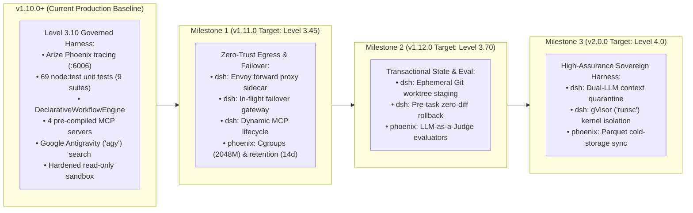

# 🗺️ DSH-DDS Engineering Roadmap & Sprints

This document defines the actionable, milestone-by-milestone engineering roadmap for `DSH-DDS`. It translates the architectural requirements established in [`SOTA-ResearchReport-ProductionArch.md`](SOTA-ResearchReport-ProductionArch.md) into concrete, trackable development tasks across both the **DSH Engine Container (`dsh`)** and the **OpenTelemetry Container (`phoenix`)**.

---

## 🎯 Milestone Overview



---

## 🚀 Milestone 1 (v1.11.0) — Zero-Trust Network Egress, Model Failover & Telemetry Hardening

* **Target Release:** `v1.11.0`
* **Focus Areas:** Network perimeter containment, model resilience, dynamic plugin governance, and Phoenix resource bounds.

### Track A: DSH Engine Container (`dsh`)

> [!TIP]
> **Implementation Blueprints**: Refer to [Section 8.1 (`envoy-egress.yaml`)](SOTA-ResearchReport-ProductionArch.md#81-network-egress-proxy-configuration-with-antigravity-support-confignetworkenvoy-egressyaml), [Section 8.2 (`antigravity-search.mjs`)](SOTA-ResearchReport-ProductionArch.md#82-antigravity-search-tool-wrapper-configantigravity-searchmjs), [Section 8.3 (`failover-gateway.mjs`)](SOTA-ResearchReport-ProductionArch.md#83-in-flight-model-failover-gateway-configfailover-gatewaymjs), and [Section 8.5 (`docker-compose.sandbox.yml`)](SOTA-ResearchReport-ProductionArch.md#85-hardened-sandbox-specification-with-antigravity-auth-mount-docker-composesandboxyml) for production code specifications.

#### Task A.1: Envoy Egress Forward Proxy Sidecar (`config/network/envoy-egress.yaml`)
* [ ] **Objective**: Prevent unmediated outbound WAN access from the sandbox while allowing authorized LLM APIs, package registries, and Google Antigravity.
* [ ] **Implementation Steps**:
  1. Add `egress-filter` service (`envoyproxy/envoy:v1.31-latest`) to `docker-compose.sandbox.yml`.
  2. Map `dsh-internal` (no direct WAN) and `dsh-egress-net` (bridge to WAN) to the Envoy proxy.
  3. Configure domain allowlist in `config/network/envoy-egress.yaml`:
     - **LLM Endpoints**: `generativelanguage.googleapis.com:443`, `openrouter.ai:443`.
     - **Google Antigravity**: `antigravity.google:443`, `*.antigravity.google:443`, `oauth2.googleapis.com:443`.
     - **GitHub & Registries**: `api.github.com:443`, `github.com:443`, `registry.npmjs.org:443`, `pypi.org:443`.
  4. **MCP-Safe Tier 2 Filter**: Restrict arbitrary web fetching for `mcp-fetch` to HTTP `GET` and `HEAD` methods with a 10s timeout; drop all outbound `POST`/`PUT`/`DELETE` attempts with `HTTP 403`.
* [ ] **Acceptance Criteria**:
  - Outbound `curl -I https://generativelanguage.googleapis.com` succeeds through proxy.
  - Outbound `curl https://attacker-c2.com` drops immediately with a connection timeout or 403.

#### Task A.2: Native Cordis In-Flight Failover Gateway (`config/failover-gateway.mjs`)
* [ ] **Objective**: Transparently catch upstream HTTP 429 (Rate Limit) and HTTP 503 (Overloaded) errors mid-workflow without aborting the agent loop.
* [ ] **Implementation Steps**:
  1. Implement `config/failover-gateway.mjs` as an in-process Cordis service (`ctx.provide('gateway')`).
  2. Implement cascade array: `gemini-2.5-flash` $\rightarrow$ `openrouter/claude-3.5-sonnet` $\rightarrow$ `openrouter/llama-3.3-70b-instruct`.
  3. Implement schema translation between Gemini `functionDeclarations` and OpenRouter OpenAI-compatible tool calls.
  4. Register plugin in `config/profiles/web/cordis.patch.yml`.
* [ ] **Acceptance Criteria**:
  - Injected synthetic HTTP 429 triggers automated failover to secondary provider in $<1.5\text{ s}$ with conversation context preserved.

#### Task A.3: Typed Google Antigravity Search Tool (`config/antigravity-search.mjs`)
* [ ] **Objective**: Encapsulate the headless Google Antigravity CLI (`agy`) as a typed Cordis tool for agent personas.
* [ ] **Implementation Steps**:
  1. Create `config/antigravity-search.mjs` exporting a Cordis `search` service.
  2. Execute `agy -p "<query>" --dangerously-skip-permissions` with non-interactive execution.
  3. Bind HTTP/HTTPS proxy environment variables to the Envoy sidecar.
* [ ] **Acceptance Criteria**:
  - Agent querying web search receives clean, structured markdown without spawning in-container browser engines.

#### Task A.4: Dynamic On-The-Fly Plugin & MCP Lifecycle Governance
* [ ] **Objective**: Enable developers to safely add plugins and MCP servers at runtime via UI or prompt without breaking container immutability.
* [ ] **Implementation Steps**:
  1. Enforce that dynamic installations write exclusively to `./config/` (mapped to `/root/.dsh/`) to respect container `read_only: true`.
  2. Bind dynamic MCP tool registrations to `declarative-orchestrator.mjs` and `rbac-policy.mjs`.
  3. Intercept dynamic tool arguments through `canonicalizeWithAncestorRealpath()` to guarantee path containment.
* [ ] **Acceptance Criteria**:
  - Installing a plugin on the fly persists across container restarts and cannot traverse outside `/workspace`.

---

### Track B: OpenTelemetry Container (`phoenix`)

> [!TIP]
> **Implementation Blueprint**: Refer to [Section 8.5 (`phoenix-tracer.mjs`)](SOTA-ResearchReport-ProductionArch.md#85-opentelemetry--arize-phoenix-tracer-configphoenix-tracermjs) for the native Cordis OpenTelemetry plugin, OTLP container topology, and regression tests.

#### Task B.1: Cgroup Resource Limits & Log Rotation
* [ ] **Objective**: Prevent the Phoenix container from causing host memory starvation or disk bloat during heavy trace collection.
* [ ] **Implementation Steps**:
  1. Update `docker-compose.yml` and `docker-compose.sandbox.yml` with cgroup resource limits for `phoenix`:
     ```yaml
     deploy:
       resources:
         limits:
           cpus: '1.5'
           memory: 2048M
         reservations:
           cpus: '0.25'
           memory: 512M
     ```
  2. Apply Docker logging options (`max-size: "10m"`, `max-file: "3"`).
* [ ] **Acceptance Criteria**:
  - `docker inspect phoenix` confirms memory limit of 2048M and CPU limit of 1.5.

#### Task B.2: Rolling Storage Retention & Database Vacuuming
* [ ] **Objective**: Stop `./config/phoenix` SQLite and Parquet trace files from growing unbounded over time.
* [ ] **Implementation Steps**:
  1. Set environment variable `PHOENIX_MAX_DAYS_RETENTION=14` in `docker-compose.yml`.
  2. Create maintenance script `scripts/prune_telemetry.sh` executing SQLite vacuuming on `./config/phoenix/phoenix.db`.
* [ ] **Acceptance Criteria**:
  - Telemetry older than 14 days is automatically pruned; database size remains bounded.

#### Task B.3: OTLP Port Standardization
* [ ] **Objective**: Support standard OpenTelemetry collector endpoints alongside the Phoenix UI.
* [ ] **Implementation Steps**:
  1. Map standard OTLP ports in `docker-compose.yml`:
     - `127.0.0.1:4317:4317` (gRPC)
     - `127.0.0.1:4318:4318` (HTTP OTLP)
  2. Verify that host test suites and external subagents can export spans directly to `http://localhost:4318/v1/traces`.
* [ ] **Acceptance Criteria**:
  - Ingesting a test OTLP span over port `4317` or `4318` renders immediately in the Phoenix UI.

---

## 📦 Milestone 2 (v1.12.0) — Transactional State Management & Automated Evaluation

* **Target Release:** `v1.12.0`
* **Focus Areas:** Atomic workspace rollbacks, Git worktrees, and automated trajectory grading.

### Track A: DSH Engine Container (`dsh`)

> [!TIP]
> **Implementation Blueprint**: Refer to [Section 8.4 (`worktree-staging.mjs`)](SOTA-ResearchReport-ProductionArch.md#84-transactional-workspace-staging-configworktree-stagingmjs) for the transactional Git worktree staging code.

#### Task A.1: Ephemeral Git Worktree Staging (`config/worktree-staging.mjs`)
* [ ] **Objective**: Isolate multi-step agent code modifications in temporary Git worktrees to prevent leaving broken, half-edited code on the host.
* [ ] **Implementation Steps**:
  1. Implement `TransactionalWorktree` class managing `git worktree add` on task initialization.
  2. Direct agent file mutations into the ephemeral worktree directory.
  3. If deterministic test assertions pass, execute fast-forward merge to host branch.
  4. If test assertions fail or an exception occurs, purge the worktree cleanly.
* [ ] **Acceptance Criteria**:
  - Simulated agent task crash (`kill -9`) leaves the host workspace in a clean, zero-diff `HEAD` state.

### Track B: OpenTelemetry Container (`phoenix`)

#### Task B.1: Native "LLM-as-a-Judge" Trajectory Grading
* [ ] **Objective**: Automatically evaluate agent reasoning traces and tool outputs against deterministic criteria.
* [ ] **Implementation Steps**:
  1. Connect Phoenix's built-in evaluation client (`phoenix.evals`) to analyze completed trace graphs.
  2. Compute quantitative quality scores: Hallucination Rate, Tool Execution Accuracy, and Code Syntax Validity.
  3. Render evaluation badges and scores directly on the Phoenix trace dashboard.
* [ ] **Acceptance Criteria**:
  - Every completed workflow displays a normalized trajectory correctness score (0.0–1.0) in Phoenix.

#### Task B.2: Telemetry Authentication & Access Governance
* [ ] **Objective**: Prevent unauthorized trace viewing or spoofing in multi-developer environments.
* [ ] **Implementation Steps**:
  1. Support `PHOENIX_ENABLE_AUTH=true` with secure password authentication.
  2. Require bearer token authentication (`PHOENIX_API_KEY`) for all incoming OTLP span exports.
* [ ] **Acceptance Criteria**:
  - Unauthenticated requests to `:6006` or `:4317` are rejected with HTTP 401 Unauthorized.

---

## 🏛️ Milestone 3 (v2.0.0) — Level 4.0 High-Assurance Sovereign Harness

* **Target Release:** `v2.0.0`
* **Focus Areas:** Structural Indirect Prompt Injection defense, hypervisor micro-sandboxes, and cold-storage telemetry sync.

### Track A: DSH Engine Container (`dsh`)

#### Task A.1: Dual-LLM Context Quarantine (`config/context-quarantine.mjs`)
* [ ] **Objective**: Structurally eliminate Indirect Prompt Injection (IPI) from untrusted workspace files.
* [ ] **Implementation Steps**:
  1. Untrusted workspace files are read exclusively by an **unprivileged reader model** (`gemini-2.5-flash` with zero tool permissions).
  2. The reader model extracts structured, typed JSON summaries conforming to strict JSON Schemas.
  3. The **privileged executor model** receives only the sanitized JSON payload, never raw workspace strings.
* [ ] **Acceptance Criteria**:
  - Red-team injection suite containing 25+ adversarial injection payloads achieves $0.0\%$ execution of unauthorized commands.

#### Task A.2: gVisor (`runsc`) Hypervisor Kernel Isolation
* [ ] **Objective**: Protect against Linux kernel privilege escalation and container breakout zero-days.
* [ ] **Implementation Steps**:
  1. Configure `runtime: runsc` in `docker-compose.sandbox.yml`.
  2. Intercept all guest syscalls in gVisor's sandboxed virtualized kernel layer.
* [ ] **Acceptance Criteria**:
  - System call inspection confirms that kernel calls run within gVisor's isolated Sentry layer.

### Track B: OpenTelemetry Container (`phoenix`)

#### Task B.1: Telemetry Cold-Storage Export & Sync
* [ ] **Objective**: Archive production agent traces for long-term compliance, auditability, and fine-tuning.
* [ ] **Implementation Steps**:
  1. Implement scheduled exporter syncing Parquet trace partitions from `./config/phoenix` to object storage (AWS S3, Google Cloud Storage, or MinIO).
* [ ] **Acceptance Criteria**:
  - Partitions are synced nightly with cryptographic checksums for compliance audits.

---

## 📋 Release Verification Checklist

Prior to tagging and releasing each milestone, the following gates must pass:

* [ ] **Unit & Integration Suite**: All 69 native tests across 9 suites (`npm test`) pass with $0$ failures.
* [ ] **Sandbox Invariant Audit**: `cap_drop: ALL`, `read_only: true`, and cgroup limits verified via `docker inspect`.
* [ ] **Telemetry Assertion**: Arize Phoenix successfully records trace spans for model calls and tool executions.
* [ ] **Clean-Room Installation**: `install_dsh.sh` executes in an isolated environment with zero missing assets.
* [ ] **Zero Uncommitted Diff**: Git tree is clean and synchronized with upstream release tags.
