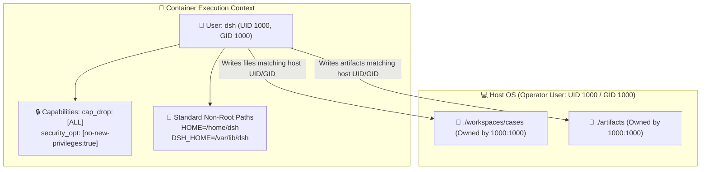

# 🛡️ Module 01: Root Role Elimination & Security Confinement

> **Document ID**: `DSH-DDS-REF-01`  
> **Target**: `Dockerfile`, `docker-compose.yml`, `docker-compose.sandbox.yml`, host file ownership

---

## 1. Problem Statement & Threat Analysis

In the legacy setup, DeepSeek Harness operates under container `root` (UID 0, GID 0). While containers isolate processes via Linux namespaces, running AI agent harnesses as root introduces severe architectural and security risks:

### A. Host File Ownership Poisoning
When an AI agent executes file creation tools (e.g. creating cases, code files, or artifacts in `./workspaces/cases` or `./artifacts`), those files are written to the host filesystem owned by `root:root`. 
On Linux and macOS host systems, the operator cannot edit, rename, or delete these files from their host editor (VS Code, Cursor, Vim) without executing `sudo rm -rf`.

### B. Privilege Escalation & Container Breakout Surface
AI agents natively possess shell execution capabilities (`dsh-plugin-bash`). If an adversary successfully executes prompt injection or a vulnerable C extension in an MCP server is exploited, the executing process already has UID 0 privileges inside the container namespace. If any kernel vulnerability or host mount permission misconfiguration exists, breakout to the host system is vastly easier under UID 0.

### C. Violation of Zero-Trust & Least Privilege
Production security frameworks (NIST SP 800-190, CIS Docker Benchmark, OWASP Top 10 for LLMs) strictly require containers to run under non-root service accounts with stripped Linux capabilities.

---

## 2. Target Non-Root Architecture



---

## 3. Implementation Specifications

### A. Dockerfile Multi-Stage User Provisioning
In the production runner stage of `Dockerfile`:

```dockerfile
# ── Create unprivileged service user and group ────────────────────
RUN groupadd -g 1000 dsh \
    && useradd -u 1000 -g dsh -m -s /bin/bash dsh \
    && mkdir -p /home/dsh/.local/bin /var/lib/dsh /app /run/dsh /var/log/dsh \
    && chown -R dsh:dsh /home/dsh /var/lib/dsh /app /run/dsh /var/log/dsh

# ── Ensure all installed CLI tools are globally accessible ─────────
RUN chmod -R 755 /usr/local/bin /usr/local/lib/node_modules

# ── Set non-root runtime environment ──────────────────────────────
USER dsh:dsh
WORKDIR /home/dsh
ENV HOME="/home/dsh"
ENV PATH="/home/dsh/.local/bin:/usr/local/bin:${PATH}"
ENV DSH_HOME="/var/lib/dsh"
```

### B. Production `docker-compose.yml` Hardening
The container configuration is updated with explicit non-root user mappings and kernel security options:

```yaml
services:
  dsh:
    build: .
    image: dsh-local:latest
    user: "${DSH_UID:-1000}:${DSH_GID:-1000}"
    restart: unless-stopped
    security_opt:
      - no-new-privileges:true
    cap_drop:
      - ALL
    ports:
      - "127.0.0.1:${DSH_PORT:-3080}:3080"
    volumes:
      - ./config:/etc/dsh:ro
      - ./config/sessions:/var/lib/dsh/sessions:rw
      - ./config/audit:/var/lib/dsh/audit:rw
      - ./config/storages:/var/lib/dsh/storages:rw
      - ./config/cache:/var/lib/dsh/cache:rw
      - ./workspaces:/workspaces:ro
      - ./workspaces/cases:/workspaces/cases:rw
      - ./workspaces/artifacts:/artifacts:rw
    tmpfs:
      - /run/dsh:rw,nosuid,nodev,noexec,size=32m
      - /tmp:rw,nosuid,nodev,size=64m
    environment:
      - PORT=3080
      - DSH_HOME=/var/lib/dsh
      - DSH_CONFIG_DIR=/etc/dsh
      - DSH_SETTINGS_FILE=/var/lib/dsh/storages/settings.yaml
```

### C. Arize Phoenix Container Hardening
Arize Phoenix is similarly transitioned off `/root`:

```yaml
  phoenix:
    image: arizephoenix/phoenix:20.5.0@sha256:39374ee6ad0c69c0a5e713e42e869f70ae99f681e0dbad374721a5ccecd0d54d
    user: "${DSH_UID:-1000}:${DSH_GID:-1000}"
    security_opt:
      - no-new-privileges:true
    volumes:
      - ./config/phoenix:/home/phoenix/.phoenix
    environment:
      - PHOENIX_PORT=6006
      - PHOENIX_GRPC_PORT=4317
      - PHOENIX_ENABLE_AUTH=${PHOENIX_ENABLE_AUTH:-false}
```

---

## 4. Verification & Security Audit Criteria

1. **User Identity Verification**:
   ```bash
   docker exec testinstall-dsh-1 id
   # Output must be: uid=1000(dsh) gid=1000(dsh) groups=1000(dsh)
   ```
2. **Capability Audit**:
   ```bash
   docker inspect --format '{{.HostConfig.CapDrop}}' testinstall-dsh-1
   # Output must be: [ALL]
   ```
3. **Host File Permission Audit**:
   ```bash
   docker exec testinstall-dsh-1 touch /workspaces/cases/test_ownership.txt
   ls -ln workspaces/cases/test_ownership.txt
   # UID and GID on the host must match the local user (1000 1000), not root (0 0).
   ```
