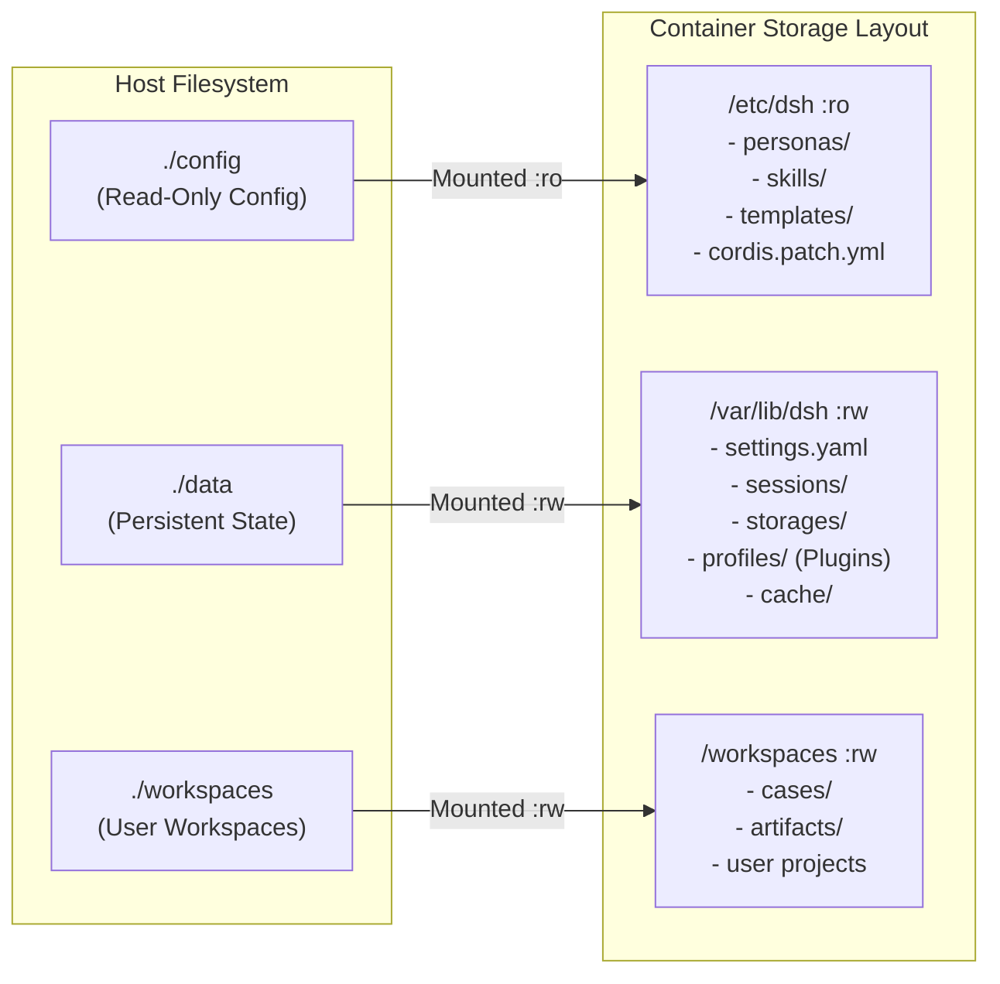

# 📂 Module 02: Filesystem Hierarchy & 100% Persistence Guarantees

> **Document ID**: `DSH-DDS-REF-02`  
> **Target**: Filesystem hierarchy, volume bindings, Docker storage persistence, plugin retention

---

## 1. The Legacy Filesystem Collision

In the legacy setup, host `./config` was mounted read-only (`:ro`) directly over the user's home directory:
`./config -> /root/.dsh:ro`

Because DeepSeek Harness assumes `~/.dsh` is its writable home directory, this triggered a cascade of workarounds:
1. **`settings.yaml` crash**: DSH could not write settings, requiring a Dockerfile string replacement hack to redirect `settings.yaml` into `/root/.dsh/storages/`.
2. **`profiles` crash**: DSH could not extract or update plugins in `/root/.dsh/profiles/`, forcing `tmpfs: /root/.dsh/profiles:rw,size=256m`.
3. **Missing dependencies**: The tmpfs overlay erased `node_modules`, forcing a fragile symlink:
   `/root/.dsh/profiles/web/node_modules -> /app/prebuilt-profiles/web/node_modules`.
4. **Data loss on container down**: Because `/root/.dsh/profiles` was mounted as in-memory `tmpfs`, **any plugin installed by the user via the Web UI Market was wiped whenever `docker compose down` was executed**.

---

## 2. Target Linux Filesystem Hierarchy (FHS)

The refactored architecture adheres strictly to standard Linux Filesystem Hierarchy standards:

| Path | Mount Type | Purpose | Persistence Guarantee |
| :--- | :--- | :--- | :--- |
| `/app` | Image Layer | Immutable application code, `@dsh-dds/core`, prebuilt core profiles | Immutable in image |
| `/etc/dsh` | Bind Mount `:ro` | Operator configuration: persona manifests, declarative policies, skills | Persisted on host (`./config`) |
| `/var/lib/dsh` | Volume / Bind `:rw` | `DSH_HOME`: mutable runtime state, settings, chat sessions, cache | **100% Persisted on host** (`./data`) |
| `/workspaces` | Bind Mount `:rw` | User project repositories, case files, output artifacts | **100% Persisted on host** (`./workspaces`) |
| `/run/dsh` | `tmpfs` | Disposable runtime IPC sockets and process locks | Ephemeral |
| `/tmp` | `tmpfs` | Standard temporary scratch directory | Ephemeral |

---

## 3. Comprehensive Persistence Matrix

The following table proves data survival across both routine reboots and full container recreations:

| Data Category | Path on Host | Container Path | Across `docker restart` | Across `docker compose down` & `up` |
| :--- | :--- | :--- | :---: | :---: |
| **User Workspaces & Cases** | `./workspaces/cases/` | `/workspaces/cases/` | ✅ Persisted | ✅ Persisted |
| **Generated Artifacts** | `./workspaces/artifacts/` | `/artifacts/` | ✅ Persisted | ✅ Persisted |
| **User Settings & SQLite DB** | `./data/storages/` | `/var/lib/dsh/storages/` | ✅ Persisted | ✅ Persisted |
| **Chat Sessions & History** | `./data/sessions/` | `/var/lib/dsh/sessions/` | ✅ Persisted | ✅ Persisted |
| **GRC Audit Ledgers** | `./data/audit/` | `/var/lib/dsh/audit/` | ✅ Persisted | ✅ Persisted |
| **Persona & Skill Manifests** | `./config/personas/` | `/etc/dsh/personas/` | ✅ Persisted | ✅ Persisted |
| **Web UI Market Plugins** | `./data/profiles/` | `/var/lib/dsh/profiles/` | ✅ Persisted | ✅ **Persisted (Fixed!)** |
| **Phoenix Telemetry Traces** | `./config/phoenix/` | `/home/phoenix/.phoenix/` | ✅ Persisted | ✅ Persisted |

---

## 4. Solving the In-Container Dynamic Plugin Installation Lifecycle

### The Problem in Legacy
When a user clicks "Install" on a plugin like `dsh-better-sidebar` in the Web UI:
1. `dshmarket` executes `pnpm add dsh-better-sidebar` inside `/root/.dsh/profiles/web`.
2. In the legacy architecture, `/root/.dsh/profiles` was inside in-memory `tmpfs`.
3. Running `docker compose down` destroyed the container and its tmpfs, wiping the newly installed plugin completely.

### The Solution in Refactored Architecture
1. In the refactored architecture, `/var/lib/dsh` is backed by persistent host storage (`./data` or a dedicated named Docker volume `dsh-state`).
2. When `dshmarket` runs `pnpm add`:
   - Dependencies and lockfiles are written to `/var/lib/dsh/profiles/web`.
   - The data is immediately flushed to persistent host storage.
   - Even if the container is destroyed via `docker compose down` and recreated with `docker compose up`, `/var/lib/dsh/profiles/web` remains intact.
3. When the container reboots, the engine detects the existing persistent profile and launches with all user-installed plugins active immediately.
