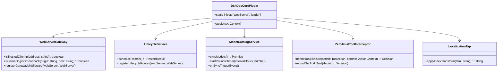

# 🧩 Module 03: Native Cordis Plugin Architecture (`@dsh-dds/core`)

> **Document ID**: `DSH-DDS-REF-03`  
> **Target**: `packages/dsh-dds-core`, Cordis Service Injection, WebServer Gateway, In-Line Zero-Trust RBAC (PEP), Lifecycle

---

## 1. Why Native Cordis Instead of Monkey-Patching?

DeepSeek Harness is powered by **Cordis**, an extensible Inversion-of-Control (IoC) microkernel for Node.js. 

In a Cordis-based application:
* Components are **Plugins** with explicit dependencies declared via `static inject = [...]`.
* Functionality is shared via **Services** (e.g. `ctx.webServer`, `ctx.loader`).
* Operations are event-driven (`ctx.emit()`, `ctx.on()`, `ctx.before()`).

Monkey-patching files on disk via ad-hoc scripts fights Cordis rather than embracing it. By building an in-tree plugin (`@dsh-dds/core`), we integrate cleanly with the framework's native extension points.

---

## 2. Component Architecture of `@dsh-dds/core`



---

## 3. Subsystem Specifications

### A. WebServer Gateway Interceptor
**Replaces**: `config/patch-market-restart.mjs` and `config/patch-client-connection.mjs`.

* Hooks directly into Cordis `webServer` during activation:
  ```typescript
  ctx.inject(['webServer'], (ctx) => {
    // Intercept incoming requests before route matching
    ctx.webServer.server.prependListener('request', (req, res) => {
      // 1. Recognize Docker bridge gateway (172.16.0.0/12) as trusted loopback peer
      // 2. Normalize localhost and 127.0.0.1 origins
      // 3. Fallback to Referer origin if Origin header is omitted by browser
    });
  });
  ```
* Provides an authenticated `/dsh-dds/lifecycle/restart` endpoint that gracefully signals process exit (`process.kill(process.pid, 'SIGTERM')` followed by `process.exit(0)`), allowing Docker's `restart: unless-stopped` supervisor to cleanly cycle the container.

### B. Event-Driven Model Catalog Service
**Replaces**: Standalone `sync_models.mjs` and the `/tmp/dsh-sync.trigger` bash polling loop.

* Operates entirely in-process within Node.js:
  - Listens to lifecycle events: `ctx.on('ready', () => syncModels())`.
  - Exposes an authenticated management endpoint: `POST /dsh-dds/api/models/sync`.
  - Replaces the waking shell loop (`while true; sleep 2`) with an internal event trigger (`ctx.emit('models:sync')`) and Node timer.
  - Automatically updates Arize Phoenix provider registrations and caches catalog responses in `/var/lib/dsh/cache/`.

### C. In-Line Zero-Trust Tool Interceptor (Policy Enforcement Point - PEP)
**Integrates**: `config/rbac-policy.mjs` into real runtime tool execution.

* In the legacy setup, `rbac-policy.mjs` was only invoked in isolated tests or external orchestrator steps. Native agent tool calls (bash commands, file writes) bypassed in-line policy enforcement.
* In the refactored architecture:
  ```typescript
  ctx.before('tool-execute', async (action) => {
    const decision = enforceRbacPolicy(ctx.currentPersona, action);
    if (!decision.allowed) {
      logGrcAuditEvent({ action, decision: 'DENIED', reason: decision.violation });
      throw new Error(`[Zero-Trust RBAC] Action blocked: ${decision.violation}`);
    }
    logGrcAuditEvent({ action, decision: 'GRANTED' });
  });
  ```
* Ensures that no persona or tool execution can escape its declared filesystem or command allowlist.

### D. Localization Tap
**Replaces**: `config/patch_translations.mjs` regex rewriting.

* Cordis `webServer` provides a native `tapIndex` API designed specifically for HTML and asset transforms:
  ```typescript
  ctx.webServer.tapIndex((html) => {
    // Injects client-side translation dictionary and overrides client text cleanly
    return injectEnglishLocaleDictionary(html);
  });
  ```
* Eliminates search-and-replace scripts over minified JavaScript bundles.

---

## 4. Packaging and Registration

`@dsh-dds/core` is organized as an in-tree workspace package under `packages/dsh-dds-core`. It is registered declaratively in `config/profiles/web/cordis.patch.yml`:

```yaml
- insert:
    - id: dsh-dds-core
      name: '@dsh-dds/core'
      config:
        trustedGateways:
          - '172.16.0.0/12'
          - '10.0.0.0/8'
          - '192.168.0.0/16'
        enableToolRbac: true
        modelSyncIntervalHours: 12
```
