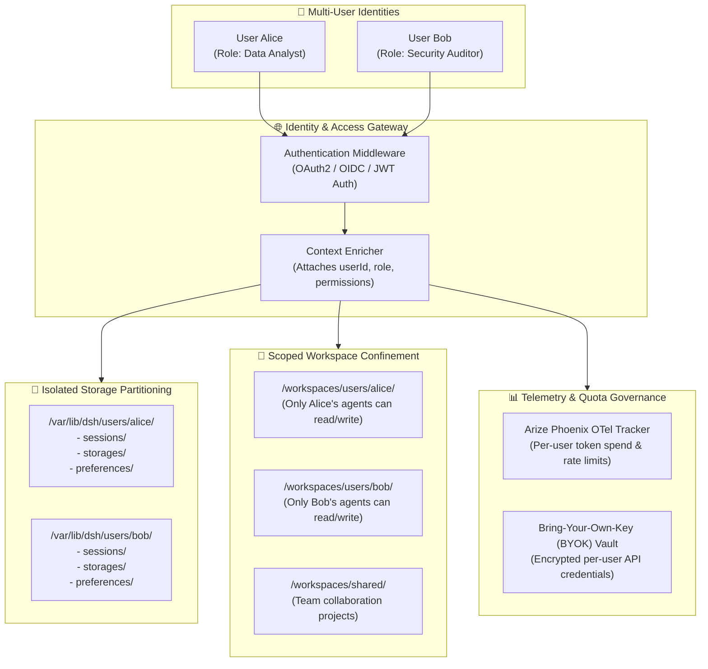

# 👥 Module 05: Multi-User Architectural Roadmap

> **Document ID**: `DSH-DDS-REF-05`  
> **Target**: Multi-tenancy, Identity & Access Management (IAM), Session Namespacing, Workspace Confinement, Quota Management

---

## 1. Overview & Multi-Tenancy Readiness

While DeepSeek Harness currently operates as a single-tenant local workbench, modern enterprise deployments often demand team collaboration and multi-user isolation.

Attempting multi-user under the legacy architecture was impossible due to:
* Hardcoded `/root/.dsh` home directories.
* Flat session storage without user identity context.
* Container root execution allowing tool executions to cross-contaminate.

The global refactoring creates the exact architectural foundation required to support multi-tenancy as a natural, non-breaking extension.

---

## 2. The 4 Multi-Tenant Layers



---

## 3. Implementation Specifications for Multi-Tenancy

### A. Identity & Authentication (IAM)
* In `@dsh-dds/core`, register an authentication middleware on Cordis `webServer`:
  - Supports GitHub OAuth, Google OIDC, or internal enterprise SSO (Keycloak, Authentik).
  - Validates session tokens and enriches the Cordis execution context with `ctx.user = { id, name, roles, permissions }`.

### B. Namespaced Session & Memory Isolation
* Chat sessions and memory embeddings are segregated by user ID:
  ```
  /var/lib/dsh/users/
  ├── usr_alice_9823/
  │   ├── sessions/ (Alice's chat history & agent turns)
  │   └── storages/ (Personal settings & SQLite memory index)
  └── usr_bob_4412/
      ├── sessions/ (Bob's chat history & agent turns)
      └── storages/ (Personal settings & SQLite memory index)
  ```
* User A cannot access or query User B's conversation history or agent memories.

### C. Workspace Confinement via In-Line RBAC (PEP)
* The in-line Policy Enforcement Point (Pillar 7) evaluates workspace access dynamically against the authenticated user:
  ```javascript
  ctx.before('tool-execute', (action) => {
    const user = ctx.user;
    const target = action.targetPath;
    
    // Admins can inspect all workspaces; standard users are confined to their own directory
    if (!user.roles.includes('admin')) {
      const allowedPrefix = `/workspaces/users/${user.id}`;
      const sharedPrefix = `/workspaces/shared`;
      
      if (!target.startsWith(allowedPrefix) && !target.startsWith(sharedPrefix)) {
        throw new Error(`[Zero-Trust RBAC] Access Denied: User ${user.id} cannot access ${target}`);
      }
    }
  });
  ```

### D. Quota Tracking & Bring-Your-Own-Key (BYOK)
1. **Organization-Pooled Keys**:
   When using a centralized `OPENROUTER_API_KEY`, `@dsh-dds/core` tags all outbound OpenTelemetry spans sent to Arize Phoenix with `user.id`. Administrators can monitor and limit token spend per user.
2. **Bring-Your-Own-Key (BYOK)**:
   Users can supply their own private API keys (Gemini, DeepSeek, Anthropic) via their Web UI profile settings. Keys are encrypted at rest using AES-256-GCM keyed to a master container secret.

---

## 4. Multi-Tenant Architectural Readiness Comparison

| Feature | Legacy Patching Setup | Refactored Architecture |
| :--- | :---: | :---: |
| **User Data Separation** | ❌ Hardcoded `/root/.dsh` | ✅ **Ready** (`/var/lib/dsh` and `/etc/dsh`) |
| **Security Blast Radius** | ❌ Runs as `root` (UID 0) | ✅ **Hardened** (Unprivileged `dsh`, `cap_drop: ALL`) |
| **RBAC Enforcement Point** | ❌ External tests only | ✅ **Native** (In-line Cordis tool execution guard) |
| **Auth Middleware Hook** | ❌ No extension point | ✅ **Native** (Cordis `webServer` middleware) |
| **Per-User Workspaces** | ❌ Single `/workspaces` | ✅ **Partitionable** via RBAC path rules |
