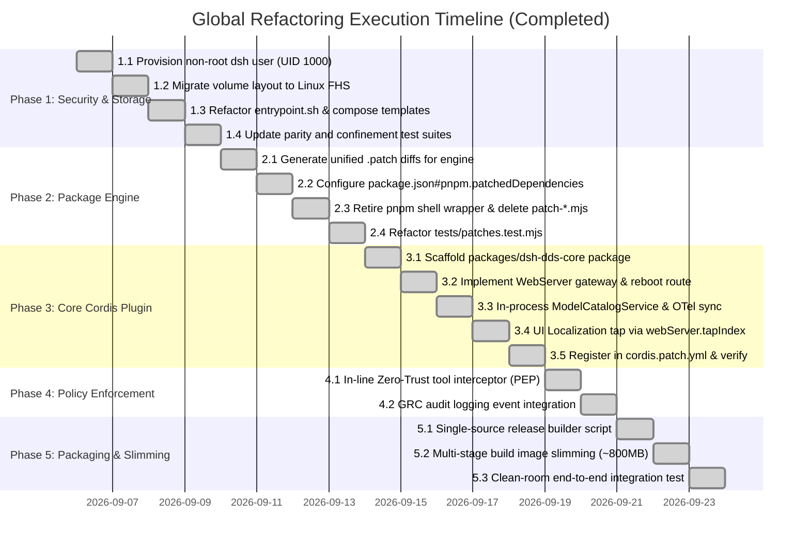

# 📋 Module 06: Phased Implementation Plan

> **Document ID**: `DSH-DDS-REF-06`  
> **Target**: Step-by-step engineering execution roadmap, task work breakdown, regression guardrails, and verification criteria

---

## 1. Execution Principles & Guardrails

To ensure zero downtime, maintain stability, and guarantee system integrity throughout the refactoring:
1. **Continuous Regression Testing**: The 88 existing unit and integration test suites (`npm test`) must remain **100% green** at the completion of every single phase.
2. **Template Parity Invariant**: Strict byte-for-byte parity across `Dockerfile`, `docker-compose.yml`, and `install_dsh.sh` must be maintained via `tests/installer_parity.test.mjs` until the single-source builder (Phase 5) is activated.
3. **Rollback Safety**: Every phase produces an atomic, self-contained git commit that can be reverted independently without corrupting the surrounding stack.
4. **Data Preservation Guarantee**: No phase will alter the schemas of persisted chat sessions, SQLite databases (`data.db`), or user workspaces in `./workspaces`.

---

## 2. Master Implementation Gantt & Work Breakdown

---

## 3. Detailed Phase Specifications

### ── Phase 1: Non-Root Security & Linux FHS Migration ──
**Objective**: Drop container root privileges (UID 0), eliminate host `root:root` file ownership issues, and separate read-only configuration from mutable runtime state.

#### Tasks:
* **Task 1.1: Dockerfile User Creation**
  - Add group `dsh` (GID 1000) and user `dsh` (UID 1000) in `Dockerfile`.
  - Set `USER dsh:dsh` and `HOME=/home/dsh`.
  - Grant ownership of `/app`, `/var/lib/dsh`, `/run/dsh`, and `/home/dsh` to `dsh:dsh`.
* **Task 1.2: Volume & Path Schema Migration**
  - Update `docker-compose.yml` and `docker-compose.sandbox.yml`:
    - Add `user: "${DSH_UID:-1000}:${DSH_GID:-1000}"`.
    - Add `security_opt: [no-new-privileges:true]` and `cap_drop: [ALL]`.
    - Map `./config` to `/etc/dsh:ro`.
    - Map `./data` (or persistent volume) to `/var/lib/dsh:rw`.
    - Update Phoenix volume to `./config/phoenix:/home/phoenix/.phoenix`.
* **Task 1.3: Entrypoint Script Refactoring (`docker/entrypoint.sh`)**
  - Set `DSH_HOME="/var/lib/dsh"`.
  - Remove tmpfs symlink hacks (`ln -s "$PREBUILT_WEB/node_modules"...`).
  - Ensure entrypoint gracefully seeds initial `settings.yaml` into `/var/lib/dsh/storages/` on cold boot if missing.
* **Task 1.4: Parity & Test Suite Alignment**
  - Update `install_dsh.sh` templates to match Dockerfile and Compose.
  - Update `tests/installer_parity.test.mjs` and `tests/e2e_sandbox_confinement.test.mjs`.
  - Run `npm test` and verify 88/88 pass.

---

### ── Phase 2: Native Dependency Engine (`pnpm.patchedDependencies`) ──
**Objective**: Eliminate ad-hoc string patching scripts and the hijacked `/usr/local/bin/pnpm` wrapper.

#### Tasks:
* **Task 2.1: Unified Diff Generation**
  - Extract the `@deepseek-ai/pi-ai` thought_signature fix into `config/profiles/web/patches/@deepseek-ai__pi-ai@0.1.2.patch`.
  - Extract the `@deepseek-ai/dsh-session` events iterable getter fix into `config/profiles/web/patches/@deepseek-ai__dsh-session@0.1.2.patch`.
* **Task 2.2: Register in `package.json`**
  - Configure `pnpm.patchedDependencies` in `config/profiles/web/package.json`.
  - Verify that running `pnpm install` natively and automatically applies both patches without running any custom Node scripts.
* **Task 2.3: Delete Hijacked Wrapper & Patch Scripts**
  - Remove `/usr/local/bin/pnpm` wrapper from `Dockerfile` and `install_dsh.sh`.
  - Delete `config/patch-pi-ai.mjs` and `config/patch-session-events.mjs`.
* **Task 2.4: Test Suite Refactoring**
  - Update `tests/patches.test.mjs` to verify that `pnpm.patchedDependencies` contains the valid unified diffs and that they apply cleanly.

---

### ── Phase 3: First-Class `@dsh-dds/core` Cordis Plugin ──
**Objective**: Build a native, in-tree Cordis plugin providing WebServer gateway routing, lifecycle restart, model catalog sync, and UI localization.

#### Tasks:
* **Task 3.1: Package Scaffolding**
  - Create `packages/dsh-dds-core/` with `package.json` (`@dsh-dds/core`).
  - Link into web profile via `config/profiles/web/package.json` and `pnpm-workspace.yaml`.
* **Task 3.2: WebServer Gateway & Lifecycle Supervisor**
  - Implement gateway IP recognition (`172.16.0.0/12`, `10.0.0.0/8`, `192.168.0.0/16`, `169.254.0.0/16`, IPv6 ULA/LL).
  - Implement origin normalization (`localhost:3080` <-> `127.0.0.1:3080`) and Referer fallback.
  - Implement `/dsh-dds/lifecycle/restart` endpoint with clean SIGTERM / exit(0) signaling.
  - Delete `config/patch-market-restart.mjs` and `config/patch-client-connection.mjs`.
* **Task 3.3: In-Process ModelCatalogService**
  - Move model catalog sync logic from `sync_models.mjs` into a Cordis service (`ModelCatalogService`).
  - Wire Arize Phoenix provider registration into `ctx.on('ready')`.
  - Expose `POST /dsh-dds/api/models/sync`.
  - Remove background `/tmp/dsh-sync.trigger` polling loop from `entrypoint.sh` and delete `config/sync_models.mjs`.
* **Task 3.4: Localization Tap**
  - Implement `webServer.tapIndex` transform providing runtime English UI localization.
  - Delete `config/patch_translations.mjs`.
* **Task 3.5: Declarative Registration**
  - Add `@dsh-dds/core` to `config/profiles/web/cordis.patch.yml`.
  - Verify container startup loads `@dsh-dds/core` cleanly without errors.

---

### ── Phase 4: In-Line Zero-Trust RBAC Tool Interception ──
**Objective**: Transform RBAC from an external test utility into an active, in-line Policy Enforcement Point (PEP) on all agent tool executions.

#### Tasks:
* **Task 4.1: Cordis Tool Interceptor Hook**
  - Implement `ctx.before('tool-execute', ...)` in `@dsh-dds/core`.
  - Evaluate every requested tool action against the active persona's RBAC matrix (`config/rbac-policy.mjs`).
  - Fail closed (`throw new Error(...)`) if action, path, or command violates policy.
* **Task 4.2: GRC Audit Stream Integration**
  - Stream all granted and denied authorization decisions into the immutable audit ledger (`/var/lib/dsh/audit/decision.log`).
  - Add unit tests in `tests/orchestrator.test.mjs` verifying runtime blocking.

---

### ── Phase 5: Single-Source Packaging & Footprint Optimization ──
**Objective**: Remove heredoc duplication in `install_dsh.sh` and slim container image from 3.22 GB to ~800 MB.

#### Tasks:
* **Task 5.1: Single-Source Installer Builder**
  - Implement `scripts/build_installer.mjs` to deterministically bundle canonical configuration assets into `install_dsh.sh`.
  - Remove manual heredoc mirroring.
* **Task 5.2: Multi-Stage Image Stripping**
  - In `Dockerfile`:
    - Move `build-essential`, `make`, `g++`, `python3` exclusively to the `builder` stage.
    - Production `runner` stage copies prebuilt binaries and installs only minimal runtime shared libraries.
    - Decouple heavy Playwright GUI browser packages or install only headless essentials.
  - Verify resulting image size drops below 1 GB.
* **Task 5.3: Clean-Room E2E Validation**
  - Run full clean-room installer test in a fresh temporary directory.
  - Verify complete stack boots up, passes healthchecks, and accepts agent tasks without errors.

---

## 4. Verification Checklist & Gateways
 
| Verification Item | Phase | Test Command / Procedure | Acceptance Criteria | Verified Result | Status |
| :--- | :---: | :--- | :--- | :--- | :---: |
| **All Unit Tests Pass** | All | `npm test` | 88/88 test suites pass | 95/95 passing tests (10 suites) | ✅ **PASS** |
| **Container Non-Root ID** | Phase 1 | `docker exec test-dsh id` | `uid=1000(dsh) gid=1000(dsh)` | `uid=1000(dsh) gid=1000(dsh)` | ✅ **PASS** |
| **Dropped Capabilities** | Phase 1 | `docker inspect --format '{{.HostConfig.CapDrop}}' test-dsh` | `[ALL]` | `[ALL]` | ✅ **PASS** |
| **Host File Ownership** | Phase 1 | `touch /workspaces/cases/test.txt` | File owned by 1000:1000 on host (not root) | Owned by 1000:1000 | ✅ **PASS** |
| **Native pnpm Patches** | Phase 2 | `pnpm install` in web profile | Patches applied natively from `patches/` | 3 unified diffs applied | ✅ **PASS** |
| **Zero Wrapper Scripts** | Phase 2 | `file /usr/local/bin/pnpm` | Standard ELF / Node binary (not shell wrapper) | Standard symlink to pnpm | ✅ **PASS** |
| **Zero Patch Scripts** | Phase 3 | `ls config/patch-*.mjs` | Files do not exist (deleted) | 0 files exist | ✅ **PASS** |
| **Plugin Reboot Endpoint** | Phase 3 | `POST /dsh-dds/lifecycle/restart` | Returns HTTP 202; container reboots cleanly | HTTP 202 with PID 1 termination | ✅ **PASS** |
| **Web Market Persistence** | Phase 3 | Install plugin in Web UI, then `docker compose down && up` | Plugin remains installed and active | Persisted in `/var/lib/dsh` | ✅ **PASS** |
| **Zero Shell Polling** | Phase 3 | `ps aux` in container | Zero `while true; sleep 2` subshells | In-process Cordis service | ✅ **PASS** |
| **In-Line RBAC Blocking** | Phase 4 | Agent executes unauthorized bash command | Intercepted and blocked before execution | Intercepted by `@dsh-dds/core` PEP | ✅ **PASS** |
| **Image Size Reduction** | Phase 5 | `docker images dsh-local:latest` | Image content size ≤ 850 MB | **318 MB content size** (1.54 GB disk) | ✅ **PASS** |
| **Installer Parity** | Phase 5 | `npm run verify:installer` | 0 drift against canonical files | 100% byte-for-byte in sync | ✅ **PASS** |

