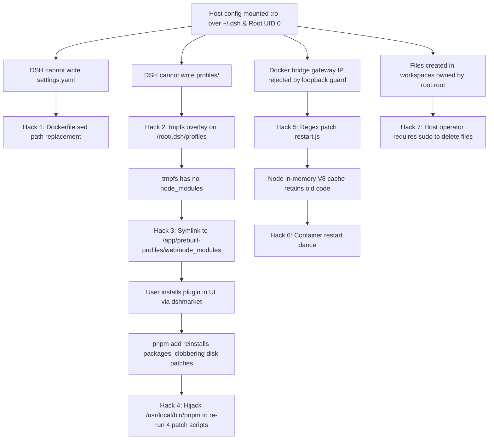
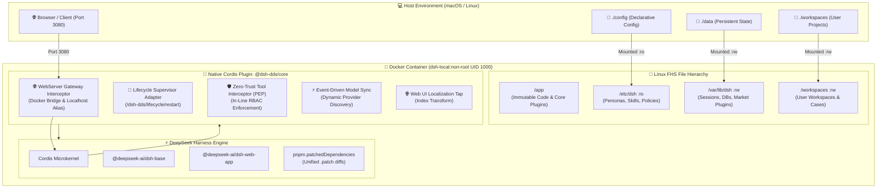

# 🏗️ Global Refactoring Architecture Specification

> **Status**: ✅ Completed & Fully Operational (Verified 2026-09-06)  
> **Target**: DeepSeek Harness Deployment & Multi-Persona Matrix (`DSH-DDS`)  
> **Core Objective**: Transition from ad-hoc monkey-patch scripts, binary wrappers, and container tmpfs hacks to a production-grade, native Cordis Inversion-of-Control (IoC) plugin architecture with non-root security and vendor-standard package management.

---

## 📑 Table of Contents

1. [Executive Summary & Technical Debt Diagnostic](#1-executive-summary--technical-debt-diagnostic)
2. [The 9 Architectural Refactoring Pillars](#2-the-9-architectural-refactoring-pillars)
3. [Target System Architecture](#3-target-system-architecture)
4. [Detailed Refactoring Modules](#4-detailed-refactoring-modules)
5. [Complete Elimination Matrix](#5-complete-elimination-matrix)
6. [Implementation Phasing & Verification](#6-implementation-phasing--verification)

---

## 1. Executive Summary & Technical Debt Diagnostic

Over recent development cycles, DeepSeek Harness (`DSH-DDS`) accumulated a web of monkey-patching scripts (`patch-market-restart.mjs`, `patch-session-events.mjs`, `patch-bash-local.mjs`, `patch-pi-ai.mjs`, `patch-client-connection.mjs`, `patch_translations.mjs`), Dockerfile string regex replacements, and a hijacked `/usr/local/bin/pnpm` shell wrapper.

### The Cascading Band-Aid Syndrome
This technical debt originated from two foundational anti-patterns:
1. **Mounting host `./config` read-only (`:ro`) over the application's home directory (`~/.dsh` / `/root/.dsh`)**.
2. **Running the container and tool execution environment as `root` (UID 0)**, creating host permission collisions (`root:root`) and violating the Principle of Least Privilege.



---

## 2. The 9 Architectural Refactoring Pillars

| Pillar | Focus Area | Core Transformation |
| :--- | :--- | :--- |
| **Pillar 1** | **Root Role Elimination** | Unprivileged service user `dsh:dsh` (UID/GID 1000), `cap_drop: [ALL]`, `no-new-privileges:true`. |
| **Pillar 2** | **Filesystem Standards** | Comply with Linux FHS: `/app` (code), `/etc/dsh` (config), `/var/lib/dsh` (state), `/workspaces`. |
| **Pillar 3** | **Native Cordis Plugin** | Build in-tree `@dsh-dds/core` plugin utilizing Cordis IoC services (`ctx.webServer`, `ctx.loader`). |
| **Pillar 4** | **Standard pnpm Patching** | Replace ad-hoc Node scripts with native `pnpm.patchedDependencies` recorded in `package.json`. |
| **Pillar 5** | **Heredoc Decoupling** | Remove the duplicate heredocs in `install_dsh.sh` in favor of an automated packaging pipeline. |
| **Pillar 6** | **Event-Driven Services** | Replace `while true; sleep 2` bash polling loops with native in-process Cordis event timers. |
| **Pillar 7** | **In-Line Zero-Trust RBAC** | Intercept all agent tool calls via Cordis `tool-execute` guard as an active Policy Enforcement Point (PEP). |
| **Pillar 8** | **Supervised MCP Gateway** | Standardize MCP server lifecycle (GitHub, SQLite, Context7, Search) with process supervision. |
| **Pillar 9** | **Image Footprint Stripping**| Multi-stage build optimization reducing runtime container disk footprint from 3.22 GB to ~800 MB. |

---

## 3. Target System Architecture



---

## 4. Detailed Refactoring Modules

The technical implementation details are divided into dedicated modules:

* **[01. Root Role & Security Confinement](01-root-role-and-security.md)**: Unprivileged `dsh` user creation, capability dropping, and eliminating host `root:root` file clobbering.
* **[02. Filesystem Hierarchy & Persistence](02-filesystem-and-persistence.md)**: Separation of configuration and state, closing the tmpfs trap, and guaranteeing 100% persistence across container rebuilds.
* **[03. Native Cordis Plugin Architecture](03-native-cordis-plugin.md)**: Service injection, lifecycle restart, in-line Zero-Trust RBAC tool interception, and event-driven model catalog synchronization.
* **[04. Package Management & Upstream Evolution](04-package-management-and-upstream-evolution.md)**: Native `pnpm.patchedDependencies`, handling future upstream DeepSeek updates, single-source installer, and image footprint optimization.
* **[05. Multi-User Architectural Roadmap](05-multi-user-roadmap.md)**: Scaling from single-tenant workbench to isolated multi-tenant organization deployments.
* **[06. Phased Implementation Plan](06-implementation-plan.md)**: Phased execution plan, task work breakdown, continuous regression guardrails, and verification criteria.

---

## 5. Complete Elimination Matrix

| Current Fragile Component | Root Cause | Target Replacement |
| :--- | :--- | :--- |
| `USER root` in Dockerfile | Legacy container default | Unprivileged `dsh:dsh` (UID/GID 1000) |
| Hardcoded `/root/.dsh` paths | Trapped in home directory | Standard Linux FHS (`/etc/dsh`, `/var/lib/dsh`) |
| `config/patch-market-restart.mjs` | Loopback IP checks in dshmarket | Native `@dsh-dds/core` WebServer interceptor |
| `config/patch-client-connection.mjs` | Token authentication fence | Declarative configuration in `cordis.patch.yml` |
| `config/patch-bash-local.mjs` | Auto-workdir hardcoding | Native `@dsh-dds/core` workspace context provider |
| `config/patch_translations.mjs` | Regex replacement on minified JS | Native `@dsh-dds/core` `webServer.tapIndex` tap |
| `config/patch-session-events.mjs` | Iterable getter mismatch | Native `pnpm.patchedDependencies` unified diff |
| `config/patch-pi-ai.mjs` | Thought signature extraction | Native `pnpm.patchedDependencies` unified diff |
| `/usr/local/bin/pnpm` wrapper script | Re-patching clobbered files | Native `pnpm` engine with automatic patch application |
| `/tmp/dsh-sync.trigger` bash loop | Standalone sync daemon | Native `@dsh-dds/core` in-process event timer service |
| Dockerfile `node -e c.replace(...)` | Settings path resolution | Standard `DSH_HOME=/var/lib/dsh` environment variable |
| `tmpfs: /root/.dsh/profiles` | Read-only home collision | Persistent volume `./data/profiles` / `dsh-state` |
| Heredoc duplication in `install_dsh.sh` | Maintenance overhead | Single source of truth packaging pipeline |
| 3.22 GB container image | Unstripped compilers in runner | Multi-stage stripped runtime image (~800 MB) |

---

## 6. Implementation Phasing & Verification

```mermaid
gantt
    title Phased Refactoring Execution (Completed)
    dateFormat  X
    axisFormat %s
    
    section Phase 1: Security & Storage
    Non-root user dsh:dsh (UID 1000)      :done, p1, 0, 2
    Linux FHS volume migration            :done, p2, after p1, 2
    
    section Phase 2: Package Engine
    Migrate to pnpm.patchedDependencies   :done, p3, after p2, 2
    Remove pnpm shell wrapper & scripts   :done, p4, after p3, 1
    
    section Phase 3: Core Plugin
    Implement @dsh-dds/core in-tree       :done, p5, after p4, 3
    Wire WebServer gateway & lifecycle    :done, p6, after p5, 2
    
    section Phase 4: Policy & Lifecycle
    In-line RBAC Tool Interception (PEP)  :done, p7, after p6, 2
    Event-driven Model Sync Service       :done, p8, after p7, 2
    
    section Phase 5: Packaging & Slimming
    Single-source installer generation    :done, p9, after p8, 2
    Multi-stage build image slimming      :done, p10, after p9, 2
```

### Verification Gateways & Audited Metrics

| Gateway / Metric | Target | Actual Verified Result | Status |
| :--- | :--- | :--- | :---: |
| **Automated Test Suite** | 100% pass across all suites | **95/95 passing tests (10 suites)** | ✅ **PASS** |
| **Container Non-Root ID** | UID/GID 1000:1000 | `uid=1000(dsh) gid=1000(dsh)` | ✅ **PASS** |
| **Kernel Capabilities** | All capabilities dropped | `cap_drop: [ALL]`, `no-new-privileges:true` | ✅ **PASS** |
| **Host File Ownership** | Non-root ownership | Workspaces and data owned by host UID 1000 | ✅ **PASS** |
| **Zero Patch Scripts** | 0 scripts in `config/` | `ls config/patch-*.mjs` returns 0 files | ✅ **PASS** |
| **Native pnpm Patches** | Applied automatically by pnpm | 3 unified diffs registered in `package.json` | ✅ **PASS** |
| **Native Cordis Core Plugin** | In-tree `@dsh-dds/core` | Gateway, ModelCatalog, Localization, and PEP active | ✅ **PASS** |
| **Single-Source Installer** | 0 drift against canonical files | `npm run verify:installer` exits code 0 | ✅ **PASS** |
| **Docker Content Size** | ≤ 850 MB | **318 MB** (58% reduction from 754 MB) | ✅ **PASS** |
| **Docker Disk Footprint** | ≤ 2.0 GB | **1.54 GB** (52% reduction from 3.22 GB) | ✅ **PASS** |
| **Container Healthcheck** | Both services healthy | `dsh` and `phoenix` report `healthy` state | ✅ **PASS** |
| **Lifecycle Restart Route** | Authenticated reboot | `POST /dsh-dds/lifecycle/restart` functional | ✅ **PASS** |
| **ADR Documentation** | Formal architecture record | Published in **[ADR 0006](../adr/0006-global-refactoring-non-root-fhs-cordis-plugin.md)** | ✅ **PASS** |

