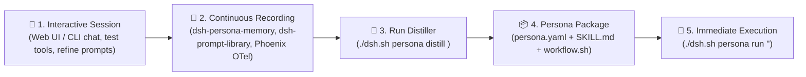

# 🎭 AI Agent Personas & Multi-Model Task Routing

A **Persona** in DeepSeek Harness is a fully packaged, domain-specific AI worker configured across **5 specialized layers**:
1. **Domain Skill (`SKILL.md`)**: Operational guidelines, domain rules, code patterns, and structured output schemas.
2. **Provider & Calibrated Models (`models`)**: A **Multi-Model Task-Routing Matrix** assigning optimal models per task type (e.g. Default, Deep Reasoning, Precision Coding/Audit, Fast Indexing, Multimodal).
3. **Dedicated Plugins (`plugins`)**: Specific DSH plugins required by the persona (e.g. `modsearch`, `dsh-mnemon`, `dsh-find-plugin`).
4. **Scoped MCP Servers (`mcpServers`)**: Dedicated Model Context Protocol tool integrations (e.g. SQLite, GitHub, Context7, Fetch).
5. **Executable Workflows (`workflow.sh`)**: Repeatable automation recipes and scheduled background tasks.

---

## 🧭 Anatomy of a Complete Persona Package


---

## 🎯 Multi-Model Task-Routing Matrix

Rather than restricting a persona to a single static model, each persona defines multiple calibrated models—each chosen for maximum performance, accuracy, or cost-efficiency on specific subtasks:

| Model Tier | Purpose | Recommended Models |
| :--- | :--- | :--- |
| **`default`** | Fast triage, general queries, drafting, and interactive conversations. | `deepseek/deepseek-chat`, `gemini-3.7-flash` |
| **`reasoning`** | Deep architectural analysis, complex math, multi-file reconciliation, and formal verification. | `deepseek/deepseek-r1`, `anthropic/claude-3.7-sonnet:thinking` |
| **`audit` / `coding`**| Precision code review, vulnerability patch generation, and production refactoring. | `anthropic/claude-3.5-sonnet`, `openai/gpt-4o` |
| **`fast`** | High-throughput parsing, bulk CSV / log scanning, and rapid symbol indexing. | `gemini/gemini-3.7-flash`, `deepseek/deepseek-chat` |
| **`multimodal`** | Architecture diagram analysis, UI screenshots, and visual document inspection. | `gemini/gemini-3.7-flash`, `openai/gpt-4o` |

---

## 🧰 Persona Package Structure (`config/personas/<name>/`)

```text
config/personas/<name>/
├── persona.yaml       # Master manifest (Multi-Model Matrix, plugins, MCP tools, workflows)
├── SKILL.md           # Reusable domain rules and operational constraints
└── workflow.sh        # Executable bash recipes for recurring tasks
```

### Example Manifest with Multi-Model Matrix (`persona.yaml`):
```yaml
name: security-auditor
title: "Security Auditor & AppSec Specialist"
description: "Specialized in code security reviews, OWASP vulnerability detection, token leak auditing, and dependency scans."

# 🎯 Multi-Model Task Routing Matrix
models:
  default:
    provider: openrouter
    model: anthropic/claude-3.5-sonnet
    temperature: 0.1
    useCase: "Precision code security auditing, vulnerability verification, and patch generation"
  reasoning:
    provider: openrouter
    model: deepseek/deepseek-r1
    temperature: 0.0
    useCase: "Complex cryptanalysis, threat modeling, and multi-file taint analysis"
  fast:
    provider: openrouter
    model: deepseek/deepseek-chat
    temperature: 0.2
    useCase: "Rapid repository secret scanning and basic linter reviews"
  multimodal:
    provider: gemini
    model: gemini-3.7-flash
    temperature: 0.1
    useCase: "Architecture diagram review and visual document inspection"

plugins:
  - "dsh-better-sidebar"
  - "dsh-find-plugin"

mcpServers:
  github:
    command: "npx"
    args: ["-y", "@modelcontextprotocol/server-github"]
  fetch:
    command: "npx"
    args: ["-y", "@mzxrai/mcp-webresearch"]

workflows:
  audit-diff:
    modelTier: default
    command: "Using the security-auditor skill, audit all modified files in git diff HEAD~1 and report security risks with diff patches."
  threat-model:
    modelTier: reasoning
    command: "Using the security-auditor skill, perform deep architectural threat modeling across the codebase."
  scan-secrets:
    modelTier: fast
    command: "Using the security-auditor skill, scan the repository for hardcoded tokens, passwords, and private keys."
```

---

## 🛠️ Pre-Packaged Starter Personas

### 1. 📊 `data-analyst` (Data Analyst & Insights Specialist)
* **Model Matrix**:
  * `default`: `openrouter/deepseek/deepseek-chat` (queries & formatting)
  * `reasoning`: `openrouter/deepseek/deepseek-r1` (statistical modeling & anomaly correlation)
  * `audit`: `openrouter/anthropic/claude-3.5-sonnet` (executive KPI summaries)
  * `fast`: `gemini/gemini-3.7-flash` (rapid CSV parsing)
* **MCP Tools**: `sqlite-db` (`@modelcontextprotocol/server-sqlite`), `fetch` (`@mzxrai/mcp-webresearch`)
* **Plugins**: `@liustack/modsearch`, `dsh-mnemon`, `dsh-find-plugin`
* **Workflows**: Table distribution summaries, database schema audits.

### 2. 🛡️ `security-auditor` (Security Auditor & AppSec Specialist)
* **Model Matrix**:
  * `default`: `openrouter/anthropic/claude-3.5-sonnet` (AppSec audit & patch diffs)
  * `reasoning`: `openrouter/deepseek/deepseek-r1` (threat modeling & crypto verification)
  * `fast`: `openrouter/deepseek/deepseek-chat` (secret scanner)
  * `multimodal`: `gemini/gemini-3.7-flash` (architecture diagram review)
* **MCP Tools**: `github` (`@modelcontextprotocol/server-github`), `fetch`
* **Plugins**: `dsh-better-sidebar`, `dsh-find-plugin`
* **Workflows**: Git diff security reviews, hardcoded secret and token leak detection.

### 3. 🌐 `sdmx-expert` (SDMX 2.1 & Statistical Data Specialist)
* **Model Matrix**:
  * `default`: `openrouter/deepseek/deepseek-chat` (dataflow queries & mapping)
  * `reasoning`: `openrouter/deepseek/deepseek-r1` (cross-agency statistical reconciliation)
  * `coding`: `openrouter/anthropic/claude-3.5-sonnet` / `openai/gpt-4o` (Python `uv` + `sdmx1` scripts)
  * `fast`: `gemini/gemini-3.7-flash` (codelist indexing)
* **MCP Tools**: `fetch`, `context7` (`@upstash/context7-mcp`)
* **Plugins**: `@liustack/modsearch`, `dsh-model-sync`
* **Workflows**: LUSTAT (STATEC LU1) and Eurostat (ESTAT) dataflow queries and Python `uv` scripts.

### 4. 🚀 `devops-sre` (DevOps & Site Reliability Engineer)
* **Model Matrix**:
  * `default`: `openrouter/deepseek/deepseek-chat` (health checks & logs)
  * `reasoning`: `openrouter/deepseek/deepseek-r1` (root-cause analysis of crash loops)
  * `coding`: `openrouter/anthropic/claude-3.5-sonnet` (Dockerfiles & CI workflows)
  * `fast`: `gemini/gemini-3.7-flash` (port triage)
* **MCP Tools**: `github`, `fetch`
* **Plugins**: `dsh-mcp-panel`, `dsh-provider-model-configurator`
* **Workflows**: `./dsh.sh doctor` ecosystem diagnostics and container log inspection.

---

## 🧪 Interactive Session Recording & Persona Distillation

Instead of writing a persona from scratch, you can **draft and refine workflows interactively** in a chat session, and then **distill the session into a permanent Persona Package**:



---

### Step-by-Step Workflow:

#### 1. Draft & Iterate in Chat (`http://localhost:3080` or `./dsh.sh cli`)
* Interact with the agent on your specific problem.
* Correct mistakes, test MCP tools (e.g. SQLite, GitHub, Fetch), and discover what prompt constraints work best.
* The pre-installed plugins (**`dsh-persona-memory`**, **`@sunjuntao/dsh-prompt-library`**, **`dsh-mnemon`**) and **Arize Phoenix** automatically record your prompt clips, tool spans, and learned guidelines in `config/MEMORY.md` and OTel trace storage.

#### 2. Distill into a Persona Package
Once you have refined the workflow, run the distiller CLI:

```bash
./dsh.sh persona distill my-specialist-name
```

What the distiller automatically generates:
* 🧠 **`SKILL.md`**: Synthesizes the domain instructions, operational constraints, and session memories into crisp markdown.
* ⚙️ **`persona.yaml`**: Configures the **Multi-Model Task Matrix** (Default, Reasoning, Audit, Fast) and required MCP servers.
* 🤖 **`workflow.sh`**: Converts successful interaction prompts into repeatable automation recipes.
* 📁 **Instant Registration**: Registers `config/skills/my-specialist-name/SKILL.md` so it appears immediately in the Web UI dropdown.

#### 3. Run & Automate
```bash
./dsh.sh persona run my-specialist-name "execute task on new dataset"
./dsh.sh persona workflow my-specialist-name default
```

---

## ⌨️ CLI Persona Management (`./dsh.sh persona`)

| Command | Action |
| :--- | :--- |
| **`./dsh.sh persona list`** | Lists all personas with their full **Task-to-Model Matrix** and starter templates. |
| **`./dsh.sh persona create <name> --template <template>`** | Scaffolds a complete persona package from a pre-built template. |
| **`./dsh.sh persona distill <name>`** | Distills recent interactive chat sessions and learned memories into a persona package. |
| **`./dsh.sh persona apply <name> [--tier <tier>]`** | Sets the persona's specified model tier as the active workspace default. |
| **`./dsh.sh persona run <name> [--tier <tier>] "<prompt>"`** | Executes a one-shot task using the persona's designated model tier (e.g. `reasoning`, `coding`, `fast`). |
| **`./dsh.sh persona workflow <name> <workflow-key>`** | Runs a pre-configured automation recipe using its calibrated model tier. |
| **`./dsh.sh persona show <name>`** | Displays the complete persona manifest and skill instructions. |

---

## 🌐 Customizing Inside the Web UI (`http://localhost:3080`)

1. **Instant Dropdown Discovery**: All skills are automatically mounted into `/root/.dsh/skills/` and appear in the UI chat dropdown.
2. **Conversational Scaffolding**: Instruct the agent in chat:
   > 💬 *"Create a new persona named `fastapi-architect` with a Multi-Model Matrix: `default` with DeepSeek V3, `reasoning` with DeepSeek R1, SQLite MCP tool, and async SQLAlchemy rules. Save it into `config/personas/fastapi-architect/`."*
3. **Trace Observability**: Every persona action (tool invocations, token costs, model latency) is tracked in real-time on **Arize Phoenix** at `http://localhost:6006`.
