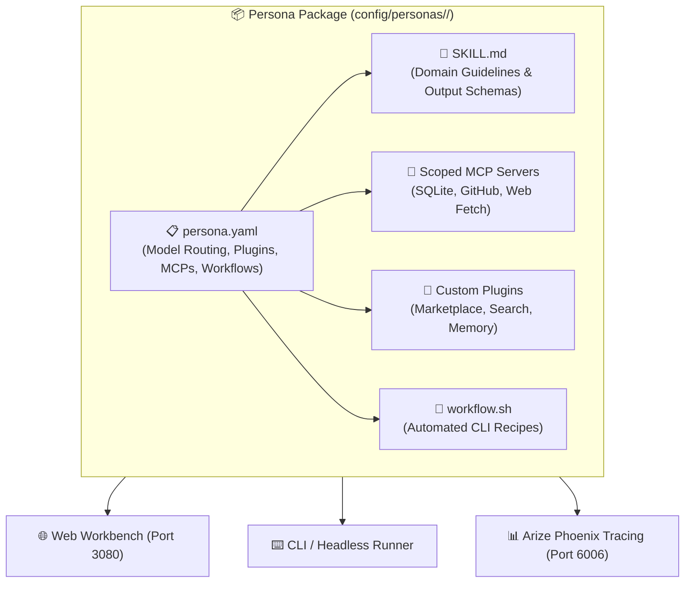

# 🎭 AI Agent Personas & Full Package Customization

A **Persona** in DeepSeek Harness is a fully packaged, domain-specific AI worker configured across **5 specialized layers**:
1. **Domain Skill (`SKILL.md`)**: Operational guidelines, rules, and output schemas.
2. **Provider & Calibrated Model (`model`)**: Optimal model routing (e.g. DeepSeek V3, Claude 3.5 Sonnet, Gemini 3.7 Flash) and temperature.
3. **Dedicated Plugins (`plugins`)**: Specific DSH plugins required by the persona (e.g. `modsearch`, `dsh-mnemon`, `dsh-find-plugin`).
4. **Scoped MCP Servers (`mcpServers`)**: Dedicated Model Context Protocol tool integrations (e.g. SQLite, GitHub, Context7, Fetch).
5. **Executable Workflows (`workflow.sh`)**: Repeatable automation recipes and scheduled background tasks.

---

## 🧭 Anatomy of a Complete Persona Package



---

## 🧰 Persona Package Structure (`config/personas/<name>/`)

Every persona is organized as an isolated, self-contained bundle:

```text
config/personas/<name>/
├── persona.yaml       # Master manifest (Model, plugins, MCP tools, workflows)
├── SKILL.md           # Reusable domain rules and operational constraints
└── workflow.sh        # Executable bash recipes for recurring tasks
```

### Example Manifest (`persona.yaml`):
```yaml
name: data-analyst
title: "Data Analyst & Insights Specialist"
description: "Specialized in querying SQL databases, analyzing tabular datasets, and computing distribution metrics."
model:
  provider: openrouter
  model: deepseek/deepseek-chat
  temperature: 0.2
plugins:
  - "@liustack/modsearch"
  - "dsh-mnemon"
  - "dsh-find-plugin"
mcpServers:
  sqlite-db:
    command: "npx"
    args: ["-y", "@modelcontextprotocol/server-sqlite", "--db-path", "/workspaces/data.db"]
  fetch:
    command: "npx"
    args: ["-y", "@mzxrai/mcp-webresearch"]
workflows:
  summarize-data: "Using the data-analyst skill, analyze /workspaces/data.csv and produce a summary table with distribution stats."
  audit-schema: "Using the data-analyst skill, inspect table schemas in /workspaces/data.db and report missing indexes."
```

---

## 🛠️ Pre-Packaged Starter Personas

### 1. 📊 `data-analyst` (Data Analyst & Insights Specialist)
* **Default Model**: `openrouter/deepseek/deepseek-chat`
* **MCP Tools**: `sqlite-db` (`@modelcontextprotocol/server-sqlite`), `fetch` (`@mzxrai/mcp-webresearch`)
* **Plugins**: `@liustack/modsearch`, `dsh-mnemon`, `dsh-find-plugin`
* **Workflows**: Table distribution summaries, database schema audits.

### 2. 🛡️ `security-auditor` (Security Auditor & AppSec Specialist)
* **Default Model**: `openrouter/anthropic/claude-3.5-sonnet` (high-accuracy vulnerability reasoning)
* **MCP Tools**: `github` (`@modelcontextprotocol/server-github`), `fetch`
* **Plugins**: `dsh-better-sidebar`, `dsh-find-plugin`
* **Workflows**: Git diff security reviews, hardcoded secret and token leak detection.

### 3. 🌐 `sdmx-expert` (SDMX 2.1 & Statistical Data Specialist)
* **Default Model**: `openrouter/deepseek/deepseek-chat` or `gemini/gemini-3.7-flash`
* **MCP Tools**: `fetch`, `context7` (`@upstash/context7-mcp`)
* **Plugins**: `@liustack/modsearch`, `dsh-model-sync`
* **Workflows**: LUSTAT (STATEC LU1) and Eurostat (ESTAT) dataflow queries and Python `uv` scripts.

### 4. 🚀 `devops-sre` (DevOps & Site Reliability Engineer)
* **Default Model**: `openrouter/deepseek/deepseek-chat`
* **MCP Tools**: `github`, `fetch`
* **Plugins**: `dsh-mcp-panel`, `dsh-provider-model-configurator`
* **Workflows**: `./dsh.sh doctor` ecosystem diagnostics and container log inspection.

---

## ⌨️ CLI Persona Management (`./dsh.sh persona`)

| Command | Action |
| :--- | :--- |
| **`./dsh.sh persona list`** | Lists all installed persona packages, their calibrated models, and available starter templates. |
| **`./dsh.sh persona create <name> --template <template>`** | Scaffolds a complete 3-file persona package and registers the skill for instant DSH discovery. |
| **`./dsh.sh persona apply <name>`** | Sets the persona's model and settings as the active workspace default. |
| **`./dsh.sh persona run <name> "<prompt>"`** | Executes a one-shot headless task using the persona's specific model, MCP tools, and skill. |
| **`./dsh.sh persona workflow <name> [action]`** | Runs a pre-configured automation recipe defined in the persona's `workflow.sh`. |
| **`./dsh.sh persona show <name>`** | Displays the complete persona manifest and skill instructions. |

---

## 🌐 Customizing Inside the Web UI (`http://localhost:3080`)

1. **Immediate Discovery**: Because `config/skills/` is mounted to `/root/.dsh/skills/`, every persona you create is immediately available in the chat dropdown.
2. **Conversational Scaffolding**: Instruct the agent in chat:
   > 💬 *"Create a new persona named `fastapi-architect` using the persona template format with model `deepseek-chat`, SQLite MCP server, and rules for async SQLAlchemy 2.0. Save it to `config/personas/fastapi-architect/`."*
3. **Trace Observability**: Every persona action (tool invocations, token costs, model latency) is tracked in real-time on **Arize Phoenix** at `http://localhost:6006`.
