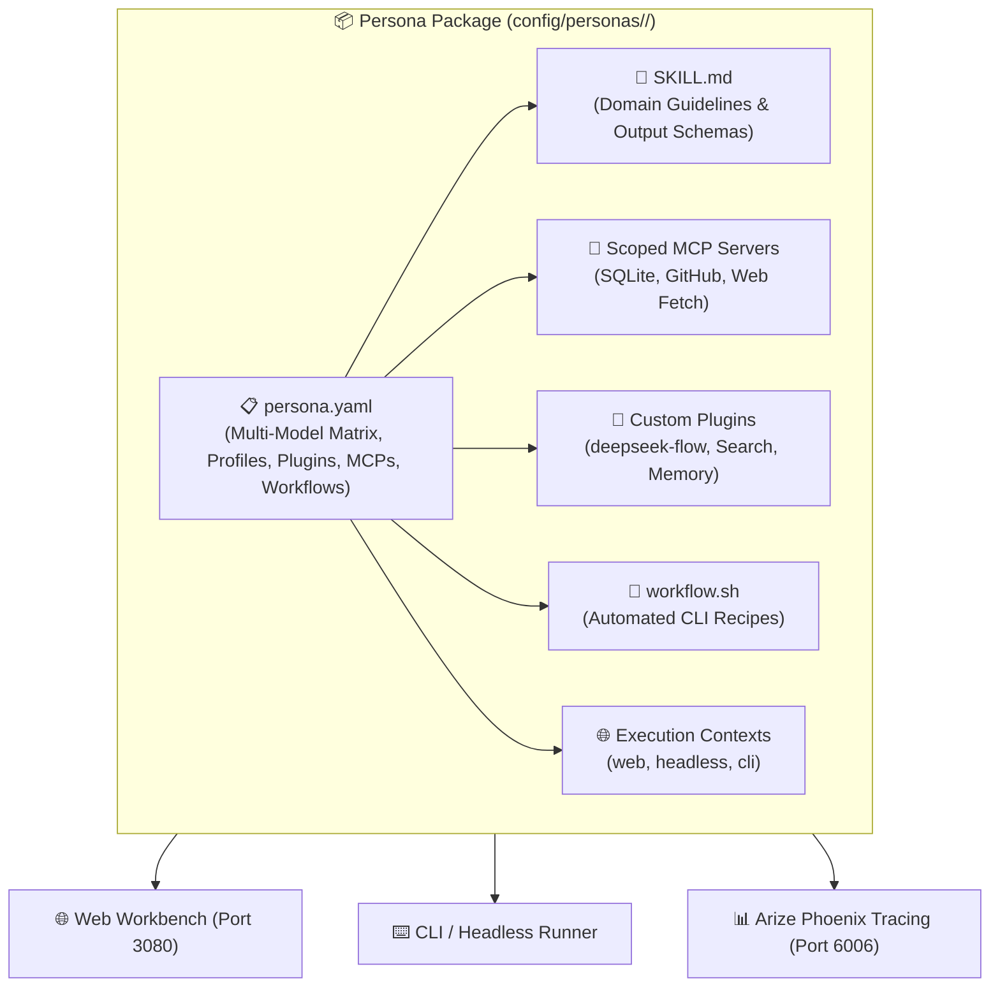
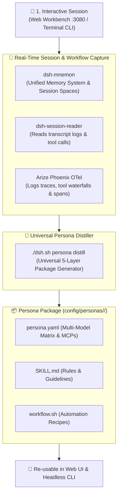
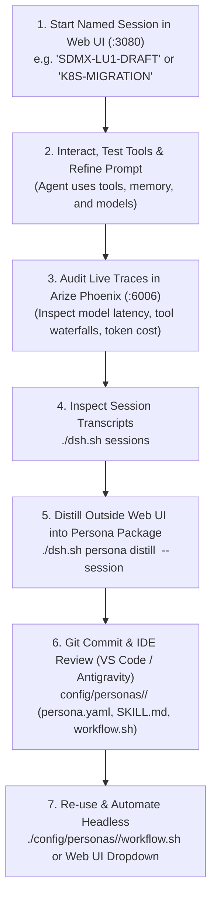

# 🎭 AI Agent Personas & Multi-Model Task Routing

A **Persona** in DeepSeek Harness is a fully packaged, domain-specific AI worker configured across **6 specialized layers**:
1. **Domain Skill (`SKILL.md`)**: Operational guidelines, domain rules, code patterns, and structured output schemas.
2. **Provider & Calibrated Models (`models`)**: A **Multi-Model Task-Routing Matrix** assigning optimal models per task type (e.g. Default, Deep Reasoning, Precision Coding/Audit, Fast Indexing, Multimodal).
3. **Execution Context Profiles (`profiles`)**: Defined runtime execution environments (e.g. `web` for interactive visual canvas & widgets, `headless` for automated CI/CD batch runs, `cli` for terminal TUI).
4. **Dedicated Plugins (`plugins`)**: Specific DSH plugins required by the persona (e.g. `deepseek-flow`, `@liustack/modsearch`, `dsh-mnemon`, `dsh-find-plugin`).
5. **Scoped MCP Servers (`mcpServers`)**: Dedicated Model Context Protocol tool integrations (e.g. SQLite, GitHub, Context7, Fetch).
6. **Executable Workflows (`workflow.sh`)**: Repeatable automation recipes and scheduled background tasks.

---

## 🧭 Anatomy of a Complete Persona Package



---

## 🌐 Persona Execution Context Profiles (`profiles`)

A Persona can operate across different execution contexts depending on the task requirements:

| Execution Context Profile | Runtime Environment | Best Suited For |
| :--- | :--- | :--- |
| **`web`** | Full browser workbench with `deepseek-flow` visual canvas, plugin market, and memory widgets. | Interactive domain exploration, visual workflow design, and human-in-the-loop debugging. |
| **`headless`** | Autonomous, zero-GUI CLI runner executing one-shot tasks and printing clean results to `stdout`. | CI/CD pipelines, automated cron scripts, and background agent swarms. |
| **`cli`** | Interactive terminal Text-User-Interface (TUI) with low memory overhead. | Terminal-first developers and remote SSH server environments. |

---

## 🎯 Multi-Model Task-Routing Matrix

Rather than restricting a persona to a single static model, each persona defines multiple calibrated models—each chosen for maximum performance, accuracy, or cost-efficiency on specific subtasks:

| Model Tier | Purpose | Recommended Models |
| :--- | :--- | :--- |
| **`default`** | Fast triage, general queries, drafting, and interactive conversations. | `deepseek/deepseek-chat`, `gemini-3.7-flash` |
| **`reasoning`** | Deep architectural analysis, complex math, multi-file reconciliation, and formal verification. | `deepseek/deepseek-r1`, `anthropic/claude-3.7-sonnet:thinking` |
| **`audit` / `coding`**| Precision code review, vulnerability patch generation, and production refactoring. | `anthropic/claude-3.5-sonnet`, `openai/gpt-4o` |
| **`fast`** | High-throughput parsing, bulk CSV / log scanning, and rapid symbol indexing. | `gemini/gemini-3.7-flash`, `deepseek/deepseek-chat` |
| **`multimodal`** | Architecture diagram analysis, UI screenshots, and visual document inspection. | `gemini/gemini-3.7-flash`, `openai/gpt-4o` |

---

## 🧰 Persona Package Structure (`config/personas/<name>/`)

```text
config/personas/<name>/
├── persona.yaml       # Master manifest (Multi-Model Matrix, profiles, plugins, MCP tools, workflows)
├── SKILL.md           # Reusable domain rules and operational constraints
└── workflow.sh        # Executable bash recipes for recurring tasks
```

### Example Manifest with Multi-Model Matrix & Profiles (`persona.yaml`):
```yaml
name: sdmx-expert
title: "SDMX 2.1 & Statistical Data Specialist"
description: "Specialized in querying, extracting, and processing official statistics from LUSTAT (STATEC) and Eurostat SDMX 2.1 APIs."

# 🌐 Supported Execution Context Profiles
profiles:
  - web
  - headless
  - cli

# 🎯 Multi-Model Task Routing Matrix
models:
  default:
    provider: openrouter
    model: anthropic/claude-3.5-sonnet
    temperature: 0.1
    useCase: "Precision code security auditing, vulnerability verification, and patch generation"
  reasoning:
    provider: openrouter
    model: deepseek/deepseek-r1
    temperature: 0.0
    useCase: "Complex cryptanalysis, threat modeling, and multi-file taint analysis"
  fast:
    provider: openrouter
    model: deepseek/deepseek-chat
    temperature: 0.2
    useCase: "Rapid repository secret scanning and basic linter reviews"
  multimodal:
    provider: gemini
    model: gemini-3.7-flash
    temperature: 0.1
    useCase: "Architecture diagram review and visual document inspection"

plugins:
  - "dsh-better-sidebar"
  - "dsh-find-plugin"

mcpServers:
  github:
    command: "npx"
    args: ["-y", "@modelcontextprotocol/server-github"]
  fetch:
    command: "npx"
    args: ["-y", "@mzxrai/mcp-webresearch"]

workflows:
  audit-diff:
    modelTier: default
    command: "Using the security-auditor skill, audit all modified files in git diff HEAD~1 and report security risks with diff patches."
  threat-model:
    modelTier: reasoning
    command: "Using the security-auditor skill, perform deep architectural threat modeling across the codebase."
  scan-secrets:
    modelTier: fast
    command: "Using the security-auditor skill, scan the repository for hardcoded tokens, passwords, and private keys."
```

---

## 🛠️ Pre-Packaged Starter Personas

### 1. 📊 `data-analyst` (Data Analyst & Insights Specialist)
* **Model Matrix**:
  * `default`: `openrouter/deepseek/deepseek-chat` (queries & formatting)
  * `reasoning`: `openrouter/deepseek/deepseek-r1` (statistical modeling & anomaly correlation)
  * `audit`: `openrouter/anthropic/claude-3.5-sonnet` (executive KPI summaries)
  * `fast`: `gemini/gemini-3.7-flash` (rapid CSV parsing)
* **MCP Tools**: `sqlite-db` (`@modelcontextprotocol/server-sqlite`), `fetch` (`@mzxrai/mcp-webresearch`)
* **Plugins**: `@liustack/modsearch`, `dsh-mnemon`, `dsh-find-plugin`
* **Workflows**: Table distribution summaries, database schema audits.

### 2. 🛡️ `security-auditor` (Security Auditor & AppSec Specialist)
* **Model Matrix**:
  * `default`: `openrouter/anthropic/claude-3.5-sonnet` (AppSec audit & patch diffs)
  * `reasoning`: `openrouter/deepseek/deepseek-r1` (threat modeling & crypto verification)
  * `fast`: `openrouter/deepseek/deepseek-chat` (secret scanner)
  * `multimodal`: `gemini/gemini-3.7-flash` (architecture diagram review)
* **MCP Tools**: `github` (`@modelcontextprotocol/server-github`), `fetch`
* **Plugins**: `dsh-better-sidebar`, `dsh-find-plugin`
* **Workflows**: Git diff security reviews, hardcoded secret and token leak detection.

### 3. 🌐 `sdmx-expert` (SDMX 2.1 & Statistical Data Specialist)
* **Model Matrix**:
  * `default`: `openrouter/deepseek/deepseek-chat` (dataflow queries & mapping)
  * `reasoning`: `openrouter/deepseek/deepseek-r1` (cross-agency statistical reconciliation)
  * `coding`: `openrouter/anthropic/claude-3.5-sonnet` / `openai/gpt-4o` (Python `uv` + `sdmx1` scripts)
  * `fast`: `gemini/gemini-3.7-flash` (codelist indexing)
* **MCP Tools**: `fetch`, `context7` (`@upstash/context7-mcp`)
* **Plugins**: `@liustack/modsearch`, `dsh-model-sync`
* **Workflows**: LUSTAT (STATEC LU1) and Eurostat (ESTAT) dataflow queries and Python `uv` scripts.

### 4. 🚀 `devops-sre` (DevOps & Site Reliability Engineer)
* **Model Matrix**:
  * `default`: `openrouter/deepseek/deepseek-chat` (health checks & logs)
  * `reasoning`: `openrouter/deepseek/deepseek-r1` (root-cause analysis of crash loops)
  * `coding`: `openrouter/anthropic/claude-3.5-sonnet` (Dockerfiles & CI workflows)
  * `fast`: `gemini/gemini-3.7-flash` (port triage)
* **MCP Tools**: `github`, `fetch`
* **Plugins**: `dsh-mcp-panel`, `dsh-provider-model-configurator`
* **Workflows**: `./dsh.sh doctor` ecosystem diagnostics and container log inspection.

---

## 🧪 Interactive Session Recording & Persona Distillation

Instead of writing a persona from scratch, you can **draft and refine workflows interactively** in a chat session, and then **distill the session into a permanent Persona Package** using our native CLI distiller:



---

---

## 🛠️ The Decoupled Developer Workflow

The recommended engineering pattern separates **interactive execution & experimentation (inside Web UI & Phoenix)** from **persona building, version control, and automation (outside Web UI via CLI & Git)**:



### 📋 Detailed Step-by-Step Guide:

#### 1. Start a Session in Web UI (`http://localhost:3080`)
* Open **[http://localhost:3080](http://localhost:3080)** and start a new conversation.
* Give the session a descriptive name in the UI history list (e.g. `ESTAT-LU1-SDMX-DRAFT`).

#### 2. Interact, Correct Mistakes, and Test Models
* Prompt the agent to accomplish your domain goal.
* Test tool calls (e.g. `@mzxrai/mcp-webresearch`, GitHub MCP, or Python `uv` execution).
* Correct any missteps directly in chat.

#### 3. Audit Observability & Telemetry in Arize Phoenix (`http://localhost:6006`)
* Open **[http://localhost:6006](http://localhost:6006)**.
* Filter by your session trace to view:
  * ⏱️ **Model Latency**: Compare DeepSeek Chat vs DeepSeek R1 vs Gemini 3.7 Flash.
  * 🌊 **Tool Waterfall**: Verify tool call arguments and response payloads.
  * 💰 **Token Attribution**: Track prompt vs completion token consumption.

#### 4. Distill Externally via CLI
Open your terminal and distill the refined session into a permanent 5-layer Persona package:

```bash
# List all recorded sessions across workspaces:
./dsh.sh sessions

# Distill the specific session into a permanent persona package:
./dsh.sh persona distill sdmx-engineer --session session-75c132db-aaf8-47be-87a4-0229667f99fb
```

#### 5. Review & Git Commit in Your IDE
Open the generated package in your editor:
```bash
# Inspect the 5-layer persona package
tree config/personas/sdmx-engineer/
# ├── persona.yaml   # Multi-Model Task Routing Matrix & MCP tools
# ├── SKILL.md       # Operational rules, guidelines & schemas
# └── workflow.sh    # Executable repeatable automation recipes

# Commit to version control
git add config/personas/sdmx-engineer/
git commit -m "feat(persona): add sdmx-engineer distilled from ESTAT/LUSTAT interactive session"
```

#### 6. Run & Automate
* **In Web UI**: The skill is automatically available in the Skills dropdown at `http://localhost:3080`.
* **In Terminal CLI**:
  ```bash
  # Execute using calibrated model tier
  ./dsh.sh persona run sdmx-engineer --tier reasoning "Calculate core inflation breaks"
  # Run batch workflow recipe
  ./config/personas/sdmx-engineer/workflow.sh reasoning
  ```

---

## ⌨️ CLI Persona & Session Commands (`./dsh.sh`)

| Command | Action |
| :--- | :--- |
| **`./dsh.sh sessions`** | Lists all recorded interactive Web UI and CLI sessions with timestamps. |
| **`./dsh.sh persona list`** | Lists all personas with their full **Task-to-Model Matrix** and starter templates. |
| **`./dsh.sh persona create <name> --template <template>`** | Scaffolds a complete persona package from a pre-built template. |
| **`./dsh.sh persona distill <name> [--session <id>]`** | Distills recent interactive chat sessions and learned memories into a persona package. |
| **`./dsh.sh persona apply <name> [--tier <tier>]`** | Sets the persona's specified model tier as the active workspace default. |
| **`./dsh.sh persona run <name> [--tier <tier>] "<prompt>"`** | Executes a one-shot task using the persona's designated model tier (e.g. `reasoning`, `coding`, `fast`). |
| **`./dsh.sh persona workflow <name> <workflow-key>`** | Runs a pre-configured automation recipe using its calibrated model tier. |
| **`./dsh.sh persona show <name>`** | Displays the complete persona manifest and skill instructions. |
