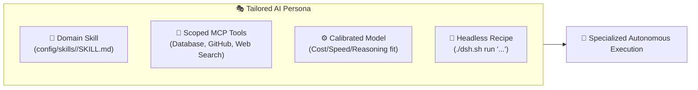

# 🎭 AI Agent Personas & Profile Specialization

A **Persona** in DeepSeek Harness is a tailored, domain-specific AI worker configured with specialized **domain skills**, **scoped MCP tools**, a **calibrated default model**, and **automated headless recipes**.

---

## 🧭 Anatomy of a Persona



A well-designed persona brings together four components:
1. **Domain Skill (`SKILL.md`)**: Reusable rules, constraints, and examples governing agent behavior.
2. **Curated Tools & MCP Servers**: Scoped tools relevant to the domain (e.g. SQLite, GitHub, Context7).
3. **Model Routing**: Selecting the optimal model for the domain (e.g. DeepSeek R1 for logic, Gemini 3.7 Flash for speed/multimodal, DeepSeek V3 for cost-effective coding).
4. **Automated Headless Recipe**: A repeatable CLI command for recurring background execution.

---

## 🛠️ Worked Persona Examples

---

### 1. 📊 The "Data Analyst & SDMX Engineer" Persona

Specialized in querying SQL databases, analyzing statistical datasets (e.g., LUSTAT, Eurostat), and generating executive summaries.

#### Step 1: The Domain Skill (`config/skills/data-analyst/SKILL.md`)
```markdown
---
name: data-analyst
description: Use when querying, cleaning, or summarizing tabular/SQL data and statistical datasets.
---

# Data Analyst & Statistical Engineer

## Guidelines & Rules
1. Always run read-only queries (`SELECT`) first; never perform `DROP` or destructive operations.
2. Summarize result sets over 20 rows into clean markdown tables with key takeaways.
3. Flag columns with >15% NULL or missing values before aggregating.
4. For statistical API endpoints (SDMX/LUSTAT/Eurostat), format dimensions cleanly.

## Output Format
* 📈 **Executive Summary** (2-3 sentences)
* 📊 **Structured Data Table**
* 💡 **Key Insights & Anomalies**
```

#### Step 2: Optimal Model Selection
* **Model**: `deepseek/deepseek-chat` (DeepSeek V3) or `gemini-3.7-flash` for fast, cost-effective data extraction.

#### Step 3: Headless Execution Recipe
```bash
./dsh.sh run "Using the data-analyst skill, analyze sales trends in /workspaces/data.csv and write an executive summary to reports/sales_q3.md"
```

---

### 2. 🛡️ The "Security & Code Review Auditor" Persona

Specialized in auditing pull requests, identifying vulnerabilities, and verifying secret sanitization.

#### Step 1: The Domain Skill (`config/skills/security-auditor/SKILL.md`)
```markdown
---
name: security-auditor
description: Use when conducting security audits, code reviews, and dependency checks.
---

# Security Auditor

## Guidelines & Rules
1. Audit for OWASP Top 10 vulnerabilities (Injection, Broken Auth, SSRF, XSS).
2. Scan for hardcoded secrets, unencrypted tokens, and insecure environment defaults.
3. Check package manifests (`package.json`, `requirements.txt`) for outdated or high-severity CVEs.
4. Every finding must include: Severity (Critical/High/Medium/Low), Vulnerable Line, and Remediation Diff.
```

#### Step 2: Optimal Model Selection
* **Model**: `anthropic/claude-3.5-sonnet` or `deepseek/deepseek-r1` for rigorous vulnerability reasoning.

#### Step 3: Headless Execution Recipe
```bash
./dsh.sh run "Using the security-auditor skill, audit all modified files in git diff HEAD~1 and generate a security report in /workspaces/security_audit.md"
```

---

### 3. 🚀 The "DevOps & SRE" Persona

Specialized in Docker container lifecycle, health diagnostics, and CI/CD pipelines.

#### Step 1: The Domain Skill (`config/skills/devops-sre/SKILL.md`)
```markdown
---
name: devops-sre
description: Use when managing Docker services, debugging container failures, and optimizing deployments.
---

# DevOps & SRE Engineer

## Guidelines & Rules
1. Run `./dsh.sh doctor` and inspect container logs before suggesting infrastructure fixes.
2. Ensure all container changes maintain non-root execution and health checks.
3. Keep Docker layers minimal and multi-stage builds clean ($< 1\text{ MB}$ writable layer).
```

#### Step 2: Headless Execution Recipe
```bash
./dsh.sh run "Using the devops-sre skill, inspect the current docker compose status and verify all health checks"
```

---

## 🧰 Fast Persona Customization & Scaffolding

DSH-DDS includes a built-in **Persona Template Scaffolder** that makes creating and customizing personas effortless both via the **CLI** and inside the **Web UI**.

---

### Method A: Scaffold via CLI (`./dsh.sh persona`)

You can list available templates and generate a new persona with 1 command:

```bash
# 1. List active personas and available starter templates
./dsh.sh persona list

# 2. Create a new persona from a pre-built template
./dsh.sh persona create my-analyst --template data-analyst
./dsh.sh persona create my-auditor --template security-auditor
./dsh.sh persona create stats-bot  --template sdmx-expert
./dsh.sh persona create custom-bot --template base-template

# 3. View the generated persona
./dsh.sh persona show my-analyst
```

#### Available Starter Templates (`config/templates/personas/`):
* `base-template.md`: Universal boilerplate with standard frontmatter, rules, and output schemas.
* `data-analyst.md`: SQL, CSV, metric summaries, and data quality checks.
* `security-auditor.md`: AppSec, OWASP top 10, secret leak verification, and code diffs.
* `sdmx-expert.md`: SDMX 2.1 dataflows, LUSTAT/STATEC, Eurostat, and Python `uv` extraction.

---

### Method B: Customize Inside the Web UI

Because `config/skills/` is mounted to `/root/.dsh/skills/`, every persona you create is **immediately discovered** in the Web UI:

1. **Via Built-in Editor**: Open the Web UI at `http://localhost:3080` $\rightarrow$ Open the File Explorer $\rightarrow$ Edit `config/skills/<name>/SKILL.md` directly.
2. **Via Conversational Prompts**: You can prompt the agent to create or modify a persona:
   > 💬 *"Create a new persona named `fastapi-architect` using the persona template format with rules for async SQLAlchemy 2.0 and Pydantic v2. Save it into `config/skills/fastapi-architect/SKILL.md`."*

---

## 🔄 Running Personas

### 1. In the Web UI (`http://localhost:3080`)
* In the chat prompt, select the skill or instruct the agent:  
  > 💬 *"Using the `data-analyst` skill, summarize the user churn dataset in `/workspaces/churn.csv`."*

### 2. In Headless CLI Mode
```bash
./dsh.sh run "Using the sdmx-expert skill, query the latest inflation dataflows from LUSTAT"
```

### 3. Trace Observability in Phoenix
Every persona execution automatically logs its reasoning traces, tools, and token metrics to **Arize Phoenix** at `http://localhost:6006`.
