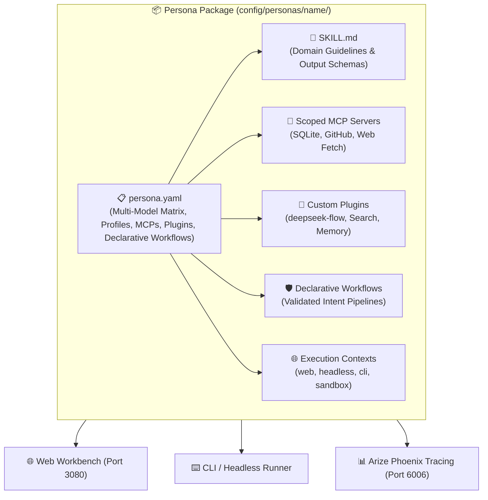
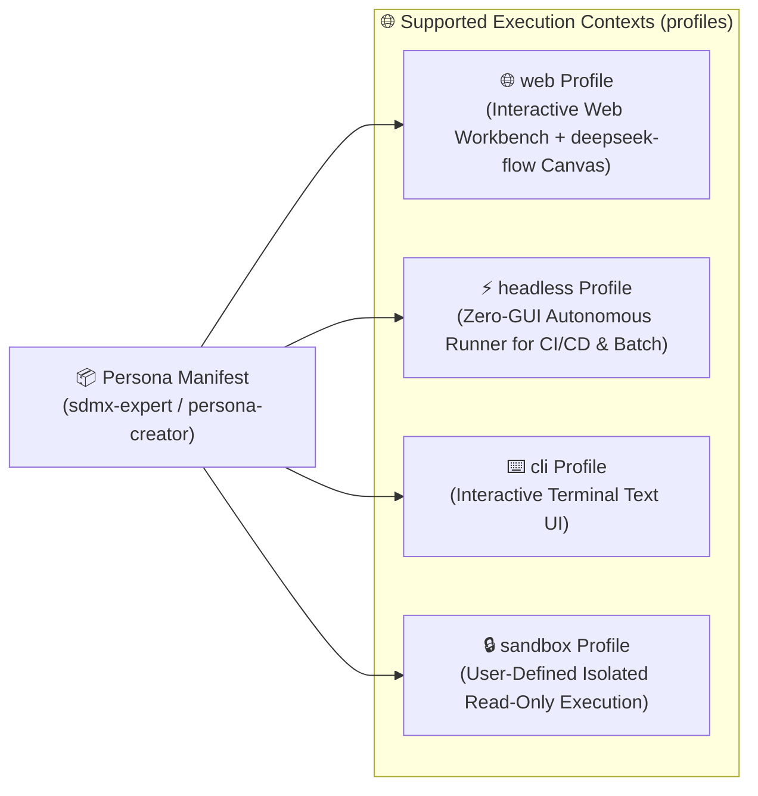
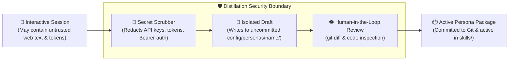
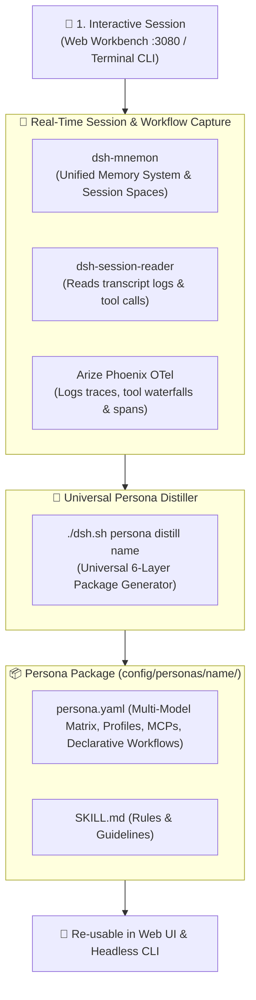
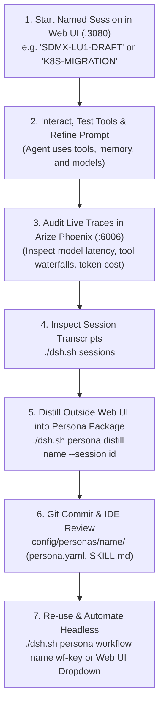

# 🎭 AI Agent Personas & Multi-Model Task Routing

> 🔬 **Academic & Industry Research**: For theoretical foundations, literature analysis (Stanford, Google, Anthropic), and comparative framework benchmarks, see the **[AI Personas Research Note](research-notes-ai-personas.md)**.

A **Persona** in DeepSeek Harness is a fully packaged, domain-specific AI worker configured across **6 specialized layers**:
1. **Domain Skill (`SKILL.md`)**: Operational guidelines, domain rules, code patterns, and structured output schemas.
2. **Provider & Calibrated Models (`models`)**: A **Multi-Model Task-Routing Matrix** assigning optimal models per task type (e.g. Default, Deep Reasoning, Precision Coding/Audit, Fast Indexing, Multimodal).
3. **Execution Context Profiles (`profiles`)**: Defined runtime execution environments (e.g. `web` for interactive visual canvas & widgets, `headless` for automated CI/CD batch runs, `cli` for terminal TUI, `sandbox` for isolated security).
4. **Scoped MCP Servers (`mcpServers`)**: Dedicated Model Context Protocol tool integrations (e.g. SQLite, GitHub, Context7, Fetch).
5. **Dedicated Plugins (`plugins`)**: Specific DSH plugins required by the persona (e.g. `deepseek-flow`, `@liustack/modsearch`, `dsh-mnemon`, `dsh-find-plugin`).
6. **Declarative Workflows (`workflows`)**: 100% declarative automation pipelines and recipes defined directly in `persona.yaml`, eliminating executable shell scripts to protect against prompt-injection execution payload weaponization.

---

## 🧭 Anatomy of a Complete Persona Package



---

## 🌐 Persona Execution Context Profiles (`profiles`)

A Persona defines **who the agent is** (rules, models, tools), while the **Execution Context Profile** defines **where and how the agent executes**.

Personas can define both **standard built-in profiles** and **custom user-defined profile configurations**:



### 📋 Profile Specifications & Capabilities:

| Profile Type | Runtime Environment | Best Suited For | Key Capabilities |
| :--- | :--- | :--- | :--- |
| **`web`** | Full browser workbench on port `3080`. | Interactive domain exploration, visual workflow design, and human-in-the-loop debugging. | • `deepseek-flow` visual canvas<br/>• `dshmarket` & MCP marketplace<br/>• `dsh-mnemon` memory manager |
| **`headless`** | Autonomous, zero-GUI CLI runner. | CI/CD automation pipelines, automated cron scripts, and background agent swarms. | • Executes single task to completion<br/>• Machine-parsable JSON/stdout<br/>• Zero browser/memory overhead |
| **`cli`** | Interactive terminal Text-User-Interface (TUI). | Terminal-first developers and remote SSH server environments. | • Full interactive multi-turn chat<br/>• Terminal streaming tokens<br/>• Low resource consumption |
| **`sandbox`** *(User-Defined)* | Restricted isolated container profile. | Security audits, untrusted code evaluation, and policy enforcement. | • Read-only filesystem boundaries<br/>• Network lockdown (no egress)<br/>• Scoped non-destructive tools (requires pre-vendored dependencies) |

---

### 📝 Defining Profiles in `persona.yaml`:

You can specify execution contexts using either a simple list or a structured dictionary with per-context settings:

#### Option A: Simple Profile List
```yaml
# 🌐 Supported Execution Context Profiles
profiles:
  - web
  - headless
  - cli
```

#### Option B: User-Defined Structured Profile Overrides
```yaml
# 🌐 User-Defined Execution Context Profiles with Scoped Configs
profiles:
  web:
    description: "Interactive Web Workbench with visual flow designer"
    plugins:
      - deepseek-flow
      - dsh-mnemon
      - dshmarket
  headless:
    description: "Autonomous batch runner for background data pipelines"
    timeout: "300s"
    outputFormat: "json"
  sandbox:
    description: "Restricted container isolation without network egress"
    network: false
    fsMode: "read-only"
```

---

## 🎯 Multi-Model Task-Routing Matrix

Rather than restricting a persona to a single static model, each persona defines multiple calibrated models—each chosen for maximum performance, accuracy, or cost-efficiency on specific subtasks:

| Model Tier | Purpose | Recommended Models |
| :--- | :--- | :--- |
| **`default`** | Primary persona model for interactive domain dialogue and task orchestration. | `deepseek/deepseek-chat`, `gemini-3.7-flash` |
| **`reasoning`** | Deep architectural analysis, complex math, multi-file reconciliation, and formal verification. | `deepseek/deepseek-r1`, `anthropic/claude-3.7-sonnet:thinking` |
| **`audit` / `coding`**| Precision code review, vulnerability patch generation, and production refactoring. | `anthropic/claude-3.5-sonnet`, `openai/gpt-4o` |
| **`fast`** | High-throughput parsing, bulk CSV / log scanning, and rapid symbol indexing. | `gemini/gemini-3.7-flash`, `deepseek/deepseek-chat` |
| **`multimodal`** | Architecture diagram analysis, UI screenshots, and visual document inspection. | `gemini/gemini-3.7-flash`, `openai/gpt-4o` |

---

## 🧰 Persona Package Structure (`config/personas/<name>/`)

```text
config/personas/<name>/
├── persona.yaml       # Master manifest (version, Multi-Model Matrix, profiles, MCPs, plugins, declarative workflows)
└── SKILL.md           # Reusable domain rules and operational constraints
```

### Flagship Manifest Example (`config/personas/sdmx-expert/persona.yaml`):
```yaml
version: "1.0"
name: sdmx-expert
title: "SDMX 2.1 & Statistical Data Specialist"
description: "Specialized in querying, extracting, and processing official statistics from LUSTAT (STATEC) and Eurostat SDMX 2.1 APIs."

# 🌐 Supported Execution Context Profiles
profiles:
  - web       # Interactive Web Workbench (visual canvas, widgets, memory)
  - headless  # Autonomous batch execution (CI/CD, scripts, crons)
  - cli       # Interactive terminal matrix (TUI)

# 🎯 Multi-Model Task Routing Matrix
models:
  default:
    provider: openrouter
    model: deepseek/deepseek-chat
    temperature: 0.1
    useCase: "Dataflow queries, dimension mapping, and XML/JSON endpoint extraction"
  reasoning:
    provider: openrouter
    model: deepseek/deepseek-r1
    temperature: 0.0
    useCase: "Complex cross-agency statistical reconciliation (LU1 vs ESTAT) and DSD validation"
  fast:
    provider: gemini
    model: gemini-3.7-flash
    temperature: 0.2
    useCase: "High-speed schema parsing and statistical codelist browsing"
  coding:
    provider: openrouter
    model: anthropic/claude-3.5-sonnet
    temperature: 0.1
    useCase: "Writing robust Python / pandas / sdmx1 data processing scripts with uv"

# 🔌 Scoped Model Context Protocol (MCP) Servers
mcpServers:
  fetch:
    command: "mcp-server-webresearch"
    args: []
  context7:
    command: "context7-mcp"
    args: []

# 🧩 Dedicated Plugins
plugins:
  - "@liustack/modsearch"
  - "dsh-model-sync"

# 🤖 Automation Recipes
workflows:
  lustat:
    modelTier: default
    command: "Using the sdmx-expert skill, query available dataflows from LUSTAT (LU1) and list top economic indicators."
  eurostat:
    modelTier: default
    command: "Using the sdmx-expert skill, discover Eurostat (ESTAT) dataflow endpoints for consumer price indexes."
  generate-script:
    modelTier: coding
    command: "Using the sdmx-expert skill, write a Python uv script using sdmx1 to fetch and convert LUSTAT data to pandas."
```

---

## 🛠️ Pre-Packaged Starter Personas

### 1. 🏗️ `persona-creator` (AI Persona & Workflow Architect)
* **Model Matrix**:
  * `default`: `openrouter/deepseek/deepseek-chat` (interactive domain interviewing & requirement gathering)
  * `reasoning`: `openrouter/deepseek/deepseek-r1` (Boolean condition gates & DAG dependency verification)
  * `audit`: `openrouter/anthropic/claude-3.5-sonnet` (precision YAML manifest & tool validation)
  * `fast`: `gemini/gemini-3.7-flash` (session log parsing & documentation indexing)
* **MCP Tools**: `fetch`, `context7`, `github`
* **Plugins**: `deepseek-flow` (visual canvas), `dsh-mnemon`, `dshmarket`, `dsh-find-plugin`
* **Workflows**: Visual canvas workflow design, automated 6-layer persona package generation.

### 2. 📊 `data-analyst` (Data Analyst & Insights Specialist)
* **Model Matrix**:
  * `default`: `openrouter/deepseek/deepseek-chat` (queries & formatting)
  * `reasoning`: `openrouter/deepseek/deepseek-r1` (statistical modeling & anomaly correlation)
  * `audit`: `openrouter/anthropic/claude-3.5-sonnet` (executive KPI summaries)
  * `fast`: `gemini/gemini-3.7-flash` (rapid CSV parsing)
* **MCP Tools**: `sqlite-db` (`mcp-server-sqlite@2025.4.25`), `fetch` (`mcp-server-webresearch@0.1.7`)
* **Plugins**: `@liustack/modsearch`, `dsh-mnemon`, `dsh-find-plugin`
* **Workflows**: Table distribution summaries, database schema audits.

### 3. 🛡️ `security-auditor` (Security Auditor & AppSec Specialist)
* **Model Matrix**:
  * `default`: `openrouter/anthropic/claude-3.5-sonnet` (AppSec audit & patch diffs)
  * `reasoning`: `openrouter/deepseek/deepseek-r1` (threat modeling & crypto verification)
  * `fast`: `openrouter/deepseek/deepseek-chat` (secret scanner)
  * `multimodal`: `gemini/gemini-3.7-flash` (architecture diagram review)
* **MCP Tools**: `github` (`github-mcp-server:v1.11.0`), `fetch` (`@mzxrai/mcp-webresearch@0.1.7`)
* **Plugins**: `dsh-find-plugin`, `dsh-mnemon`
* **Workflows**: Git diff security reviews, hardcoded secret and token leak detection.

### 4. 🌐 `sdmx-expert` (SDMX 2.1 & Statistical Data Specialist)
* **Model Matrix**:
  * `default`: `openrouter/deepseek/deepseek-chat` (dataflow queries & mapping)
  * `reasoning`: `openrouter/deepseek/deepseek-r1` (cross-agency statistical reconciliation)
  * `coding`: `openrouter/anthropic/claude-3.5-sonnet` (Python `uv` + `sdmx1` scripts)
  * `fast`: `gemini/gemini-3.7-flash` (codelist indexing)
* **MCP Tools**: `fetch`, `context7` (`@upstash/context7-mcp`)
* **Plugins**: `@liustack/modsearch`, `dsh-model-sync`, `dsh-mnemon`
* **Workflows**: LUSTAT (STATEC LU1) and Eurostat (ESTAT) dataflow queries and Python `uv` scripts.

### 5. 🚀 `devops-sre` (DevOps & Site Reliability Engineer)
* **Model Matrix**:
  * `default`: `openrouter/deepseek/deepseek-chat` (health checks & logs)
  * `reasoning`: `openrouter/deepseek/deepseek-r1` (root-cause analysis of crash loops)
  * `coding`: `openrouter/anthropic/claude-3.5-sonnet` (Dockerfiles & CI workflows)
  * `fast`: `gemini/gemini-3.7-flash` (port triage)
* **MCP Tools**: `github`, `fetch`
* **Plugins**: `dsh-mcp-panel`, `dsh-provider-model-configurator`, `dsh-mnemon`
* **Workflows**: `./dsh.sh doctor` ecosystem diagnostics and container log inspection.

---

## 📜 Normative `persona.yaml` Manifest Specification

Every persona package is defined by a master declarative manifest `config/personas/<name>/persona.yaml`:

### Schema Reference

```yaml
# Master Persona Manifest Schema (Version 1.0)
version: "1.0"                         # [Required] Schema version
name: "string"                         # [Required] Slug identifier (kebab-case)
title: "string"                        # [Required] Human-readable display title
description: "string"                  # [Required] High-level domain summary

# 🌐 Execution Context Profiles (List or Dict)
profiles:                              # [Required] List or Dict of supported profiles
  - "web"                              # Standard profiles: web | headless | cli
  - "headless"
  - "cli"
  # Or Structured Dict with Scoped Overrides:
  # sandbox:
  #   description: "Isolated security-restricted profile"
  #   network: false                   # Disable container network egress
  #   fsMode: "read-only"              # Enforce read-only filesystem mounts
  #   timeout: "180s"                  # Execution deadline
  #   outputFormat: "json"             # Formatter (json | text | markdown)
  #   plugins: ["dsh-find-plugin"]     # Scoped plugins (augmented to global plugins)

# 🎯 Multi-Model Task-Routing Matrix
models:                                # [Required] Dictionary of task-to-model tiers
  default:                             # [Required] Primary model for interactive orchestration
    provider: "openrouter|gemini|ollama" # [Required] Provider slug
    model: "string"                    # [Required] Model identifier (e.g. deepseek/deepseek-chat)
    temperature: 0.1                   # [Optional] Sampling temperature (0.0 to 1.0)
    useCase: "string"                  # [Optional] Human-readable description
  reasoning:                           # [Optional] Deep architectural & mathematical tier
    provider: "openrouter|gemini|ollama"
    model: "string"
    temperature: 0.0
    useCase: "string"
  coding:                              # [Optional] High-precision code generation tier
    provider: "openrouter|gemini|ollama"
    model: "string"
    temperature: 0.1
    useCase: "string"
  fast:                                # [Optional] High-throughput document/log parsing tier
    provider: "gemini|openrouter|ollama"
    model: "string"
    temperature: 0.2
    useCase: "string"

# 🔌 Scoped Model Context Protocol (MCP) Servers
mcpServers:                            # [Optional] Dictionary of MCP tool definitions
  <server-name>:
    command: "npx|python|docker"       # Command binary
    args: ["-y", "@scope/package"]     # Arguments
    env:                               # Environment variable indirection
      TOKEN: "${SECRET_ENV_VAR}"       # (Never hardcode secrets directly)

# 🧩 Dedicated Plugins
plugins:                               # [Optional] List of DSH plugins required
  - "plugin-id-or-npm-name"

# 🛡️ Zero Trust RBAC Matrix (ADR 0001)
rbac:                                  # [Required for PoLP] Persona access control policy
  role: "role_identifier"              # Specific role name
  permissions:
    filesystem:
      read:
        - "/workspaces"
        - "/root/.dsh/personas/<persona-name>"
      write:
        - "/workspaces"
        - "/root/.dsh/sessions"
      deny:                            # Explicitly forbidden resources (fail-closed)
        - "/etc"
        - "/root/.ssh"
        - "config/personas/*"
        - "reset.sh"
        - "install_dsh.sh"
    mcp:
      allowed:                         # Whitelisted MCP servers
        - "sqlite-db"
        - "fetch"

# 🛡️ Declarative Workflows & Adaptive Case Management (ACM)
workflows:                             # [Optional] Dictionary of named execution recipes
  <workflow-key>:
    modelTier: "default|reasoning|coding|fast" # Model tier to invoke
    description: "string"              # Summary of the workflow case
    type: "standard|case-management"   # [Optional] Declares adaptive case handling
    steps:                             # [Optional] 100% Declarative step sequence
      - name: "Step Name"
        action: "fetch_sources|evaluate_threat|..."
        scope: "workspace|docker|..."
        target: "resource-id-or-path"
        when: "expression (e.g. severity == 'CRITICAL')" # Conditional branch
        approval_required: true        # Human-in-the-Loop gateway
        on_failure: "fallback_action"  # Exception handling & escalation
        output_variable: "var_name"    # Stateful case tracking
        verification: "assertion"      # Post-action verification invariant
        destination: "report-path"     # Evidence or artifact destination
    command: "string"                  # Alternative direct declarative instruction
```

### Merging & Resolution Rules:
1. **Profiles Merging**: Per-profile `plugins` are merged (union) with global `plugins`.
2. **Model Normalization**: CLI shorthands like `openrouter/deepseek/deepseek-chat` are normalized automatically to `{ provider: 'openrouter', model: 'deepseek/deepseek-chat' }`.
3. **Secret Indirection**: All MCP credentials **must** use `${VAR_NAME}` syntax referencing environment variables from the host or container environment.

---

## 🔒 Security, Trust Boundaries & Secret Scrubbing in Distillation

When distilling interactive web sessions into permanent persona packages, DeepSeek Harness enforces strict security boundaries:



1. **Automated Secret Scrubbing**:
   * The distiller automatically sanitizes session transcripts, stripping strings matching API key patterns (`sk-...`, `ghp_...`, `Bearer ...`) and environment credentials before writing `persona.yaml` and `SKILL.md`.
2. **Indirect Prompt Injection Protection**:
   * Content retrieved from external websites via `@mzxrai/mcp-webresearch` or public APIs could contain malicious prompt injection vectors. 
   * Distillation is **never automatically pushed to production**. It creates an uncommitted local package under `config/personas/<name>/` that requires explicit developer review (`git diff`) before being committed.
3. **Predictable Cold-Starts & Air-Gapped Execution**:
   * All standard MCP servers are pre-installed as local container binaries in `/usr/local/bin`, eliminating runtime network downloads.

---

## 🧪 Interactive Session Recording & Persona Distillation

Instead of writing a persona from scratch, you can **draft and refine workflows interactively** in a chat session, and then **distill the session into a permanent 6-Layer Persona Package** using our native CLI distiller:



---

## 🛠️ The Decoupled Developer Workflow

The recommended engineering pattern separates **interactive execution & experimentation (inside Web UI & Phoenix)** from **persona building, version control, and automation (outside Web UI via CLI & Git)**:



### 📋 Detailed Step-by-Step Guide:

#### 1. Start a Session in Web UI (`http://localhost:3080`)
* Open **[http://localhost:3080](http://localhost:3080)** and start a new conversation.
* Give the session a descriptive name in the UI history list (e.g. `ESTAT-LU1-SDMX-DRAFT`).

#### 2. Interact, Correct Mistakes, and Test Models
* Prompt the agent to accomplish your domain goal.
* Test tool calls (e.g. `@mzxrai/mcp-webresearch`, GitHub MCP, or Python `uv` execution).
* Correct any missteps directly in chat.

#### 3. Audit Observability & Telemetry in Arize Phoenix (`http://localhost:6006`)
* Open **[http://localhost:6006](http://localhost:6006)**.
* Filter by your session trace to view:
  * ⏱️ **Model Latency**: Compare DeepSeek Chat vs DeepSeek R1 vs Gemini 3.7 Flash.
  * 🌊 **Tool Waterfall**: Verify tool call arguments and response payloads.
  * 💰 **Token Attribution**: Track prompt vs completion token consumption.

#### 4. Distill Externally via CLI
Open your terminal and distill the refined session into a permanent 6-layer Persona package:

```bash
# List all recorded sessions across workspaces:
./dsh.sh sessions

# Distill the specific session into a permanent persona package:
./dsh.sh persona distill sdmx-engineer --session session-75c132db-aaf8-47be-87a4-0229667f99fb
```

#### 5. Review & Git Commit in Your IDE
Open the generated package in your editor:
```bash
# Inspect the 6-layer persona package
tree config/personas/sdmx-engineer/
# ├── persona.yaml   # Multi-Model Task Routing Matrix, MCP tools & Declarative Workflows
# └── SKILL.md       # Operational rules, guidelines & schemas

# Commit to version control
git add config/personas/sdmx-engineer/
git commit -m "feat(persona): add sdmx-engineer distilled from ESTAT/LUSTAT interactive session"
```

#### 6. Run & Automate
* **In Web UI**: The skill is automatically available in the Skills dropdown at `http://localhost:3080`.
* **In Terminal CLI**:
  ```bash
  # Execute using calibrated model tier
  ./dsh.sh persona run sdmx-engineer --tier reasoning "Calculate core inflation breaks"
  # Run declarative workflow pipeline
  ./dsh.sh persona workflow sdmx-engineer default-task
  ```

---

## ⌨️ CLI Persona & Session Commands (`./dsh.sh`)

| Command | Action |
| :--- | :--- |
| **`./dsh.sh sessions`** | Lists all recorded interactive Web UI and CLI sessions with timestamps. |
| **`./dsh.sh persona list`** | Lists all personas with their full **Task-to-Model Matrix**, execution profiles, and starter templates. |
| **`./dsh.sh persona create <name> [--template <tmpl>]`** | Generates a new 6-layer persona package in `config/personas/<name>/`. |
| **`./dsh.sh persona distill <name> [--session <id>]`** | Distills an interactive web/CLI session into a permanent 6-layer persona package. |
| **`./dsh.sh persona run <name> [--tier <tier>] [--profile <profile>] "<prompt>"`** | Executes persona in target profile with calibrated model tier. |
| **`./dsh.sh persona workflow <name> <workflow-key>`** | Runs a declared automation workflow recipe. |
| **`./dsh.sh persona apply <name> [--tier <tier>]`** | Sets persona default model and active skill as default in Web UI. |
| **`./dsh.sh persona create <name> --template <template>`** | Scaffolds a complete persona package from a pre-built template. |
| **`./dsh.sh persona distill <name> [--session <id>]`** | Distills recent interactive chat sessions and learned memories into a persona package. |
| **`./dsh.sh persona apply <name> [--tier <tier>]`** | Sets the persona's specified model tier as the active workspace default. |
| **`./dsh.sh persona run <name> [--tier <tier>] "<prompt>"`** | Executes a one-shot task using the persona's designated model tier (e.g. `reasoning`, `coding`, `fast`). |
| **`./dsh.sh persona workflow <name> <workflow-key>`** | Runs a pre-configured automation recipe using its calibrated model tier. |
| **`./dsh.sh persona show <name>`** | Displays the complete persona manifest and skill instructions. |
