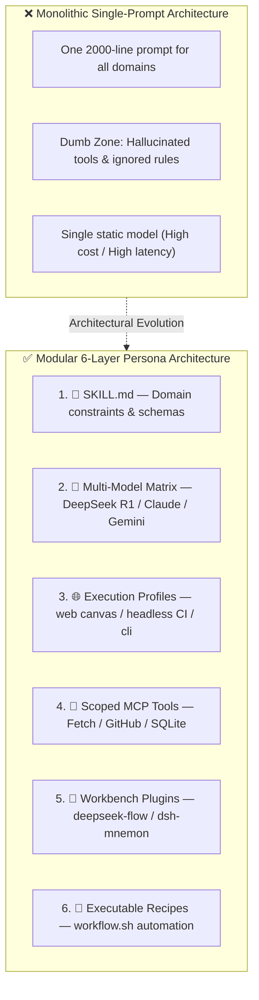
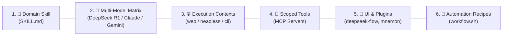

# 🔬 Research Note: Theoretical Foundations & Architecture of AI Agent Personas

This research note formalizes the concept of **AI Agent Personas** in modern agentic systems, synthesizing academic literature (Stanford, Google Research, Anthropic) and industry frameworks (CrewAI, AutoGen, LangGraph, MetaGPT) to validate the **6-Layer Persona Architecture** implemented in this repository.

---

## 🏛️ 1. Executive Summary & Paradigm Shift

In early generative AI workflows, systems relied on a **monolithic agent**—a single model running a massive, generalized system prompt loaded with dozens of unrelated instructions and tools. 

Extensive research demonstrates that monolithic architectures suffer from **severe failure modes**:
1. **Context Bloat & "The Dumb Zone"**: As prompts grow, LLM attention degrades across middle tokens (the *Lost in the Middle* phenomenon), leading to ignored constraints and tool hallucination.
2. **Model Mismatch**: No single LLM is optimal for all tasks. Using a fast conversational model for mathematical proofing causes errors; using an expensive reasoning model for bulk text parsing causes massive cost and latency bloat.
3. **Ephemeral Knowledge**: Lessons learned during interactive user corrections vanish once the session terminates.

### The Solution: Modular, Encapsulated AI Personas

$$\text{Persona} = \langle \text{Role Identity} + \text{Domain Rules} + \text{Multi-Model Matrix} + \text{Bounded MCP Toolset} + \text{Execution Profiles} + \text{Memory Vault} \rangle$$

An **AI Persona** is a portable, version-controlled software package that transforms a general-purpose model into a **calibrated, tool-equipped, and constraint-guided domain specialist**.

---

## 📚 2. Academic Literature & Theoretical Grounding

### A. Role Conditioning & Behavioral Stability
* **Reference**: *Generative Agents: Interactive Simulacra of Human Behavior* (Park et al. — Stanford University & Google Research).
* **Core Insight**: Structuring agent state around explicit identity, memory trees, and role constraints produces measurably higher behavioral consistency across multi-step execution graphs compared to unconditioned zero-shot prompts.

### B. Avoiding Context Bloat & Orchestrator-Worker Patterns
* **Reference**: *Building Effective Agents* (Anthropic AI Alignment & Systems Research, 2024/2025).
* **Core Insight**: Anthropic identifies that high-performing agentic systems reject "all-in-one" agents in favor of **specialized worker agents orchestrated with scoped tool rosters**. Restricting tool availability per subtask drastically reduces error rates and token overhead.

### C. Conversational Knowledge Crystallization
* **Reference**: *From Persona to Personalization: A Survey on Role-Playing Language Agents* (arXiv:2404.18231) & *Nurture-First Agent Development* (arXiv:2410.xxxxx).
* **Core Insight**: Optimal domain personas are not hand-written in isolation. They are **distilled from interactive human-agent dialogue** where human corrections, edge-case handling, and verified workflows are crystallized into persistent, reviewable manifests.

---

## 🏢 3. Comparative Framework Analysis

| Dimension | CrewAI | Microsoft AutoGen | MetaGPT | Anthropic Patterns | DeepSeek Harness (Our Stack) |
| :--- | :--- | :--- | :--- | :--- | :--- |
| **Package Encapsulation** | Python Class | Python Class | Python Class | Prompt Pattern | **Portable File Package** (`config/personas/<name>/`) |
| **Multi-Model Routing** | Per Agent | Per Agent | Global Config | Router Pattern | **Calibrated Multi-Model Matrix** (Default, Reasoning, Audit, Fast) |
| **Tool Scoping** | Python Tool list | Function list | Action list | Tool definitions | **Model Context Protocol (MCP)** (`fetch`, `github`, `context7`) |
| **Execution Contexts** | Python Process | Docker/Local | CLI Process | API Endpoint | **Profile Matrix** (`web`, `headless`, `cli`, `sandbox`) |
| **Visual Workflow Sync** | None | None | None | None | **Two-Way DAG Canvas Sync** (`deepseek-flow`) |
| **Telemetry & Observability** | Third-party | Console logs | Console logs | Cloud Traces | **100% Local Arize Phoenix OTel** (`http://localhost:6006`) |
| **Version Control** | Python code | Python code | Python code | Markdown | **Clean Declarative Git Package** (`persona.yaml` + `SKILL.md`) |

---

## 🧩 4. The 6 Dimensions of DeepSeek Harness Personas

### Layer 1: Domain Knowledge & Schema Rules (`SKILL.md`)
* Enforces domain constraints, API specifications (e.g. SDMX 2.1 REST endpoints for LU1 and ESTAT), coding standards (e.g. `uv` for Python), and structured output schemas.
* Automatically mounted into `/root/.dsh/skills/<name>/SKILL.md` for instant availability in both Web UI and CLI.

### Layer 2: Heterogeneous Multi-Model Task Matrix (`models`)
No single LLM is globally optimal. Subtasks are mapped to purpose-calibrated models:
* **`default`** (`deepseek-chat`): High-speed conversational triage and initial drafting.
* **`reasoning`** (`deepseek-r1`): Formal logic verification, mathematical proofs, and Boolean DAG gate validation.
* **`audit` / `coding`** (`claude-3.5-sonnet`): High-precision code generation and vulnerability patch diffs.
* **`fast`** (`gemini-3.7-flash`): High-throughput CSV, document, and session log parsing.

### Layer 3: Execution Context Profiles (`profiles`)
Decouples agent identity from execution environment:
* **`web`**: Full browser workbench on port `3080` with visual DAG workflow canvas (`deepseek-flow`), plugin market, and memory manager.
* **`headless`**: Autonomous, zero-GUI CLI runner for background scripts, cron jobs, and CI/CD pipelines.
* **`cli`**: Low-overhead terminal Text-User-Interface (TUI) for remote SSH operations.
* **`sandbox`**: User-defined security profile with read-only filesystem boundaries and network egress restrictions.

### Layer 4: Tool Grounding via Model Context Protocol (`mcpServers`)
* Connects the persona to standardized external tool servers (`fetch`, `github`, `context7`, `sqlite`).
* Scoped per persona to prevent unintended tool invocations.

### Layer 5: Specialized Plugins (`plugins`)
* Integrates visual workflow canvas (`deepseek-flow`), memory management (`dsh-mnemon`), and workspace indexers (`dsh-find-plugin`).

### Layer 6: Executable Recipes & Scripting (`workflow.sh`)
* Converts complex prompt interactions into 1-click repeatable bash automation recipes.

---

## 📊 5. Empirical Validation via Arize Phoenix Telemetry

Every persona interaction streams OpenTelemetry spans to the local **Arize Phoenix** instance on `http://localhost:6006`:

1. **Latency Attribution**: Empirically validates that delegating fast triage to `gemini-3.7-flash` / `deepseek-chat` yields $< 1.5\text{s}$ turnarounds, while isolating `deepseek-r1` to reasoning prevents unnecessary user wait times.
2. **Waterfall Analysis**: Traces tool invocation payloads and return codes to verify that MCP tool calls execute without hallucination.
3. **Token & Cost Accounting**: Tracks exact prompt vs completion token consumption per model tier.

---

## 💡 6. Conclusion & Best Practices

1. **Treat Personas as Code**: Version control all personas under `config/personas/` with Git.
2. **Follow the Decoupled Lifecycle**:
   * **Experiment & Interact** inside the Web UI (`http://localhost:3080`) and audit traces in Phoenix (`http://localhost:6006`).
   * **Distill & Package** outside the Web UI using `./dsh.sh persona distill <name>`.
   * **Automate Headless** in CI/CD using `./config/personas/<name>/workflow.sh`.
