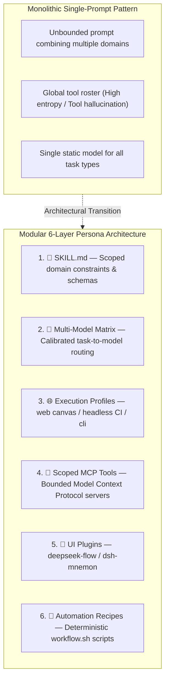

# 🔬 Research Note: Theoretical Foundations & Architecture of AI Agent Personas

This research note formalizes the concept of **AI Agent Personas** in modern agentic systems, synthesizing academic literature (Stanford, Google Research, Anthropic) and industry frameworks (CrewAI, Microsoft AutoGen, LangGraph, MetaGPT) to establish the design rationale for the **6-Layer Persona Architecture** implemented in this repository.

---

## 🏛️ 1. Theoretical Foundations & The Monolithic Failure Mode

Early LLM-based agent systems relied on **monolithic agent architectures**—a single model executing a large, generalized system prompt loaded with dozens of domain instructions, schemas, and tools.

Extensive research documents three primary structural failure modes of monolithic designs:

1. **Context Degradation & Information Position Sensitivity**:
   * *Citation*: Liu et al. (2023), *Lost in the Middle: How Language Models Use Long Contexts* (TACL 2023 / arXiv:2307.03172).
   * *Finding*: Model performance degrades significantly when key instructions or tool definitions reside in the middle of long context windows. As system prompts grow to accommodate multiple domains, adherence to negative constraints and tool schemas declines.
2. **Tool Selection Entropy & Error Surfaces**:
   * *Citation*: Anthropic Research (2024), *Building Effective Agents*.
   * *Finding*: Exposing an agent to an unbounded roster of tools increases the probability of incorrect tool selection and hallucinated arguments. Effective architectures constrain tool availability strictly to the active subtask or domain worker.
3. **Model-to-Task Capability Mismatch**:
   * No single model architecture is optimal across all operational dimensions (e.g. latency, formal reasoning, code synthesis, token cost). Monolithic routing either incurs excessive cost/latency by running reasoning models on trivial triage, or introduces errors by running lightweight models on complex multi-step logic.

---

## 🧩 2. Formal Definition of an AI Agent Persona

In modular agentic architectures, an **AI Persona** is defined as an encapsulated, portable software package:

$$\text{Persona} = \langle \text{Role Identity} + \text{Domain Rules} + \text{Multi-Model Routing} + \text{Bounded MCP Toolset} + \text{Execution Profiles} + \text{Memory Vault} \rangle$$

---

## 📚 3. Literature Synthesis

### A. Role Conditioning & Behavioral Consistency
* **Reference**: Park et al. (2023), *Generative Agents: Interactive Simulacra of Human Behavior* (UIST 2023 / arXiv:2304.03442).
* **Application**: Park et al. demonstrated that decomposing agent cognition into explicit identity files, memory retrieval streams, and plan-reflection loops produces coherent long-horizon behaviors. In developer tooling, structured role conditioning serves as a deterministic anchor for API conventions and domain rules.

### B. Specialized Worker Delegation & Scoped Toolsets
* **Reference**: Anthropic Research (2024), *Building Effective Agents*.
* **Application**: Anthropic details patterns for orchestrator-worker workflows, noting that separating tasks among specialized agents with tailored prompts and narrow toolsets consistently outperforms general-purpose single-agent loops in production environments.

### C. Agent Personalization & Identity Survey
* **Reference**: Wang et al. (2024), *From Persona to Personalization: A Survey on Role-Playing Language Agents* (arXiv:2404.18231).
* **Application**: Surverys modern methodologies for persona construction, confirming that combining explicit profile declarations with domain memory archives stabilizes agent persona adherence across multi-turn interactions.

---

## 🏢 4. Comparative Framework Analysis

Different multi-agent frameworks operationalize agent roles through distinct engineering abstractions:

| Architectural Dimension | CrewAI | Microsoft AutoGen | MetaGPT | DeepSeek Harness (This Stack) |
| :--- | :--- | :--- | :--- | :--- |
| **Primary Abstraction** | Python Class instances (`Agent`) | Conversable Python objects | Python Role classes with SOPs | **Declarative File Package** (`config/personas/<name>/`) |
| **Configuration Format** | Python code / YAML | Python dictionaries | Python code / YAML | **Master Manifest** (`persona.yaml` v1.0) |
| **Model Assignment** | Per-agent LLM parameter | Per-agent LLM configuration | Global configuration | **Multi-Model Task Matrix** (Default, Reasoning, Coding, Fast) |
| **Tool Integration Model** | Python LangChain/Crew tools | Python functions / toolkits | Action classes | **Model Context Protocol (MCP)** via JSON-RPC / stdio |
| **Execution Contexts** | In-process Python runtime | In-process / Docker sandbox | Local CLI process | **Execution Profile Matrix** (`web`, `headless`, `cli`, `sandbox`) |
| **Observability Standard** | OpenTelemetry / AgentOps | OpenTelemetry / Console | Console / Logging | **100% Local Arize Phoenix OTel** (`http://localhost:6006`) |
| **Workflow Lifecycle** | Programmatic pipeline | Conversational group chat | SOP sequence | **Two-Way DAG Canvas** (`deepseek-flow`) & `workflow.sh` |

---

## 🧩 5. The 6-Layer Persona Architecture Specification

1. **Layer 1 — Domain Skill (`SKILL.md`)**: Reusable domain knowledge, constraints, API specifications, and output formatting rules.
2. **Layer 2 — Multi-Model Task Matrix (`models`)**: Explicit routing of distinct subtasks to calibrated model classes (e.g. DeepSeek R1 for logic proofing, Claude 3.5 Sonnet for code patches, Gemini 3.7 Flash for bulk text indexing).
3. **Layer 3 — Execution Context Profiles (`profiles`)**: Decouples identity from execution environments (`web` browser workbench, `headless` CI/CD runner, `cli` terminal, `sandbox` isolated container).
4. **Layer 4 — Scoped MCP Servers (`mcpServers`)**: Model Context Protocol servers bounded per persona to limit tool search spaces and prevent ungrounded invocations.
5. **Layer 5 — Workbench Plugins (`plugins`)**: Visual DAG design canvas (`deepseek-flow`), multi-session memory systems (`dsh-mnemon`), and file finders.
6. **Layer 6 — Automation Recipes (`workflow.sh`)**: Version-controlled shell scripts encapsulating repeatable batch routines.

---

## 📊 6. Observability Instrumentation & Telemetry Framework

To measure persona execution characteristics without external cloud dependencies, DeepSeek Harness instruments all agent turns via **OpenTelemetry** into a local **Arize Phoenix** collector:

* **Span Tracing**: Captures root execution spans down to individual tool calls, LLM generation phases, and memory lookups.
* **Latency Decomposition**: Separates network transit time, prompt evaluation time, and tool execution latency across distinct model tiers.
* **Token & Cost Accounting**: Tracks exact prompt versus completion token consumption per persona and per task tier.
* **Tool Call Verification**: Logs full JSON payloads and exit codes to verify tool grounding accuracy.

---

## 🔒 7. Security & Trust Boundaries in Persona Distillation

A key innovation in this architecture is **Conversational Distillation** (`./dsh.sh persona distill <name>`), which converts interactive chat sessions into permanent persona packages. This introduces an explicit security model:

1. **Secret Redaction**: The distiller automatically scans session transcripts and strips recognized credentials (`sk-...`, `ghp_...`, Bearer tokens) before writing manifests.
2. **Human-in-the-Loop Review Gate**: Distillation creates a draft package in `config/personas/<name>/`. It is **never automatically executed or committed**; developers must review the resulting `git diff` to guard against indirect prompt injection from untrusted web pages retrieved during interactive sessions.
3. **Environment Indirection**: MCP tool configurations reference credentials exclusively via `${ENV_VAR}` variables rather than embedded secrets.
