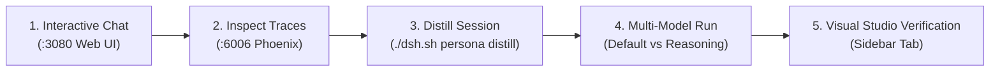

# 🧪 End-to-End Test Scenario: Interactive Drafting to Distilled Persona

This guide walks through a hands-on testing scenario demonstrating the full lifecycle of **interactive chat drafting**, **visual skill management**, **session recording**, **automated persona distillation**, **multi-model routing**, and **Arize Phoenix observability**.

---

## 🧭 Scenario Flow



---

## 📍 Step 1: Open the Web Workbench & Explore Plugins

1. Open **[http://localhost:3080](http://localhost:3080)** in your browser.
2. **Check the Navigation Sidebar**:
   * Click on the **Plugin Market (`dshmarket`)** and **MCP Market (`dsh-mcp-market`)** icons to view 1-click tools in clean English.
3. **Check the Settings Dialog**:
   * Click **Settings (⚙️)** in the bottom left to view the unified **Memory System (`dsh-mnemon`)** and **Model Configurator**.

---

## 📍 Step 2: Run an Interactive Task (Drafting Phase)

In the chat composer at `http://localhost:3080`, enter this prompt to test statistical data discovery:

```text
Help me find the exact SDMX 2.1 REST endpoints for Luxembourg inflation (LUSTAT agency LU1) and Eurostat (ESTAT). Write a small python script using `uv` to download the dataflow list and extract the dimensions.
```

### What Happens Behind the Scenes:
* **Interactive Chat**: The agent retrieves the LUSTAT & ESTAT endpoint definitions, applies SDMX rules, and structures Python `uv` code.
* **Continuous Recording**: **`dsh-mnemon`** records the operational constraints, while **`dsh-session-telemetry-otel`** streams all spans.

---

## 📍 Step 3: Inspect Real-Time Traces in Arize Phoenix

1. Open **[http://localhost:6006](http://localhost:6006)** in your browser.
2. In the Phoenix Dashboard:
   * Select the **`default`** project.
   * View the **Trace Waterfall Graph**: inspect token latency, model call timestamps, and exact prompt/completion cost attribution.

---

## 📍 Step 4: Distill the Session into a Permanent Persona Package

Open your terminal and run the **Persona Distiller**:

```bash
./dsh.sh persona distill stats-engineer --title "SDMX Statistics & Time-Series Engineer"
```

**Expected Output:**
```text
🧪 Distilling Interactive Session into Persona Package: 'stats-engineer'
✅ Successfully distilled and built persona package 'stats-engineer'!
📁 Package Path: config/personas/stats-engineer/
   ├── persona.yaml   (Multi-Model Matrix & MCPs)
   ├── SKILL.md       (Distilled rules & guidelines)
   └── workflow.sh    (Automated command recipes)
📁 Active Skill: config/skills/stats-engineer/SKILL.md
```

---

## 📍 Step 5: Test the Multi-Model Routing Matrix

Test the newly distilled persona using both its **fast default model** and its **deep reasoning tier**:

### Test A: Fast Default Tier (`deepseek/deepseek-chat`)
```bash
./dsh.sh persona run stats-engineer "list the top 3 statistical dimensions in Eurostat HICP datasets"
```

### Test B: Deep Reasoning Tier (`deepseek/deepseek-r1`)
```bash
./dsh.sh persona run stats-engineer --tier reasoning "how to detect structural breaks and seasonality in Luxembourg CPI time series?"
```

*(DeepSeek R1 activates with thorough mathematical and econometric derivation).*

---

## 📍 Step 6: Verify in the Visual Studio Sidebar

1. Refresh **[http://localhost:3080](http://localhost:3080)**.
2. Click the **Skills Tab** in the right sidebar.
3. **`stats-engineer`** is immediately visible, editable, and active with its full rule set without requiring a container restart!

---

## 📋 Features Tested in this Scenario

- [x] **Web Workbench & Prompt Clipper** (`@sunjuntao/dsh-prompt-library`)
- [x] **Visual Sidebar Skill Studio** (`@mhw12138/dsh-ui-better-sidebar-skill`)
- [x] **Live OpenTelemetry Observability** (`http://localhost:6006`)
- [x] **1-Command Session Distiller** (`./dsh.sh persona distill`)
- [x] **Multi-Model Task Matrix** (Fast Default vs DeepSeek R1 Reasoning)
