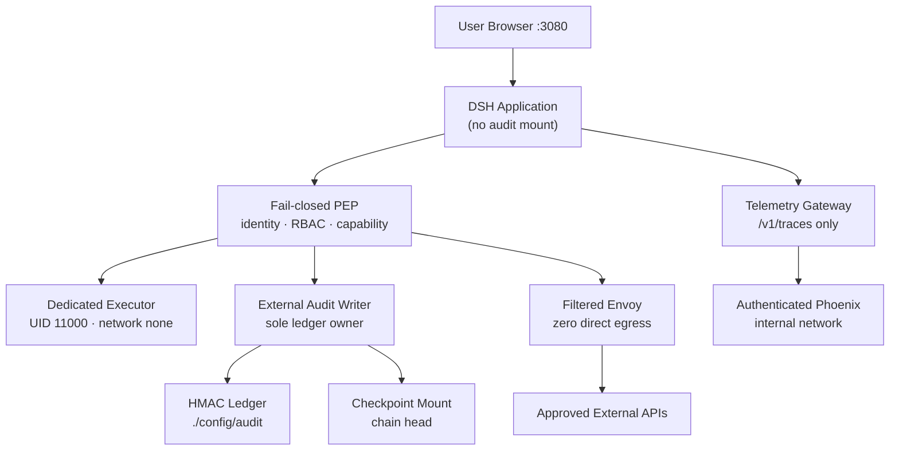
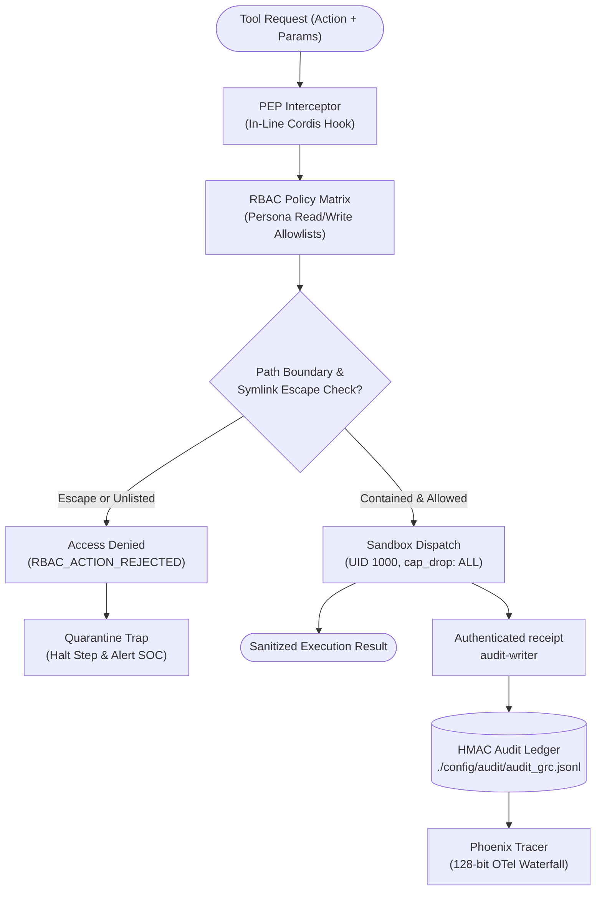
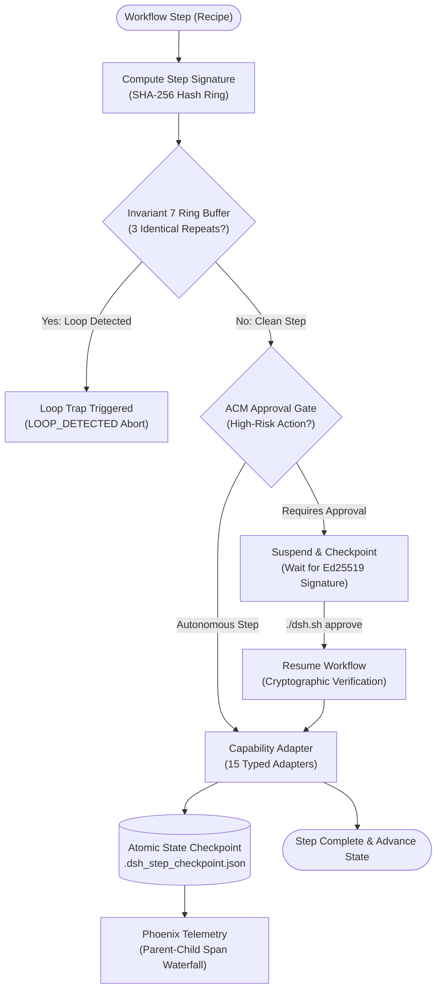
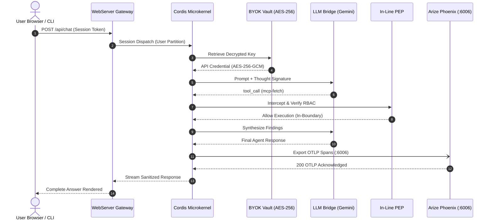

# 🗺️ Visual Architecture Journey: Interactive Exploration & Blueprints

> **Journey the architecture by visualising it.** Rather than relying on static, out-of-date image exports, this directory provides self-contained, publication-ready **interactive HTML web applications** compiled deterministically using **[Archify](https://github.com/tt-a1i/archify)** (`@tt-a1i/archify-dsh`).

### 🚀 Quick Launch — Open Directly in Your Browser
```bash
# Explore the current multi-service runtime and trust boundaries:
open docs/visual-architecture/system-runtime.architecture.html

# Inspect real-time PEP tool interception & zero-trust RBAC:
open docs/visual-architecture/security-pipeline.workflow.html

# Step through declarative workflows & Invariant 7 loop prevention:
open docs/visual-architecture/declarative-workflow.workflow.html

# Trace request lifecycle, Gemini thought signatures & Phoenix OTel:
open docs/visual-architecture/agent-trace.sequence.html
```

### 🌟 Interactive Capabilities
* 🌓 **Dark / Light Mode**: Toggle persistent visual presets with full contrast compliance.
* 🔍 **Pan, Zoom & Search**: Dynamic canvas exploration and node isolation.
* 🎬 **Story Chapters & Trace Motion**: Guided sequential walkthroughs of runtime execution flows.
* 📦 **Truthful High-Res Export**: Direct export to SVG, PNG, WebM, and canonical 1200×630 share cards.
* 🛡️ **Showcase Quality Certification**: 9/9 automated artifact checks passed with 0 composition errors.

---

## 🗺️ Interactive Visual Architecture Index

| Diagram Type | Title & Artifact | Specification (IR) | Focus & Highlights |
| :--- | :--- | :--- | :--- |
| **`architecture`** | **[System Runtime Architecture](system-runtime.architecture.html)** | [`system-runtime.architecture.json`](system-runtime.architecture.json) | DSH application and fail-closed PEP, dedicated `network_mode: none` executor, external audit-writer owning the HMAC ledger/checkpoints, authenticated telemetry gateway, Phoenix, and filtered Envoy egress. |
| **`workflow`** | **[Zero-Trust PEP & RBAC Pipeline](security-pipeline.workflow.html)** | [`security-pipeline.workflow.json`](security-pipeline.workflow.json) | Real-time tool interception, canonical path resolution, symlink traversal detection (F-02), fail-closed quarantine traps, and immutable GRC audit logging. |
| **`workflow`** | **[Declarative Workflow & Loop Trap](declarative-workflow.workflow.html)** | [`declarative-workflow.workflow.json`](declarative-workflow.workflow.json) | Deterministic step hashing, Invariant 7 loop trap ring buffer (`LOOP_DETECTED`), ACM approval gate (`./dsh.sh approve`), and 15 typed capability adapters. |
| **`sequence`** | **[Agent Execution & OTLP Telemetry](agent-trace.sequence.html)** | [`agent-trace.sequence.json`](agent-trace.sequence.json) | User request lifecycle, AES-256-GCM BYOK key decryption, Gemini thought signature preservation, governed tool dispatch, and local Phoenix OTLP waterfall. |

---

## 🏛️ Diagram 1: System Runtime Architecture & Isolation

**Interactive Artifact:** [`system-runtime.architecture.html`](system-runtime.architecture.html)  
**JSON Specification:** [`system-runtime.architecture.json`](system-runtime.architecture.json)



---

## 🛡️ Diagram 2: Zero-Trust PEP & Dynamic RBAC Pipeline

**Interactive Artifact:** [`security-pipeline.workflow.html`](security-pipeline.workflow.html)  
**JSON Specification:** [`security-pipeline.workflow.json`](security-pipeline.workflow.json)



---

## 🔄 Diagram 3: Declarative Workflow & Invariant 7 Loop Trap

**Interactive Artifact:** [`declarative-workflow.workflow.html`](declarative-workflow.workflow.html)  
**JSON Specification:** [`declarative-workflow.workflow.json`](declarative-workflow.workflow.json)



---

## ⚡ Diagram 4: Agent Execution & OTLP Telemetry Sequence

**Interactive Artifact:** [`agent-trace.sequence.html`](agent-trace.sequence.html)  
**JSON Specification:** [`agent-trace.sequence.json`](agent-trace.sequence.json)



---

## 🛠️ CLI & Build Commands

Re-compile or validate all diagrams anytime using the project scripts:

```bash
# Build and deliver all visual architecture artifacts with showcase validation:
npm run visual-architecture:build

# Validate an individual diagram specification:
npm run archify -- validate architecture docs/visual-architecture/system-runtime.architecture.json --quality showcase

# Launch local interactive preview:
npm run archify -- preview architecture docs/visual-architecture/system-runtime.architecture.json
```
