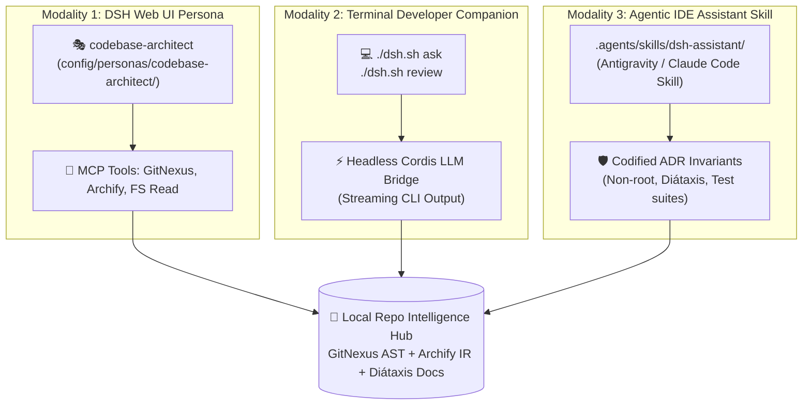

# 💡 Brainstorm Brief: In-Repository AI Assistant (`repo-copilot`)

> **Concept**: Transform DSH-DDS into a self-referential, self-explaining, and self-governing AI harness by embedding a specialized AI assistant that understands the repository's code, architecture, invariants, and operational workflows.

---

## 🧭 Problem Statement & Context

Currently, developers and security auditors interact with DSH-DDS through:
1. The **Web UI** (`:3080`) using domain personas (`sdmx-expert`, `security-auditor`, `devops-sre`).
2. The **Host CLI** (`./dsh.sh`) executing operational bash subcommands (`up`, `doctor`, `reset`, `approve`).
3. External AI pair-programmers (Antigravity, Claude Code, Cursor) reading workspace files and rules.

However, there is no **in-repo native intelligence agent** specifically specialized in:
* Answering deep questions about DSH-DDS internals (e.g. Invariant 7 loop trap, AES-256 BYOK Vault, Envoy egress filter).
* Exploring symbol call graphs and blast radiuses using the local GitNexus AST index.
* Authoring or compiling interactive Archify visual architecture diagrams on demand.
* Proposing atomic code changes safely through ephemeral Git worktrees with automatic rollback on test failure.

---

## 🎨 Modality & Architecture Ideation

We brainstormed three complementary interaction modalities:



### 1. Web Persona: `codebase-architect`
* **Role**: Resident repository architect and onboarding specialist.
* **Manifest**: Declarative `persona.yaml` with zero-trust RBAC allowing `read` over `/app`, `/workspaces`, and `/etc/dsh`, but strictly preventing direct `write` to core runtime source files without human approval.
* **Toolchain**:
  * `gitnexus_query`: Search execution flows and call chains.
  * `gitnexus_context`: Retrieve direct callers, callees, and functional clusters.
  * `gitnexus_impact`: Compute blast radius before modifying any function.
  * `archify_compile`: Render or update interactive visual architecture HTML models.

### 2. Terminal CLI Companion: `./dsh.sh ask` / `./dsh.sh review`
* **Role**: Zero-friction CLI companion for developers in the terminal.
* **Workflow Examples**:
  ```bash
  # Quick architecture query:
  ./dsh.sh ask "Explain how Envoy proxy sidecar blocks egress data exfiltration"

  # Quick blast-radius code review:
  ./dsh.sh review config/failover-gateway.mjs

  # Status and audit check:
  ./dsh.sh ask "Which OWASP Agentic AI guardrails are covered in tests/?"
  ```
* **Engine**: Dispatches headlessly into the running DSH container using the local LLM bridge (Gemini 2.5 Flash or OpenRouter) with session isolation.

### 3. Agentic IDE Skill: `.agents/skills/dsh-assistant/`
* **Role**: Context provider for Antigravity, Claude Code, and Cursor.
* **Content**: Codified repository invariants (e.g., must run `npm test`, must check `gitnexus detect-changes` before commit, must preserve non-root UID 1000).

---

## 🛡️ Security & Boundary Invariants

Any repo-assistant implementation must strictly obey the DSH-DDS security charter:
1. **Zero Unsandboxed Execution**: Code execution or testing must run inside ephemeral containers or isolated Git worktrees (`config/worktree-staging.mjs`), never on the bare host.
2. **Read-Only Code Access by Default**: The persona cannot mutate `config/` or `docker/` directly during a chat session without triggering an ACM human approval gate (`./dsh.sh approve <id>`).
3. **Local Telemetry Retention**: Telemetry and conversation traces must stay inside local Arize Phoenix (`127.0.0.1:6006`) with zero export to third-party SaaS observability platforms.

---

## 🚀 Recommendation & Next Steps

1. **Formalize into Epic**: Promote this brainstorm into `docs/work/todo/epic-repo-intelligence-assistant.md` targeted for `v2.1.0`.
2. **Phased Rollout**:
   * **Phase 1**: Author the `codebase-architect` persona manifest and skill.
   * **Phase 2**: Implement the `./dsh.sh ask` CLI wrapper.
   * **Phase 3**: Add GitNexus automated PR review bot integration.
