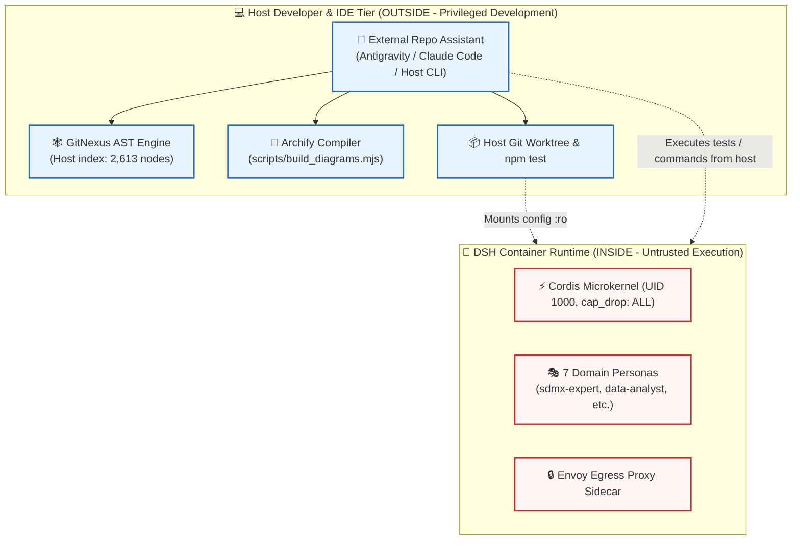

# 💡 Brainstorm Brief: External Repository AI Assistant (Host & IDE Tier)

> **Core Architectural Principle**: The Repository AI Assistant must reside **STRICTLY OUTSIDE** the `DSH-DDS` container runtime, operating at the **Host Developer & IDE Tier**, never as an in-container persona.
>
> 🔬 **Full SOTA Research Paper**: For formal comparative benchmarks, dual-ring security proofs, and OWASP threat models, see **[SOTA Research Report: External Repository AI Assistant](sota-research-external-repo-assistant.md)**.

---

## 🛑 Foundational Rule: Why Outside, Never Inside?

In `DSH-DDS`, a strict architectural boundary exists between the **sandboxed runtime** and the **host developer environment**:



### Why the Assistant Must NOT Live Inside `dsh-dds`:
1. **Sandboxing Inversion**: The DSH container is an unprivileged sandbox (`cap_drop: ALL`, read-only root FS, internal network bridge, Envoy egress filter). An assistant that inspects, refactors, and tests the repository requires host git commands, filesystem read across the repo root, and developer tooling—granting this to the container would destroy sandbox containment.
2. **Alignment with ADR 0007**: [ADR 0007](../../../adr/0007-rejection-of-in-container-antigravity-and-credential-isolation.md) formally rejected running agentic CLI tools (`agy`) inside the container to prevent privilege escalation and credential leakage. The repository assistant follows this exact mandate.
3. **Circular Dependency & Self-Mutation Hazard**: A container cannot safely modify its own Dockerfile, Compose topology, entrypoint scripts, or host mount definitions from the inside.
4. **Preservation of Domain Focus**: In-container personas (`config/personas/`) exist solely for user business domains (SDMX statistics, data analysis, MLOps, security auditing). The repository assistant is a meta-engineering tool for the human developer.

---

## 🎨 External Modality Ideation (Outside the System)

We focus on two external modalities residing completely on the host/developer tier:

### Modality 1: Agentic IDE Assistant Skill (`.agents/skills/dsh-repo-assistant/`)
* **Environment**: Runs within the developer's agentic IDE (Antigravity, Claude Code, Cursor) on the host.
* **Capabilities**:
  * **AST Navigation**: Uses GitNexus tools (`gitnexus_query`, `gitnexus_context`, `gitnexus_impact`) to trace symbols, callers, and execution flows.
  * **Architectural Guidance**: Understands Diátaxis documentation, ADR 0001–0008 invariants, and non-root rules.
  * **Visual Governance**: Formulates typed Archify JSON specs and runs `npm run visual-architecture:build`.
  * **Safety Guardrails**: Proactively runs `npx gitnexus detect-changes` before proposing or staging commits.

### Modality 2: Host CLI Companion (`./dsh.sh assistant` or `scripts/repo_assistant.mjs`)
* **Environment**: Runs directly on the host shell (`mac / zsh / bash`), completely outside Docker.
* **Developer Workflows**:
  ```bash
  # 1. Ask architectural questions from host terminal:
  ./dsh.sh assistant ask "How does the Invariant 7 loop trap prevent infinite loops?"

  # 2. Perform pre-commit blast radius review from host:
  ./dsh.sh assistant review config/failover-gateway.mjs

  # 3. Check documentation consistency & broken links:
  ./dsh.sh assistant check-docs

  # 4. Rebuild & validate visual architecture models:
  ./dsh.sh assistant build-visuals
  ```
* **Architecture**: Uses a lightweight host-side Node.js script reading host `.env` or provider keys directly to stream answers to stdout without touching container processes.

---

## 🏢 Industry Benchmark: How Does This Compare to GitHub Copilot?

While **GitHub** provides repository AI assistants across its commercial cloud suite (**Copilot Chat on github.com**, **Copilot Workspace**, **gh copilot CLI**, and **VS Code Copilot Agent**), they present critical architectural constraints for sovereign environments:
* **Cloud Transmissibility**: GitHub Copilot transmits proprietary code, prompts, and context to Microsoft Azure / OpenAI cloud infrastructure, disqualifying it under strict data residency, DORA, and EU AI Act mandates.
* **Vector Text RAG vs. Relational AST**: GitHub Chat uses probabilistic vector text chunks, which frequently hallucinate symbol relationships; DSH-DDS utilizes **GitNexus** with 2,613 typed AST nodes, 3,551 edges, and 77 execution flows for deterministic caller/callee analysis.
* **Visual Governance**: GitHub has no visual modeling compiler; DSH-DDS compiles verifiable, interactive HTML blueprints via **Archify**.
* **Zero Container Footprint**: Like GitHub's host-side Copilot Agent, our assistant operates strictly on the host/IDE tier, preserving the unprivileged isolation of the `DSH-DDS` runtime.

*(See the complete comparative analysis and exploration taxonomy in the **[SOTA Research Report](sota-research-external-repo-assistant.md#21-deep-dive-githubs-ai-assistant-ecosystem--architectural-comparison)** and **[Repository Exploration Tooling Taxonomy](sota-research-external-repo-assistant.md#22-repository-exploration--comprehension-tooling-taxonomy)**).*

---

## 🛡️ Security & Boundary Guarantees

* **Zero In-Container Footprint**: No personas added to `config/personas/`, no new daemons inside Docker.
* **Host Tool Orchestration**: Leverages host Node 20 runtime, host GitNexus CLI, and host Archify compiler.
* **Read-Only Code Analysis**: The assistant analyzes code without mutating canonical branches unless explicit user approval is granted via ephemeral Git worktrees.

---

## 🚀 Recommendation & Next Steps

1. Update the prioritized Epic (`docs/work/todo/epic-repo-intelligence-assistant.md`) to explicitly mandate **Host & IDE Tier (Outside DSH-DDS)**.
2. Implement **Modality 1** first as an IDE skill (`.agents/skills/dsh-repo-assistant/`) to assist current development.
3. Implement **Modality 2** as a host-side script (`scripts/repo_assistant.mjs`) exposed through `./dsh.sh assistant`.
