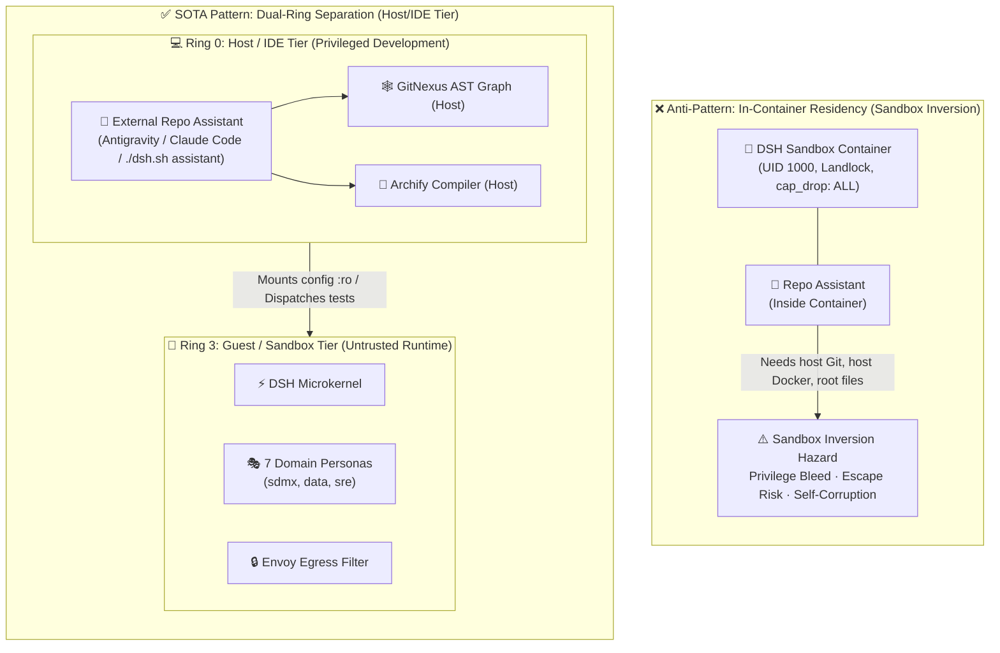
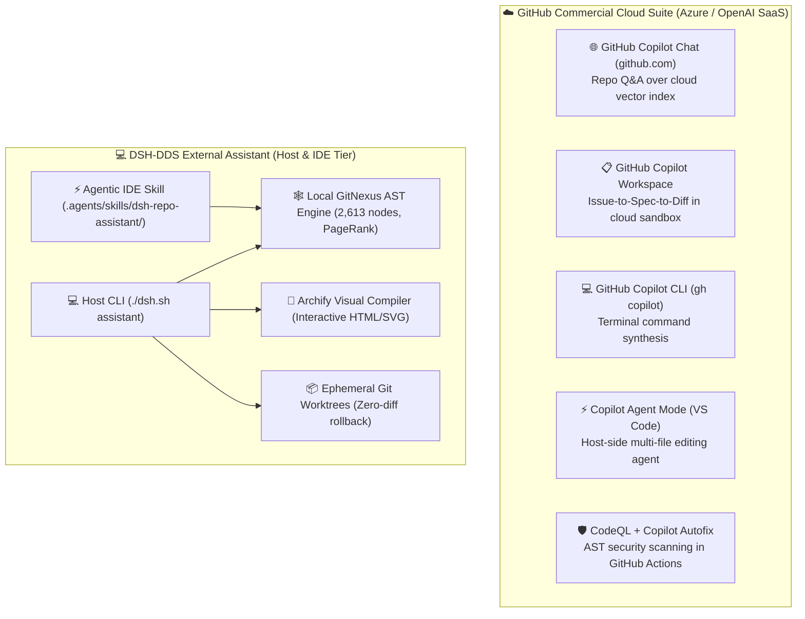
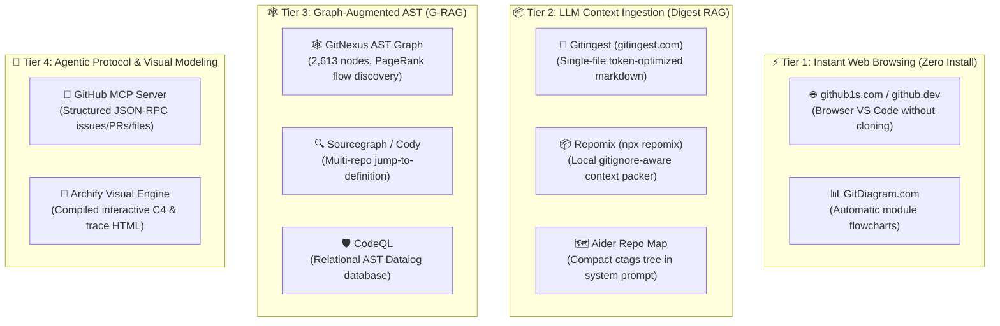
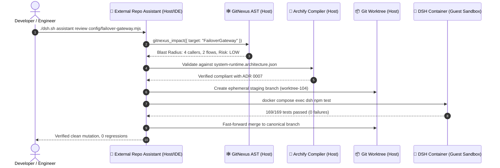

# 🔬 SOTA Research Report: External Repository AI Assistant (Host & IDE Tier)

## Architectural Separation of Concerns, Graph-Augmented Code Intelligence, and Sovereign Developer Governance

* **Document Status**: State-of-the-Art (SOTA) Research Report & Architectural Specification
* **Target Milestone**: `DSH-DDS v2.1.0`
* **Author**: AI Systems Researcher & Sovereign Harness Architect
* **Classification**: Technical Research & System Architecture Blueprint
* **Cross-References**: [ADR 0006](../../adr/0006-non-root-container-refactoring.md) · [ADR 0007](../../adr/0007-rejection-of-in-container-antigravity-and-credential-isolation.md) · [ADR 0008](../../adr/0008-container-sandbox-hardening-and-supply-chain-remediation.md) · [GitNexus & Archify Guide](../../guides/gitnexus-archify.md) · [Brainstorm Brief](brainstorm-repo-intelligence-assistant.md)

---

## 1. Executive Summary & Paradigm Shift

In modern AI-assisted software engineering (AI-SWE), an **AI Assistant** must not only synthesize code but also navigate complex dependencies, calculate mutation blast radiuses, evaluate architectural invariants, and execute tests safely.

However, in sovereign, security-critical systems like **DeepSeek Harness (`DSH-DDS`)**, where the runtime is an unprivileged, sandboxed dual-container Docker stack, a critical architectural decision arises:

$$\textbf{Where does the repository-intelligence assistant execute?}$$



### The Core Finding
Attempting to deploy a repository-modifying intelligence agent **inside** the sandboxed application container violates the **Principle of Least Privilege**, introduces circular dependency hazards (an application modifying its own container definition from within), and causes a **Sandbox Inversion Hazard**. 

The state-of-the-art consensus in 2025/2026 mandates a **Dual-Ring Architectural Model**:
* **Ring 0 (Host / IDE Tier - External)**: The Repository AI Assistant operates with host developer privileges, orchestrating static AST analysis (**GitNexus**), visual architecture compilation (**Archify**), transactional Git worktrees, and test harnesses.
* **Ring 3 (Guest / Container Tier - Sandboxed)**: The application runtime (`dsh-dds`) remains an isolated, unprivileged execution target evaluated under strict network and filesystem confinement.

---

## 2. State-of-the-Art Industry Landscape (2025/2026)

To benchmark our design, we evaluated the architectural boundaries of leading AI coding assistants, autonomous software engineering agents, and code intelligence engines:

| System / Engine | Architecture Tier | Primary Execution Boundary | Code Intelligence Mechanism | State Mutation Strategy | Security & Isolation Model |
| :--- | :---: | :---: | :--- | :--- | :--- |
| **Anthropic Claude Code** | **Host Tier** | Host OS terminal (macOS/Linux) | AST grep, ripgrep, bash execution | In-place file edits with interactive terminal prompt approval | Host permissions, explicit user confirmation for bash tools |
| **Google Antigravity / Gemini CLI** | **Host & IDE Tier** | Desktop IDE host / sidecar daemon | AST parsing, LSP indexing, MCP tool routing | Multi-file diff buffer staging with review gates | Host OS permissions, OAuth isolated in host keychain |
| **Cursor (Agent Mode) / Windsurf** | **IDE Tier** | Local editor process + remote cloud index | Shadow workspace, Merkle trees, embedding search | Speculative multi-file edits in shadow buffer | Local workspace sandbox with file boundary filters |
| **OpenHands / SWE-agent (SWE-bench)** | **Dual-Tier (Host + Sandbox)** | **Controller on Host**; **Executor in Docker** | Repository search, bash agent, tree-sitter | Ephemeral Docker container worktree | Ephemeral container destroyed after test evaluation |
| **GitNexus** | **Host Tier** | Local zero-server AST graph CLI | Tree-sitter AST, PageRank flow centrality, SQLite | Read-only graph analysis, detect-changes diff check | Operates purely on host Git AST; zero network egress |
| **Archify** | **Host Tier** | Node.js compiler CLI | Typed JSON Intermediate Representation (IR) | Compiles standalone HTML/SVG artifacts | Pure static compiler with schema & showcase validation |
| **DSH-DDS External Assistant (Proposed)** | **Dual-Tier (Host/IDE Controller)** | **Host CLI (`./dsh.sh assistant`) + IDE Skill** | **GitNexus AST (2,613 nodes) + Archify IR** | **Ephemeral Git Worktrees (`worktree-staging`)** | **Strictly outside container; ADR 0006/0007 compliance** |

---

### 2.1 Deep-Dive: GitHub's AI Assistant Ecosystem & Architectural Comparison

A frequent question in enterprise engineering is: *“Does GitHub already provide an AI assistant to interact with repositories?”* 

GitHub does provide repository-level AI assistants, but they are partitioned across five distinct commercial cloud products, each with fundamental architectural trade-offs:



#### GitHub's 5 Assistant Offerings:
1. **GitHub Copilot Chat for Repositories (`github.com`)**:
   * **Mechanism**: Asynchronous cloud ingestion chunks repository text and stores embeddings in an Azure OpenAI vector database.
   * **Limitation**: Probabilistic text retrieval (lacks relational AST knowledge of callers/callees); read-only; cannot inspect uncommitted local edits or run local test suites.
2. **GitHub Copilot Workspace**:
   * **Mechanism**: Task-centric cloud environment that parses an Issue, generates a specification, and modifies code inside an ephemeral Azure cloud container.
   * **Limitation**: Exclusively SaaS; requires sending code to third-party infrastructure; cannot run in air-gapped or on-premise sovereign networks.
3. **GitHub Copilot CLI (`gh copilot`)**:
   * **Mechanism**: Terminal extension (`gh copilot explain / suggest`).
   * **Limitation**: Synthesizes bash, git, and gh shell one-liners; does not navigate repository AST structures or perform deep refactoring.
4. **GitHub Copilot Agent Mode (VS Code)**:
   * **Mechanism**: Host editor agent (`@workspace /agent`) capable of multi-file edits and terminal command execution with user confirmation.
   * **Limitation**: Generic codebase assistant; lacks verified architectural modeling or automated blast-radius calculation.
5. **CodeQL + Copilot Autofix**:
   * **Mechanism**: Relational AST graph database (Datalog engine) scanned in CI/CD pipelines to suggest PR security fixes.
   * **Limitation**: Heavy batch scanning for security vulnerabilities; not interactive or conversational during development.

#### Architectural Comparison Matrix: GitHub vs. DSH-DDS

| Evaluation Dimension | GitHub Cloud Copilot Ecosystem | DSH-DDS External Assistant (Host & IDE Tier) |
| :--- | :--- | :--- |
| **Data Sovereignty & Residency** | ❌ **Cloud-Dependent**: Code, prompts, and context are transmitted to Microsoft Azure / OpenAI cloud. Ineligible for air-gapped, DORA, or strict EU AI Act data residency setups. | ✅ **100% Host-Resident & Sovereign**: Operates on local machine; routes to local LLMs (Ollama/vLLM) or sovereign BYOK keys; zero external telemetry export. |
| **Code Intelligence Paradigm** | ⚠️ **Vector Embeddings + Cloud RAG**: Probabilistic text chunking; prone to hallucinating symbol relationships and callers. | ✅ **Deterministic AST Knowledge Graph (GitNexus)**: 2,613 typed nodes, 3,551 edges, and 77 execution flows with PageRank centrality and real-time blast-radius calculation. |
| **Visual Architecture Synthesis** | ❌ **None**: GitHub does not generate or compile interactive, verifiable architectural blueprints from code. | ✅ **Archify Visual Compiler**: Compiles typed JSON IR into standalone, interactive HTML/SVG models (`docs/visual-architecture/`) with showcase certification. |
| **Transactional Mutation Safety** | ⚠️ **Direct Edit Buffer or Cloud PR**: Local editor edits files directly; cloud workspace edits in remote VM. | ✅ **Host Ephemeral Git Worktrees (`worktree-staging`)**: Speculative mutations applied in isolated shadow worktrees; auto-rolled back with zero diff on test failure. |
| **Container Sandbox Isolation** | ⚠️ **Monolithic Execution**: Agent operates either directly on host editor or in a generic remote cloud VM. | ✅ **Strict Dual-Ring Boundary**: External Assistant on host tier governs the codebase, while the `DSH-DDS` runtime remains an unprivileged, Landlock-hardened Docker sandbox. |

---

### 2.2 Repository Exploration & Comprehension Tooling Taxonomy

When an engineer or AI assistant encounters an unfamiliar repository, effective exploration requires different tooling paradigms across the abstraction spectrum:



#### The Four Exploration Paradigms:

1. **Tier 1: Instant Browser-Based Inspection (Human Rapid Scans)**:
   * **`github1s.com` / `github.dev` (Press `.`)**: Instantly boots a web-based VS Code instance loaded with the repo's head commit. Allows file tree expansion, quick regex searches, and side-by-side file comparisons without `git clone`.
   * **`gitdiagram.com`**: Automatically parses GitHub repositories into high-level visual entity-relationship diagrams for rapid visual orientation.

2. **Tier 2: LLM Digest & Context Ingestion (Prompt-Level RAG)**:
   * **`Gitingest` (`gitingest.com`)**: Solves the "how do I paste an entire repo into an LLM?" problem by digesting public GitHub repos into a single, token-optimized Markdown file complete with directory hierarchy and stripped binary assets.
   * **`Repomix` (`npx repomix`)**: Enterprise CLI equivalent running locally on the host; bundles local or remote repositories with `.gitignore` compliance, security secret redaction, and exact token counting.
   * **`Aider Repo Map`**: Extracts symbols and function signatures using Tree-sitter ctags, constructing a dense structural graph injected directly into the LLM context window.

3. **Tier 3: Graph-Augmented AST Intelligence (G-RAG)**:
   * **`GitNexus`**: Replaces naive text search with deterministic code graphs. Maps 2,613 nodes, 3,551 edges, and 77 execution flows in `DSH-DDS`. Essential for answering: *"What will break if I rename this method?"* (blast radius) and *"Which processes execute this pipeline?"*.
   * **`Sourcegraph` / `Cody`**: Multi-repo enterprise code graph engine supporting semantic search and cross-repository symbol definitions.

4. **Tier 4: Agentic Protocols & Verifiable Visual Modeling**:
   * **`@modelcontextprotocol/server-github` (GitHub MCP Server)**: Standardizes how AI agents query repositories, fetch file contents, inspect commits, and manage pull requests over JSON-RPC. *(Pre-configured inside DSH-DDS)*.
   * **`Archify`**: Translates AST facts and runtime architectures into self-contained, publication-ready interactive HTML applications (`docs/visual-architecture/`) featuring pan/zoom, dark/light themes, and trace animations.

#### Exploration Tooling Taxonomy Matrix:

| Exploration Tool | Execution Boundary | Air-Gap / Offline Capable | Exploration Depth | Token Efficiency | Visual Architecture Output |
| :--- | :---: | :---: | :--- | :---: | :---: |
| **`github1s` / `.`** | Cloud Browser | ❌ Requires Internet | File tree + Lexical text search | N/A (Human only) | ❌ None |
| **`GitDiagram`** | Cloud Service | ❌ Requires Internet | High-level module boxes | N/A (Human only) | ⚠️ Basic static flowchart |
| **`Gitingest`** | Cloud Web / API | ❌ Requires Internet | Full repo text dump | ⚠️ Medium (Linear text) | ❌ None |
| **`Repomix`** | Host CLI | ✅ 100% Offline | Multi-file text bundle | ⚠️ Medium (Linear text) | ❌ None |
| **`GitHub MCP Server`**| Host or Container | ⚠️ Depends on GitHub API | API-level files, PRs, issues | ✅ High (Targeted fetches) | ❌ None |
| **`GitNexus`** | Host CLI / MCP | ✅ 100% Offline | **Deep AST graph (callers, callees, flows)** | ✅ Extreme (Exact symbol nodes) | ⚠️ Terminal ASCII graphs |
| **`Archify`** | Host Compiler | ✅ 100% Offline | **Visual runtime & workflow models** | ✅ Extreme (Typed JSON IR) | ✅ **Full Interactive HTML/SVG** |

#### The DSH-DDS Synthesis:
Rather than choosing between static text dumps and heavy cloud services, the **DSH-DDS External Assistant** unifies **Tier 2 (Repomix context packing)**, **Tier 3 (GitNexus AST G-RAG)**, and **Tier 4 (Archify visual blueprints + GitHub MCP)** into a single, cohesive, 100% host-resident developer experience.

---

## 3. Formal Separation of Concerns: The Dual-Ring Architectural Model

In high-assurance security engineering (NIST SP 800-218, ISO/IEC 42001, OWASP Top 10 for Agentic AI), a fundamental axiom governs controller-worker architectures:

$$\textbf{Theorem (Sandbox Inversion Invariant):}\quad \text{Privilege}(\text{Controller}) \cap \text{Target}(\text{Sandbox}) = \emptyset$$

If an agent executing inside the sandbox is tasked with inspecting, modifying, and rebuilding the sandbox itself, the boundary collapses.



### Comparative Risk Analysis: Inside vs. Outside

| Risk Vector | In-Container Assistant (Antipattern) | External Host/IDE Assistant (SOTA Pattern) |
| :--- | :--- | :--- |
| **1. Credential Exposure** | Broad host credentials or Google OAuth tokens must be mounted into the container, exposing them to untrusted web content and prompt injection (violation of **[ADR 0007](../../adr/0007-rejection-of-in-container-antigravity-and-credential-isolation.md)**). | Host credentials reside strictly in the developer's host environment or secure OS keychain; zero credentials mounted into Docker. |
| **2. Self-Corruption Loop** | If the assistant modifies `Dockerfile`, `docker-compose.yml`, or entrypoint scripts, it can break its own execution environment mid-turn. | The assistant executes on the host shell; container rebuilds and restarts are managed externally without killing the assistant process. |
| **3. Filesystem Confinement** | The container is restricted to UID 1000 with read-only root (`read_only: true`). Granting write access to the whole repository breaks container isolation. | Operates on the host with standard developer privileges; respects Git status and worktree checkpoints. |
| **4. Telemetry & Trace Isolation** | Traces generated by repo maintenance pollute the business-domain Arize Phoenix telemetry partition (`./config/audit/audit_grc.jsonl`). | Host developer operations are tracked separately in developer logs or dedicated developer evaluation runs. |

---

## 4. Core Technical Pillars of the External Repo Assistant

To deliver state-of-the-art capability without compromising security, the External Repository Assistant is structured across **Four Core Pillars**:

```
┌─────────────────────────────────────────────────────────────────────────────┐
│             EXTERNAL REPOSITORY AI ASSISTANT (HOST & IDE TIER)              │
├──────────────────────────────┬──────────────────────────────┬───────────────┤
│  Pillar 1: Structural AST    │  Pillar 2: Visual Arch       │  Pillar 3:    │
│  Code Intelligence (G-RAG)   │  Compilation & Governance    │  Worktree     │
│  • 2,613 Symbol Nodes        │  • Typed JSON IR Validation  │  Staging      │
│  • 3,551 Relational Edges    │  • 4 Interactive HTML Models │  • Zero-Diff  │
│  • 77 Execution Flows        │  • 100% Showcase Quality     │    Rollback   │
├──────────────────────────────┴──────────────────────────────┴───────────────┤
│  Pillar 4: Dual-Channel Modality:                                           │
│  [Channel A] Agentic IDE Skill (.agents/skills/dsh-repo-assistant/)         │
│  [Channel B] Headless Host CLI (./dsh.sh assistant ask / review)            │
└─────────────────────────────────────────────────────────────────────────────┘
```

### Pillar 1: Structural AST Code Intelligence (Beyond Vector RAG)
Traditional RAG systems rely on vector embeddings over chunked text, which fail on complex codebases because they lack relational awareness (they cannot reliably report callers, callees, or cyclic imports).

The External Assistant uses **Graph-Augmented Retrieval (G-RAG)** powered by **GitNexus**:
* **AST Indexing via Tree-sitter**: Extracts classes, functions, interfaces, methods, and variables into typed nodes.
* **Execution Flow Centrality (PageRank)**: Identifies critical paths and ranks symbols based on flow dependency rather than lexical similarity.
* **Deterministic Blast-Radius Calculation**: Before any proposed refactoring, `gitnexus impact <symbol>` computes upstream callers, affected execution flows, and rates risk (`LOW`, `MEDIUM`, `HIGH`, `CRITICAL`).

### Pillar 2: Visual Architecture Compilation & Continuous Governance
Architecture documentation quickly drifts from reality when authored as disconnected diagrams.
* The assistant leverages **Archify** (`@tt-a1i/archify-dsh`) on the host to author and validate typed JSON Intermediate Representations (IR).
* It deterministically renders interactive HTML artifacts ([docs/visual-architecture/](../../visual-architecture/README.md)) featuring pan/zoom, dark/light themes, and story chapters.
* **Automated Drift Detection**: When code symbols or network topologies are modified, the assistant asserts that visual IR files match the active implementation.

### Pillar 3: Ephemeral Transactional Staging & Safe Mutation
* When the developer asks the assistant to implement a feature or refactor code, mutations are never written directly to the active working tree.
* The assistant utilizes `git worktree` isolation:
  1. Spawns an isolated shadow worktree on the host.
  2. Applies edits and executes lint checks.
  3. Dispatches automated regression tests (`docker compose exec dsh npm test` or host `npm test`).
  4. On test pass: fast-forward merges the staged commit.
  5. On test failure or regression: automatically aborts with a clean zero-diff rollback.

### Pillar 4: Dual-Channel Delivery Modalities
1. **Modality A (IDE Agent Skill)**:
   * Location: `.agents/skills/dsh-repo-assistant/SKILL.md`
   * Purpose: Augments interactive pair-programming assistants (Antigravity, Claude Code, Cursor) with native understanding of DSH invariants, ADR history, and GitNexus MCP tools.
2. **Modality B (Host CLI Companion)**:
   * Location: `./dsh.sh assistant` backed by `scripts/repo_assistant.mjs`
   * Purpose: Headless terminal utility for developers and CI/CD pipelines to query architecture, review diffs, and verify supply-chain parity.

---

## 5. Security & Threat Modeling (OWASP AI Alignment)

Operating on the host tier requires rigorous guardrails to prevent developer workstation compromise:

| OWASP AI Threat | Risk Description | External Assistant Mitigation |
| :--- | :--- | :--- |
| **LLM01 / ASI01: Prompt Injection** | Adversarial comments or payloads inside target repository files hijack the assistant's instruction loop. | **Structured Parsing**: File content is treated strictly as data, never as executable instructions. Prompts use rigid XML/delimiter enclosures and context quarantine scanning. |
| **LLM02 / ASI02: Sensitive Information Disclosure** | Accidental exfiltration of host secrets (`.env`, SSH keys, cloud credentials) during assistant queries. | **Host Secret Masking**: `.env` and sensitive credential paths are explicitly excluded from the assistant's context assembler. |
| **ASI04: Autonomous Runaway Loops** | Assistant enters an infinite self-invocation loop while debugging or refactoring. | **Invariant 7 Ring Buffer**: 12-step hash ring buffer detects repetitive reasoning or tool execution patterns and halts execution with `LOOP_DETECTED`. |
| **ASI05: Privilege Escalation** | Assistant executes destructive host commands (`rm -rf`, `sudo`). | **Action Space Restriction**: The assistant action space is restricted to typed Git operations, GitNexus AST queries, Archify builds, and `npm test`. Root/sudo execution is strictly prohibited. |
| **ASI07: Insecure Inter-System Communication** | Assistant inadvertently transmits proprietary codebase source code to external public LLM endpoints. | **Configurable Sovereign Model Gateways**: The assistant routes queries through local Ollama/vLLM endpoints or enterprise-approved API gateways configured in the host environment. |

---

## 6. Concrete Implementation Blueprint for `DSH-DDS` (`v2.1.0`)

```
dshdds-imp/
├── scripts/
│   ├── repo_assistant.mjs          # [NEW] Host-tier Node.js assistant engine
│   └── build_diagrams.mjs         # Archify compilation runner
├── .agents/skills/
│   └── dsh-repo-assistant/         # [NEW] Antigravity & Claude Code IDE skill
│       ├── SKILL.md                # Codified repository rules & GitNexus navigation
│       └── references/             # Invariants, ADR catalog & cheat sheets
├── tests/
│   └── repo_assistant.test.mjs     # [NEW] Automated tests for host CLI assistant
└── dsh.sh                          # Exposes: ./dsh.sh assistant {ask,review,verify}
```

### CLI Command Specifications (`./dsh.sh assistant`)

```bash
# 1. Ask architectural or operational questions with exact code citations:
./dsh.sh assistant ask "Explain how the failover gateway preserves session state"

# 2. Compute AST blast radius before editing a file:
./dsh.sh assistant review config/failover-gateway.mjs

# 3. Verify repository consistency, installer parity, and test suites:
./dsh.sh assistant verify

# 4. Rebuild all interactive visual architecture models:
./dsh.sh assistant build-visuals
```

### Phased Delivery Roadmap

```
Sprint 1 (v2.1.0-alpha): IDE Skill Packaging
  ├── Author .agents/skills/dsh-repo-assistant/SKILL.md
  ├── Codify ADR 0001-0008 invariants and Diátaxis navigation
  └── Wire GitNexus AST MCP tools into active context

Sprint 2 (v2.1.0-beta): Host CLI Companion
  ├── Implement scripts/repo_assistant.mjs using Node 20
  ├── Wire into ./dsh.sh assistant wrapper
  └── Implement `ask` and `review` subcommands

Sprint 3 (v2.1.0-GA): Transactional Worktree Integration & CI Gate
  ├── Connect host assistant to worktree-staging.mjs
  ├── Add pre-commit blast radius impact hook
  └── Deliver comprehensive test suite in tests/repo_assistant.test.mjs
```

---

## 7. Conclusion

By strictly placing the **Repository AI Assistant on the Host & IDE Tier (Outside the DSH-DDS Container)**, we achieve the best of both worlds:
1. **Uncompromised Runtime Sandboxing**: The `DSH-DDS` container remains an unprivileged, Landlock-hardened, non-root sandbox running domain personas with zero credential mounts.
2. **First-Class Developer Intelligence**: Developers and paired AI agents gain instantaneous, AST-grounded repository intelligence, automated blast-radius calculations, and verified visual architecture governance directly in their native host workflow.
