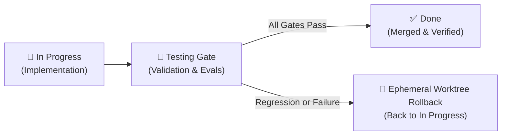

# 🧪 Testing & Verification Gate

Welcome to the **Testing & Verification Gate**. In our Agile Kanban lifecycle, items transitioning from `in-progress/` enter `testing/` before they can be marked `done/`.

---

## 🎯 Purpose

The testing phase ensures that every feature, refactoring, or security mitigation is rigorously validated against automated regression suites, supply chain invariants, AST blast-radius checks, and LLM trajectory evaluations.

---

## 🛡️ Mandatory Quality Gates

Every initiative in `testing/` must satisfy the **Five Quality Gates** before promotion to `done/`:

| Gate | Verification Command | Objective | Passing Standard |
| :--- | :--- | :--- | :--- |
| **1. Unit & Integration** | `npm test` | Regression testing across all components | 100% pass rate (225/225 tests) |
| **2. Supply Chain & Installer** | `npm run verify:installer` | Zero drift between installer and source files | Parity verified |
| **3. Visual Architecture** | `npm run visual-architecture:build` | Archify showcase quality certification | 9/9 checks passed, 0 errors |
| **4. AST Blast Radius** | `npx gitnexus detect-changes` | Verify only intended symbols were touched | Low risk, 0 unmapped mutations |
| **5. LLM Trajectory Evals** | `node --test tests/phoenix_evals.test.mjs` | Multi-dimensional trajectory scoring | Score ≥ 0.85 (Tool, RBAC, Syntax) |

---

## 📋 Active Verification Records

* *No blocking items currently in testing.*
